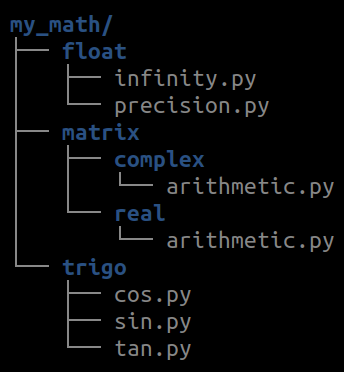

<!-- 
class: invert
paginate: true
footer: 'Python advanced training – exercices and mini-projects – Yoan Mollard – CC-BY-NC-SA [🔗](https://advanced.python.training.aubrune.eu/)'
title: Exercises – Python advanced training
author: 'Yoan Mollard'
image: https://www.python.org/static/favicon.ico
-->

<style>
    .hljs-string {
    color: #cd9067;
}
</style>

# **Python advanced training**, exercises

Yoan Mollard, for **Human Coders**

https://advanced.python.training.aubrune.eu/


---
# Mini-project 1. Estimate π with Nilakantha
## Part 1: Basic implementation
The Nilakantha method consists into computing `n` fractions from the formula:


Compute the estimation of π with `n=10000` using regular Python floats and compare digit-by-digit with a ground reference of 100 digits:
```python
3.1415926535897932384626433832795028841971693993751058209749445923078164062862089986280348253421170679
```
Increase the value of `n` and note the maximum number of digits you can achieve in reasonable time (30 seconds max).

---
## Part 2: Use the decimal module
We have touched the limits of the `float` precision.

Update your code so that you do not rely on `float` but on `Decimal` instead. 
Read the [documentation here](https://docs.python.org/3/library/decimal.html). Set the limit to 50 digits:

```python
from decimal import Decimal, getcontext
getcontext().prec = 50
```
They behave just like floats you can sum/multiply/divide them!

But be careful, do not mix `Decimal` with `float`, you would ruin the precision:

```python
Decimal(3) + Decimal(0.1415)    # DON'T! The float will ruin the precision
Decimal(3) + Decimal("0.1415")  # DO! str do not have precision loss
```

Note the max number of digits you can achieve in reasonable time (30 seconds max).

---
## Part 3: Use multiprocessing

**3.1.** Refactor you code so that a single function can compute a partial Nilakantha sum of `count=10000000` fractions each. Here is the general form:

```python
def get_partial_nilakantha(start_n: int, count: int) -> Decimal:
    """
    Computes a portion of the Nilakantha fractions:
    pi = 3 + fraction #1 + fraction #2 + ... + fraction #N

    :param start_n: Index of the first Nilakantha fraction (must be odd)
    :param count: Number of total fractions to be generated (must be odd)
    :return: the sum of the Nilakantha fractions between #start_n and #final_n

    ..warning: count and start id must be odd so that all partial sums are coherentlm
    """
```
---
**3.2.** Read the [documentation](https://docs.python.org/3.9/library/multiprocessing.html?highlight=multiprocess#module-multiprocessing) of the `multiprocessing` module to parrallelize the computation of 6 partial sums:

Each process will run `get_partial_nilakantha(start_n, count)` with:
* `process_id` going from `0` to `5` for 6 processes
* `start_n = 2*process_id*count+2`
* `count = 10000000`

First make sure you can open a single process and get the same result as before.

**3.3.** Add a [queue](https://docs.python.org/3.9/library/queue.html#queue.Queue) in parameter of the function run by processes so that they can each `put()` their result in.

**3.4.** Run your code with 6 processes and `count = 10000000`

Limit to 30s of computation max. What is the best number of digits you can achieve?

---
# Mini-project 3. Build a full package – Money transfer simulator

In this exercise we are going to create a simplified Information System that is able to handle and simulate bank transactions.
In our scenario there are 4 actors: a bank, a Walmart supermarket, and 2 individuals Alice and Bob.
Each actor has its own bank account.

---
## Mini-project 3 – Part 1: The basic scenario

* 1.1. Create a class `BankAccount` that owns 2 attributes:
  * `owner` (of type `str`): the owner's name
  * `balance` (of type `int`): the balance (do not take care of decimals)
  * the class constructor takes in parameter, in this order, `owner` and `initial_balance` 

With your class it must be possible to execute the following scenario (that has no effect so far, but it must not raise any error):
```python
bank = BankAccount("LCL", 10000)
walmart = BankAccount("Walmart", 5000)
alice = BankAccount("Alice Worz", 500)
bob = BankAccount("Bob Müller", 100)
```

---
* 1.2. Implement the `print()` method in class `BankAccount` that displays the name of the owner and the current balance. Iterate on all accounts to print them.

* 1.3. Implement these methods :
  * `_credit(value)` that credits the current account with the value passed in parameter. We will explain the goal of the initial underscore later.
  * `transfer_to(recipient, value)` that transfers the value passed in parameter to the recipient passed in parameter
  
* 1.4. After each of the following transactions, print the state of all accounts to make sure the intermediary result is correct:
  * 1.4.1. Alice buys $100 of goods at Walmart
  * 1.4.2. Bob fbuys $100 of goods at Walmart
  * 1.4.3. Alice makes a donation of $100 to Bob
  * 1.4.4. Bob buys $200 at Walmart

---
## Mini-project 3 – Part 2: The blocked account

Bob is currently overdrawn. To prevent this kind of situation, its customer adviser prefers to convert his account into a blocked account. This way, any purchase would be refused if Bob had not enough money.

* 2.1. Implement a class `BlockBankAccount` so that:
  * the `BlockedBankAccount` inherits from `BankAccount`. Make sure you do not forget to call parent method with the `super()` keyword if necessary
  * the `transfer_to` methods overloads the parent method, with the only difference that it raises an exception if the balance is not sufficiently provided to execute the transfer

---
* 2.2. Replace Bob's account by a blocked account and check that the previous scenario actually raises an exception

* 2.3. Protect the portion of code that looks coherent with `try..except` in order to catch the exception without interrupting the script

* 2.4. Explain the concept of protected method and the role of the underscore in front of the method name ; and why it is preferable than `_credit` is protected

---
## Mini-project 3 – Part 3: The account with agios

In real life another kind of account exists: the account whose balance can actually be negative, but it that case the owner must pay agios to his(her) bank.
The proposed rule here is that, when an account is negative after an outgoing money transfer, each second will cost $1 to the owner until the next money credit.

---
* 3.1. Implement a class `AgioBankAccount` so that:
  * the `AgioBankAccount` inherits from `BankAccount`. Make sure you do not forget to call parent method with the `super()` keyword if necessary
  * the constructor of this account takes in parameter the account of the bank so that agios can be credited on their account.
  * the  `transfer_to` methode overloads the parent method, with the only difference that it it records the time from which the balance becomes negative. You need an additional attribute for this.
  * the `credit` method overload the methode from the parent class, with the only difference that it computes the agios to be payed to the bank and transfer the money to the bank. Round agios to integer values.

---
 * 3.2. Move the code computing the agios in a private method named `__check_for_agios`, explain the concept of private method and the role of the double underscore 
 * 3.3. Check your implementation with the previous scenario, pause the scenario during 5 seconds and check that in the end, $5 of agios are payed by Bob to his bank, before Alice makes him a donation.
 
---
# Mini-project 2 : Code optimization
## Mini-project 2 Part 1 : Bread-First Search

> BFS browses a tree data structure. It starts at the tree root and explores all nodes at the present depth prior to moving on to the nodes at the next depth level. 
Extra memory, usually a queue, is needed to keep track of the children that were reached but not yet explored.

*From [Breadth-first_search, Wikipedia](https://en.wikipedia.org/wiki/Breadth-first_search)*.

📈 **Black** = explored ; **Grey** = queued to be explored later on
ℹ️ BFS is known as *parcours en largeur* in French


---

Here is the general algorithm of the BFS:
```vb
Input:  A graph G, 
Input:  A root node where to start BFS
Output: EXPLORED, the list of all nodes in BFS order
```

```ada
 1  procedure BFS(G, ROOT) is
 2      let Q be a list
 2      let EXPLORED be a list 
 3      append ROOT at the end of EXPLORED
 4      append ROOT at the end of Q
 5      while Q is not empty do
 6          v := pop the first node of G
 7          for all children of node v in G do
 8              if w is not in EXPLORED then
 9                  append w at the end of EXPLORED
10                  append w at the end of Q
```

---
**1.1**. Implement and test with `timeit` a first version `naive_bfs(G: dict, root: str)` of the preceeding BFS pseudocode:
* For `Q`, use a `list`
* For `EXPLORED`, use a `list`
* For `G` use a `dict` associating a list of children for each node:
```python
G = { # dict representing the children of all nodes
  '5' : ['3','7', '9'], # 5 has 3 children: 3 7 and 9 
  '3' : ['2', '4', '10'],
  '7' : ['8'],
  '2' : [],    # A node with an empty list is a leaf
  '4' : ['8', '9'],
  '8' : [],
  '9' : ['13','12', '11'],
  '10': ['13', '11', '8', '9'],
  '11': ['3','7', '9'],
  '12': [],
  '13': []}
```


---
**1.2.** : Use a graphical profiler to identify the culprints of your code:
* Install `snakeviz` with `pip`. Read the [documentation](https://jiffyclub.github.io/snakeviz/).
* Make sure you repeat calls to `naive_bfs()` several thousands of time to get meaningful statistics about its performance
* Generate a profile for your naive implementation of BFS
* What could be improved?

**1.3.**: Implement a new version `fixed_bfs()` that fixes the performance issue you spotted with the profiler. Measure the difference of execution time with `timeit`.


---
## Mini-project 3 – Part 4: The `account` package

We have just coded a very simple tool simulating transactions between bank accounts in Object-Oriented Programming.
In order to use it with a lot of other scenarii and actors, we are going to structure our code within a Python package.

We will organise our accounts with the following terminology:
* **bank-internal** accounts do not create agios and are not blocked, there are `BankAccount` and only banks can own such account
* **bank-externes** accounts are for individuals or companies, they can be either blocked or agios accounts.

---
We would like to be able to import ther classes from than manner:
```
from account.external.agios import AgiosBankAccount
from account.external.blocked import BlockedBankAccount
from account.internal import BankAccount
```
This hierarchy sets the file/directory hierarchy to use in your package:


---
* 4.1. Re-organize your code in order to create this hierarchy of empty `.py` files first. Create an empty script `scenario1.py`for the future scenario.

* 4.2. Move the class declaration of `AgioBankAccount` in `agio.py`

* 4.3. Move the class declaration of `BlockedBankAccount` in `blocked.py`

* 4.4. Move the class declaration of `BankAccount` in `internal.py`

* 4.5. Move the scenario (i.e. the successive instanciation of all accounts of companies and individuals) in `scenario1.py`

* 4.6. Open `blocked.py`, it misses an import from the parent class `BankAccount`. Add the import as a relative one.

---
* 4.7. Open `agio.py`, it missed the same import as well as an import of the  `time` module (or any package your used to deal with time)

* 4.8. Complete the missing imports i the scenario file. Be careful: the imports in the scenario must not be relative because `scenario1.py` will be located outside package `account`. 

_Nota Bene:_ Since package `account` is in the same directory as the scneario script, there will not be any issue to import it. If it had to be in another path, we could fix it by adding the path to `account` to the `sys.path` value.

---
* 4.9. Add empty `__init__.py` files to all directories of the package. You must have:



* 4.10. Execute the scenario and check that it leads to the same result as before this refactoring

* 4.11. Create other `scenario2` scripts, with transactions adn actors of your choice...

---
## Mini-project 3 – Part 5: Operator and magic methods overloading

According to you, would it make sense to add several bank account, e.g. `account1 + account2`?
What would be the type resulting from this sum?

* 5.1. Implement the *magic method* corresponding to the sum: `__add__(self, other)` in one of your classes. Choose a behaviour to deal with the name of owners and balance.
* 5.2. Test your sum operator by adding two actual accounts in a new scenario

---
## Mini-project 3 – Part 6: Unit tests for the package with `pytest`

Unit tests consits into testing functions one after the other, by checking individually their output accourding to a given input.
Several Python package can help automate unit tests. Among them, `pytest` is the best compromise between efficiency and simplicity

* 6.1. Install `pytest` with pip
* 6.2. Creat an empty file `tests.py`in the same folder than the scenario
* 6.3. With the documentation of `pytest`, implement a few unit tests for your classes and run the test with pytest 

---
## Mini-project 3 – Part 7: Distribute your package to TestPyPi
* 7.1. Add a `setup.py` file to your package and update all its values
* 7.2. Name your package `accounts-MYNAME` by replacing your name
* 7.3. Install `wheel` and `twine`, build `sdist` and `bdist_wheel` distributions
* 7.5. Upload both distributions to TestPyPI with account `python-trainings-testpypi@aubrune.eu` password `Human/Coders/42` (ask for pwd updates)
* 7.6. Make sure you can then install your package via pip if you target the TestPyPI index ith `--index-url https://test.pypi.org/simple/`
* 7.7. Update your package (e.g. add `numpy` dependency) and publish a new version 1.1. Make sure both versions are now on TestPyPI

Note: If you create your own PyPI account, make sure you create it on the [TestPyPI index](https://test.pypi.org/account/register/) that is pruned periodically, instead of the regular PyPI.

---
# Mini-project 4: AsyncIO

In this mini-project, we will simulate **moves of chess** during a tournament in which a unique chess master faces many opponents by turns

We will simulate only the **timeslots for each move and each player**, but we will not simulate the pieces their play or their actual outcome.

In a tournament in general, many games are being played in parallel on many boards. The I/O resource that slows down the games here is the time allotted to think-and-play.

**Laws of the simulation:**
* A player (master or opponent) cannot play moves against several players at a time
* A player (master or opponent) cannot play the other has not finished their move

---

## Part 1. Synchronous simulation
Create a synchronous version of the simulator in which only 1 single move can be played on a board at a time in the entire crowd of participants. Implement the following:
* A `Chessmaster` class with method `think_and_play(self, round: "Round", opponent: "Player")` that waits 1 sec to simulate the player's move
* A `Round` class with method `play(self, opponent_id: int)` that allows the player and then the master to think-and-play.
* A `Player` class with method `think_and_play(self, round: "Round", opponent: "Player")` that waits 5 secs to simualte the player's move
* A `Simulator` class with a single function `main()` being the entry point

Run a simulation between 3 players against the master, playing 2 rounds each. Report the overall simulation time (*see figure next page*).

---


---

## Part 2. Asynchronous simulation
In the synchronous version IOs were waited for return every time but they can be optimized: several players can play their move on their board at a time, as long as the laws of the simulator here above are met. 

1. Trasform relevant functions in coroutines `async` and await them. Start the event loop with `asyncio.run(entry_point)`. This first step is still a **sequential run**
2. Identify which coroutines will need to be concurrent in the final run.
3. Create tasks for the latter so that their are scheduled by the event loop, and awit for their terminaison. This new step is a **full-concurrent run**
4. Choose the number and the different types of [synchonization primives](https://docs.python.org/3/library/asyncio-sync.html) that will enforce the laws in any case, so that tasks wait the right time to run. 

Run the simulation with the same parameters (*see figure next page*).

---


---
# Mini-project 5:  (Naive) Virus spread simulation

This is a project to practice **numpy** and **matplotlib**. It consists into simulating a number of sick people based on a simplistic exponential contamination model.

It relies on the `R0` variable: it describes the slope of the contamination:
* `R0 < 1` = In average, a person contaminates less than 1 person: The number of contamination dicreases
* `R0 > 1` = In average, a person contaminates more than 1 person: The number of contaminations increases


The goal is to simulate contamination scenarii and plot them as presented on the next figure. 

---


---
## Description of the model to implement
In our simplistic model:
* The R0 has discrete values for different periods:
  * a **value during migitation measures** (e.g. lockdowns ; low R0)
  * a **value during celebrations** (e.g. Christmas ; high R0)
  * a regular value for all other periods
* Time is measured in number of days from day 0, for a certain **simulation duration**
* **Incubation time** is taken into account: it is materialized by a delay of a few days every time the R0 changes
* Lockdown is triggered automatically when the number of contaminations goes beyond a **critical threshold**, causing the R0 to

**bold values** are taken as parameters of the simulation.

---

## Part 1: Core of the simulator

1. Implement a class with a constructor accepting the parameters of the simu, e.g:
```python
s = Scenario(
    incubation_duration = 15,     # Number of days before the R0 actually changes 
    duration = 300,               # Days of simulation
    critical = 5000,              # Threshold for triggering lockdowns
    lockdown_duration = 60,       # Lockdown duration in days
    celebrations = [
                    74, 75, 76,   # Individual dates of celebrations
                    210, 211, 212 
                   ], 
    r0 = {
        "high": 2,          # R0 applied for celebrations
        "lockdown": 0.9,    # R0 applied for lockdowns
        "regular": 1.2,     # R0 applied for all other cases
    }
)
```
Store the parameters as attributes.

---

2. Implement a method `plot(self)` that draws a plot with matplotlib, with:
* a correct *xlabel*, *ylabel*, *legend* and *title*
* a linear plot `f(x)=x` from 0 to `duration`. Execute and check that the plot is right

3. Initialize a new attribute `self.num_cases` to 1 in the constructor (this is our first person contaminating the other!) 

*NB: do not forget to add docstrings as long as you code!*

---

4. Implement a method `next(self, num_former_cases:int)` intended to be called by the simulator every simulated day. This method must:
* read the regular R0 from the constructor
* update `self.num_cases` for the current day ; based on the number of cases for the previous day: `new_cases = R0*former_cases`

5. In `plot()`, repeat calls to `next()` for each simulated day and store each return values in a list of ordinates stored as the attribute `self.cases_history`

6. Substitute the ordinates `self.cases_history` to the linear ordinates in `pyplot.plot()` (***ordinates** are y-values*)

7. Drop the `self.num_cases` variable since it now corresponds to `self.cases_history[-1]`. Update code where necessary.

**Outcome:** Now you must see an exponential curve in your plot.

---
## Part 2: Lockdown implementation

1. In `next()`, check if the cases has reached the critical level. If yes, substitute the regular R0 for the "lockdown" R0

2. Revert to the regular R0 when the number of cases is below the critical level again

**Outcome:** You should see an exponential curve ending in shaky oscillations around the critical threshold. This is what would happen if the lockdowns were released too fast.

3. Add an attribute counting the number of remaining lockdown days since it has been triggered. Change the behaviour so that lockdown is released only when `lockdown_duration` days have passed. 

**Outcome:** You should see 3 peaks of ascending and descending exponential curves.

---

4. Store lockdowns starts and ends in a attribute `self.lockdown`. Use [`fill_between`](https://matplotlib.org/stable/api/_as_gen/matplotlib.pyplot.fill_between.html) to draw green areas for each lockdown, with parameters `color="green", alpha=0.1, label="lockdown"`.
- `self.lockdown: list[dict[str, int]]` stores the start and end dates, e.g. `[{"start": 50, "end": 65}, {"start": 100, "end": 115}`
- Do not start a new lockdown if the previous is not ended
- In case the last lockdown is not over when the simulation ends, stop the filled area at the end of the simulation.

**Outcome:** You should see 3 peaks with 3 green areas representing 3 lockdowns

---
## Part 3: Incubation delay
So far, when a lockdown happens, the number of contaminations starts to decrease the same day. We do not consider people contaminated right before the lockdown.

1. Add a `r0_history:` [`deque`](https://docs.python.org/3/library/collections.html#collections.deque) as an attribute to keep a track of previous R0, and:
- Init the queue with a neutral R0 i.e. as many `1` as the number of incubation delay
- `next()` must now accept the previous number of cases in parameter: `next(self, previous_num_cases: int)`
- `next()` must now enqueue the current R0 to the history
- `next()` must now return a new contamination case with delay: pop the r0_history from the left and use this to return the current number of contamination cases

`next()` now returns a current number of cases based on a former R0 (kept into memory in the queue). **Outcome:** Every R0 change you plot is delayed by some days.

---

## Part 4: Celebrations
In this mini-project, celebrations simulate a temporary decrease of the respect of mitigation measures, causing a temporary increase of the R0. Here again, this increase will be delayed by the incubations time.

1. In `next()`, simply multiply the current R0 by `R0["high"]` if this day is present in the list of celebration days.

2. Plot a red vertical bar with `pyplot.plot()` for every celebration day

*NB: We use R0 multiplication instead of a substitution of the R0 so that the effect of mitigation measures are still visible but their impact is lowered due to the celebration.*

**Outcome**: You must see delayed peaks of cases due to the celebrations. Severity of peaks is highly influenced by the severity of cases at the moment of the celebration.