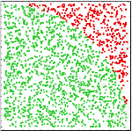

<!-- 
class: invert
paginate: true
footer: 'Python advanced training – exercices and mini-projects – Yoan Mollard – CC-BY-NC-SA'
-->


# **Python advanced training**, exercises

Yoan Mollard, for **Human Coders**

http://files.aubrune.eu/formations/humancoders


---
# Mini-projet 1. Optimization – Monte-Carlo estimation of Pi

Compute a maximum number of decimals of π has become a challenge to benchmark CPUs. In particular, the **Monte-Carlo method** estimates the value of pi this way:

1. Estimate the area of a quarter of a circle by picking at least 1 billion random points between 0 and 1.
2. Count all those which are inside the circle of radius 1 (in green). Their sum is an estimate of the green quarter of circle.
3. Using formula `area = π x r²`, deduce an estimate value of π.


🚨 *Monte-Carlo is not an efficient technique, for a 1e-4 precision, roughly 1.789e9 points are necessary!*



---
## Mini-project 1 – Part 1: First draft
1. Generate `n = 10000000` float abscissas as well as `n` float ordinates in range `[0; 1[`
2. Group these floats by two in order to get a list of couples: `[(x, y), (x, y), (x, y), …]`
3. Count how many `M(x,y)` points comply the following equation `x²+y² < 1` (call this number `m`)
4. The `m/n` ratio is an estimate of the area of the 1/4 of circle of centre `0, 0` with radius `1`. Multiply this ratio per 4 to get the area of the full circle `A`, and since `A = n.r²` this result is also the estimate of `n`

*On a regular machine, this program takes few seconds with a poor precision (1e-3)*

---
## Mini-project 1 – Part 2: Use workers to improve precision
5. Encapsulate your current code in a function `estimate_pi(n:int)`
6. Instead of calling this function directly, declare a single `Process` from the [`multiprocessing` library](https://docs.python.org/3.7/library/multiprocessing.html)). 
7. Declare a `Queue`, put the `m` value in it from the child process and get it back from the parent process. Divide by `n` and check that estimation still works with no improvement yet
8. Declare a list or pool of 100 workers computing 1 million points each

*The best you can get with Mont-Carlo and a regular x86_64 CPU is a 1e-4 precision*

---
## Mini-project 1 – Part 3 [OPTIONAL]: Command-line script
9. Get 1000 random points from the workers and use `pyplot.scatter(x, y, color=’green’)` to plot them, in green if they are inside the circle, red otherwise.
10. Use `argparse` or `click` libraries to make your module usable as a command-line tool, e.g.:
```bash
~$ estimate_pi.py --num_workers=100 --num_points=1000000 --plot
```

---
# Mini-projet 2. Networked distributed ??–


---
# Mini-projet 2. Optimize a few programs

Here are well written but yet optimizable Python scripts. Use analysis tools to spot CPU or memory bottlenecks and optimize. The expected performance improvement can reach up to x2 in time.

## Mini-project 1 – Part 1: Math program

TODO np.sqrt

TODO add decorators to your personal project
---

## Mini-project 1 – Part 2: Breadth-first search (BFS)

> BFS browses a tree data structure. It starts at the tree root and explores all nodes at the present depth prior to moving on to the nodes at the next depth level. 
Extra memory, usually a queue, is needed to keep track of the children that were reached but not yet explored.

*From [Breadth-first_search, Wikipedia](https://en.wikipedia.org/wiki/Breadth-first_search)*.

📈 **Black** = explored ; **Grey** = queued to be explored later on
ℹ️ BFS is known as *parcours en largeur* in French


---

### BFS pseudocode
```vb
Input:  A graph G
Output: A printed path corresponding to the full tree browsing in BFS order
```

```ada
 1  procedure BFS(G) is
 2      let Q be a queue
 3      label the root of G as explored
 4      Q.enqueue(the root of G)
 5      while Q is not empty do
 6          v := Q.dequeue()
 7          for all edges from v to w in G.adjacentEdges(v) do
 8              if w is not labeled as explored then
 9                  label w as explored
10                  Q.enqueue(w)
```

---
```python
from collections import deque
# node = {"parent_city": ["child_city1", "child_city2"]}

graph = {
    "Paris": [
        {"Poitiers": [
            {"Bordeaux": [
                {"Lacanau": None},
                {"Toulouse": None}]}
                ]},
        {"Lyon": [{"Grenoble": None,
        "Chambéry": None}}}
    ]}
TODO : repartir de optimize_bfs.py

def bfs(graph, root):
    queue = dequeu()
    explored = [True]
    queue.append(root)
    while len(queue) > 0:
        vertex = queue.deque()
        for child in vertex:
            if child not in explored:
                explored.append(True)
                queue.append(child)

```

--- 
### BFS implementation in Python to be optimized

---
# Mini-project 3. Build a full package – Money transfer simulator

In this exercise we are going to create a simplified Information System that is able to handle and simulate bank transactions.
In our scenario there are 4 actors: a bank, a Walmart supermarket, and 2 individuals Alice and Bob.
Each actor has its own bank account.

---
## Mini-project 3 – Part 1: The basic scenario

* [ ] 1.1. Create a class `BankAccount` that owns 2 attributes:
  * `owner` (of type `str`): the owner's name
  * `balance` (of type `int`): the balance (do not take care of decimals)
  * the class constructor takes in parameter, in this order, `owner` and `initial_balance` 

With your class it must be possible to execute the following scenario (that has no effect so far, but it must not raise any error):
```
bank = BankAccount("LCL", 10000)
walmart = BankAccount("Walmart", 5000)
alice = BankAccount("Alice Worz", 500)
bob = BankAccount("Bob Müller", 100)
```

---
* [ ] 1.2. Implement the `print()` method in class `BankAccount` that displays the name of the owner and the current balance. Iterate on all accounts to print them.

* [ ] 1.3. Implement these methods :
  * `_credit(value)` that credits the current account with the value passed in parameter. We will explain the goal of the initial underscore later.
  * `transfer_to(recipient, value)` that transfers the value passed in parameter to the recipient passed in parameter
  
* [ ] 1.4. After each of the following transactions, print the state of all accounts to make sure the intermediary result is correct:
  * 1.4.1. Alice buys $100 of goods at Walmart
  * 1.4.2. Bob fbuys $100 of goods at Walmart
  * 1.4.3. Alice makes a donation of $100 to Bob
  * 1.4.4. Bob buys $200 at Walmart
  
## Mini-project 3 – Part 2: The blocked account

Bob is currently overdrawn. To prevent this kind of situation, its customer adviser prefers to convert his account into a blocked account. This way, any purchase would be refused if Bob had not enough money.

* [ ] 2.1. Implement a class `BlockBankAccount` so that:
  * the `BlockedBankAccount` inherits from `BankAccount`. Make sure you do not forget to call parent method with the `super()` keyword if necessary
  * the `transfer_to` methods overloads the parent method, with the only difference that it raises an exception if the balance is not sufficiently provided to execute the transfer

---
* [ ] 2.2. Replace Bob's account by a blocked account and check that the previous scenario actually raises an exception

* [ ] 2.3. Protect the portion of code that looks coherent with `try..except` in order to catch the exception without interrupting the script

* [ ] 2.4. Explain the concept of protected method and the role of the underscore in front of the method name ; and why it is preferable than `_credit` is protected

---
## Mini-project 3 – Part 3: The account with agios

In real life another kind of account exists: the account whose balance can actually be negative, but it that case the owner must pay agios to his(her) bank.
The proposed rule here is that, when an account is negative after an outgoing money transfer, each second will cost $1 to the owner until the next money credit.

---
* [ ] 3.1. Implement a class `AgioBankAccount` so that:
  * the `AgioBankAccount` inherits from `BankAccount`. Make sure you do not forget to call parent method with the `super()` keyword if necessary
  * the constructor of this account takes in parameter the account of the bank so that agios can be credited on their account.
  * the  `transfer_to` methode overloads the parent method, with the only difference that it it records the time from which the balance becomes negative. You need an additional attribute for this.
  * the `credit` method overload the methode from the parent class, with the only difference that it computes the agios to be payed to the bank and transfer the money to the bank. Round agios to integer values.

---
 * [ ] 3.2. Move the code computing the agios in a private method named `__check_for_agios`, explain the concept of private method and the role of the double underscore 
 * [ ] 3.3. Check your implementation with the previous scenario, pause the scenario during 5 seconds and check that in the end, $5 of agios are payed by Bob to his bank, before Alice makes him a donation.
 
---
## Mini-project 3 – Part 4: The `account` package

We have just coded a very simple tool simulating transactions between bank accounts in Object-Oriented Programming.
In order to use it with a lot of other scenarii and actors, we are going to structure our code within a Python package.

We will organise our accounts with the following terminology:
* **bank-internal** accounts do not create agios and are not blocked, there are `BankAccount` and only banks can own such account
* **bank-externes** accounts are for individuals or companies, they can be either blocked or agios accounts.

---
We would like to be able to import ther classes from than manner:
```
from account.external.agios import AgiosBankAccount
from account.external.blocked import BlockedBankAccount
from account.internal import BankAccount
```
This hierarchy sets the file/directory hierarchy to use in your package:


---
* [ ] 4.1. Re-organize your code in order to create this hierarchy of empty `.py` files first. Create an empty script `scenario1.py`for the future scenario.

* [ ] 4.2. Move the class declaration of `AgioBankAccount` in `agio.py`

* [ ] 4.3. Move the class declaration of `BlockedBankAccount` in `blocked.py`

* [ ] 4.4. Move the class declaration of `BankAccount` in `internal.py`

* [ ] 4.5. Move the scenario (i.e. the successive instanciation of all accounts of companies and individuals) in `scenario1.py`

* [ ] 4.6. Open `blocked.py`, it misses an import from the parent class `BankAccount`. Add the import as a relative one.

---
* [ ] 4.7. Open `agio.py`, it missed the same import as well as an import of the  `time` module (or any package your used to deal with time)

* [ ] 4.8. Complete the missing imports i the scenario file. Be careful: the imports in the scenario must not be relative because `scenario1.py` will be located outside package `account`. 

_Nota Bene:_ Since package `account` is in the same directory as the scneario script, there will not be any issue to import it. If it had to be in another path, we could fix it by adding the path to `account` to the `sys.path` value.

But the preffered fix would be to create an installable package with pip, that would then be importable from any path just as other pacakges we installed and used (matplotlib, pytest, time, math ...).
However this technique is extra-curricular.

---
* [ ] 4.9. Add empty `__init__.py` files to all directories of the package. You must have:


* [ ] 4.10. Execute the scenario and check that it leads to the same result as before this refactoring

* [ ] 4.11. Create other `scenario2` scripts, with transactions adn actors of your choice...

---
## Mini-project 3 – Part 5: Operator and magic methods overloading

According to you, would it make sense to add several bank account, e.g. `account1 + account2`?
What would be the type resulting from this sum?

* [ ] 5.1. Implement the *magic method* corresponding to the sum: `__add__(self, other)` in one of your classes. Choose a behaviour to deal with the name of owners and balance.
* [ ] 5.2. Test your sum operator by adding two actual accounts in a new scenario

---
## Mini-project 3 – Part 6: Unit tests for the package with `pytest`

Unit tests consits into testing functions one after the other, by checking individually their output accourding to a given input.
Several Python package can help automate unit tests. Among them, `pytest` is the best compromise between efficiency and simplicity

* [ ] 6.1. Install `pytest` with pip
* [ ] 6.2. Creat an empty file `tests.py`in the same folder than the scenario
* [ ] 6.3. With the documentation of `pytest`, implement a few unit tests for your classes and run the test with pytest 

---
## Mini-project 3 – Part 7: Distribute your package to TestPyPi
* [ ] 7.1. Add a `setup.py` file to your package and update all its values
* [ ] 7.2. Name your package `accounts-MYNAME` by replacing your name
* [ ] 7.3. Install `wheel` and `twine`, build `sdist` and `bdist_wheel` distributions
* [ ] 7.5. Upload both distributions to TestPyPI with account `python-trainings-testpypi@aubrune.eu` password `Human/Coders/42` (ask for pwd updates)
* [ ] 7.6. Make sure you can then install your package via pip if you target the TestPyPI index ith `--index-url https://test.pypi.org/simple/`
* [ ] 7.7. Update your package (e.g. add `numpy` dependency) and publish a new version 1.1. Make sure both versions are now on TestPyPI

Note: If you create your own PyPI account, make sure you create it on the [TestPyPI index](https://test.pypi.org/account/register/) that is pruned periodically, instead of the regular PyPI.