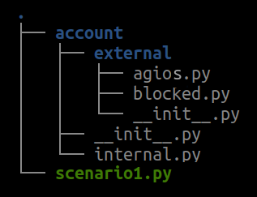
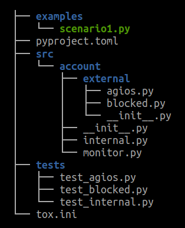
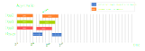

<!-- 
class: invert
paginate: true
footer: 'Advanced Python training – exercices and mini-projects – Yoan Mollard – CC-BY-NC-SA [🔗](https://advanced.python.training.aubrune.eu/)'
title: Exercises – Advanced Python training
author: 'Yoan Mollard'
image: https://www.python.org/static/favicon.ico
-->

<style>
    .hljs-string {
    color: #cd9067;
}
</style>


# **Python advanced training**, exercises

Yoan Mollard, for **Human Coders**

https://advanced.python.training.aubrune.eu/


---

#  List of mini-projects

1. [ WARMUP – The dataset generator](#3)
2. [Build a full package – Money transfer simulator](#4)
3. [Optimization – Bread-First Search in a graph](#23)
4. [Optimization – The code breaker](#27)
5. [Estimate π with Nilakantha](#31)
6. [Asynchronous programming – The chess master](#35)
7. [The Virus spread simulator](#40)


---
# Mini-project 1: WARMUP – The dataset generator
We will use Jupyter Lab in this mini-project.

1. Install Jupyter Lab with `pip install jupyterlab` in the virtual environment created in PyCharm (Tab *Terminal*).

2. Launch it by typing `jupyter lab` in the same terminal

3. Download [the notebook](https://github.com/ymollard/python-advanced-slides/raw/main/exercises/dataset.ipynb) in your PyCharm project's folder and check your browser again

If you cannot install it in short time, do not spend too much time, copy/paste cells in a regular PyCharm script from the [online notebook](https://github.com/ymollard/python-advanced-slides/blob/main/exercises/dataset.ipynb).


---
# Mini-project 2. Build a full package – Money transfer simulator

In this exercise we are going to create a simplified Information System that is able to handle and simulate bank transactions.

In our scenario there are 4 actors: a bank (HSBC), a supermarket (Walmart), and 2 individuals Alice and Bob.

Each actor has his/her own bank account.

---
## Part 1: The basic scenario

- 1.1. Create a class `BankAccount` that owns 2 attributes:
  - a private `owner` (of type `str`): the owner's name
  - a protected `balance` (of type `int`): the balance *(do not care about decimals)*
  - the class constructor takes in parameter, `owner` and `initial_balance` 

- 1.2. Implement a property with only a getter for the balance ; and a property having both a getter and a setter for the owner.

With your class it must be possible to execute the following scenario:
```python
bank = BankAccount("HSBC", 10000)
walmart = BankAccount("Walmart", 5000)
alice = BankAccount("Alice Worz", 500)
bob = BankAccount("Bob Müller", 100)
```

---
- 1.2. Implement the `__str__()` magic in class `BankAccount` to return a f-string stating the owner and current balance. Loop over all accounts to print them.

- 1.3. Implement these methods :
  - `_credit(value)` that credits the current account with the value passed in parameter. We will explain the goal of the initial underscore later.
  - `transfer_to(recipient, value)` that transfers the value passed in parameter to the recipient passed in parameter
  
- 1.4. Run the following scenario and check that end balances are right:
  - 1.4.1. Alice buys $100 of goods at Walmart
  - 1.4.2. Bob buys $100 of goods at Walmart
  - 1.4.3. Alice makes a donation of $100 to Bob
  - 1.4.4. Bob buys $200 at Walmart

---
## Part 2: The blocked account

Bob is currently overdrawn. To prevent this kind of situation, its customer adviser prefers to convert his account into a blocked account. This way, any purchase would be refused if Bob had not enough money.

- 2.1. Create the `InsufficientBalance` exception type inheriting from `ValueError`

- 2.2. Implement a class `BlockedBankAccount` so that:
  - the `BlockedBankAccount` inherits from `BankAccount`. Make sure you do not forget to call parent method with the `super()` keyword if necessary
  - the `transfer_to` methods overrides the parent method, with the only difference that it raises `InsufficientBalance` if the balance is not sufficiently provided to execute the transfer

---
- 2.3. Replace Bob's account by a blocked account and check that the previous scenario actually raises an exception

- 2.4. Protect the portion of code that looks coherent with `try..except` in order to catch the exception without interrupting the script

- 2.5. Explain the concept of protected method and the role of the underscore in front of the method name ; and why it is preferable that `_credit` is protected

---
## Part 3: The account with agios

In real life another kind of account exists: the account whose balance can actually be negative, but it that case the owner must pay agios to his(her) bank.

The proposed rule here is that, when an account is negative after an outgoing money transfer, each day will cost $1 to the owner until the next money credit.

To do so, we need to introduce **transaction dates** in our simulation.

---
- 3.1. Implement a class `AgiosBankAccount` so that:
  - the `AgiosBankAccount` inherits from `BankAccount`. Make sure you do not forget to call parent method with the `super()` keyword if necessary
  - the constructor of this account takes in parameter the account of the bank so that agios can be credited on their account.
  - the  `transfer_to` method overrides the parent method:
    - it takes the `transaction_date` in parameter, of type `datetime`
    (*also change the parent class and propagate the date when necessary*)
    - it records the time from which the balance becomes negative. You need an additional attribute for this.
  - the `_credit` method overrides the method from the parent class, with the only difference that it computes the agios to be payed to the bank and transfer the money to the bank. Round agios to integer values.

---
 - 3.2. Move the code computing the agios in a private method named `__check_for_agios`, explain the concept of private method and the role of the double underscore 
 - 3.3. Check your implementation with the previous scenario: After Bob has a negative balance, Alice makes him a transfer 5 days later: make sure that $5 of agios are payed by Bob to his bank.

---
## Part 4: The `account` package

We have just coded a very simple tool simulating transactions between bank accounts in Object-Oriented Programming.

In order to use it with a lot of other scenarii and actors, we are going to structure our code within a Python package.

We will organise our accounts with the following terminology:
- **bank-internal** accounts do not create agios and are not blocked, there are `BankAccount` and only banks can own such account
- **bank-external** accounts are for individuals or companies, they can be either blocked or agios accounts.

---
We would like to be able to import the classes from than manner:
```python
from account.external.agios import AgiosBankAccount
from account.external.blocked import BlockedBankAccount
from account.internal import BankAccount
```


- 4.1. Re-organize your code in order to create this hierarchy of empty `.py` files first as on the figure.
Create an empty script `scenario1.py`for the scenario.



---

- 4.2. Create a logger for each module: `agios.py`, `blocked.py`, `internal.py`. Make sure you log useful debug info in the next questions.

- 4.3. Move the class declaration of `AgiosBankAccount` in `agios.py`

- 4.4. Move the class declaration of `BlockedBankAccount` in `blocked.py`

- 4.5. Move the class declaration of `BankAccount` in `internal.py`


- 4.6. Move the scenario (i.e. the successive instanciation of all accounts of companies and individuals) in `scenario1.py`

---

- 4.7. Check each module and add missing relative import statements 
Relative imports start with `.` or `..`

- 4.8. Check each module and add missing absolute import statements such as `datetime`

⚠️ Import statements in the scenario must not be relative because `scenario1.py` will be located outside package `account`. 

- 4.9. Add empty `__init__.py` files to all directories of the package.

- 4.10. Execute the scenario and check that it leads to the same result as before this refactoring

---
## Part 5: Test your package with `pytest`

- 5.1. Install `pytest` with pip
- 5.2. Create independant test files `tests/<module>.py` for each module of your package
- 5.3. Add an entry in `sys.path` pointing to the parent folder of your package so that pytest is able to locate and import your `account` package (*)
- 5.4. With the documentation of [`pytest`](https://docs.pytest.org/), implement unit tests for your classes and run the tests with pytest 

(*) *Note: This workaround is not ideal since this path is different on each system, and the situation will be fixed once the package will be made installable in Part 6.*

---
## Part 6: Automate package building and testing with `tox`
### 6.1. Make your package installable

Refer to the doc about [package creation](https://packaging.python.org/tutorials/packaging-projects) and make your package installable. Move your code into a new `src/` directory as recommanded by the doc.

Create a dynamic metadata file `pyprojet.toml` and update its metadata (package name, author, dependencies if any).

Delete the `sys.path` workaround in test files since your package is now installable.

But do not try to run the tests now, since the package is not yet installed in your venv.

---

### 6.2. Install, configure and run `tox`
Refer to the [`tox` basic example](https://tox.wiki/en/latest/#basic-example). Create a basic `tox.ini` so that your package is built and tested against Python 3.10 + 3.9

Install and run tox in your project. Make sure all tests pass in both environments.

Re-organise your project structure as proposed in the figure. In Pycharm *File > Settings > Project > Project Structure*, identify `src` as a source folder so that the linter can identify your source files.



---
## Part 7: Distribute your package on TestPyPi
- 7.1. Refer to the doc about [package creation](https://packaging.python.org/en/latest/tutorials/packaging-projects/#creating-pyproject-toml) to create a minimal `pyproject.toml`
- 7.2. Name your package `accounts-<MYNAME>` and substitute your name
- 7.3. Install `build`, `wheel` and `twine`
- 7.4. Refer to the [doc](https://packaging.python.org/en/latest/tutorials/packaging-projects/#generating-distribution-archives) to build `sdist` and `bdist_wheel` distributions
- 7.5. Upload both distributions to TestPyPI using login `__token__`. For the password, ask for the token or create your own [TestPyPI account](https://test.pypi.org/account/register/) and new token.
- 7.6. Make sure you can install your package from the TestPyPI index via pip:
`pip install accounts-MYNAME --index-url https://test.pypi.org/simple/`


---
## Part 8: Implement extra features and distribute a new version on TestPyPI (Optional)

Questions 8.1, 8.2, 8.3 and 8.4 are independant from each other. Choose the most interesting ones for you and publish a new version of your package with question 8.5. 

### 8.1. Define an Abstract Base Class (ABC) for bank accounts

Since `BankAccount` is meant to be subclassed, a better design option would be to:
- Transform `BankAccount` as an ABC in module `account.abc`
- Implement the ABC with a concrete class `InternalBankAccount` for the internal use of banks in module `account.internal`

Refer to the [abc documentation](https://docs.python.org/3/library/abc.html) to implement and test this new design.

---

### 8.2. Write a decorator

In a new module `account.monitor`, implement a `@monitor` decorator for the `transfer_to` methods to print a warning if this user has never transferred an amount of money higher than `value` before.
    - Recall that it is possible to assign an attribute to a function
    - Recall that a decorator takes a function in input and returns a function 
    - Recall that decorators are not bound to class instances

### 8.3. Override magic methods
Implement the *magic method* `__add__(self, other)` so that accounts can be added if they share the same owner, resulting in a new account with the sum of balances.

---

### 8.4. Plot the balance history of all accounts

For each account, keep a record of the balance between each transaction and their associated date.

Install matplotlib in your venv and show a single graph at the end of the simulation with a plot for each account owner.

### 8.5. Publish a new version of your package

If you have implemented the plots, add a new dependency to `matplotlib` in the `install_requires` list of the `setup.py` metadada.

In `setup.py` set the version to `0.0.2`. Drop former distribution versions from `dist/` so that you do not upload them again.

Build and publish this new version on TestPyPI. 

---
# Mini-project 3: Optimization – Bread-First Search in a graph

> BFS browses a tree data structure. It starts at the tree root and visits all nodes at the present depth prior to moving on to the nodes at the next depth level. 


*From [Breadth-first_search, Wikipedia](https://en.wikipedia.org/wiki/Breadth-first_search)*.

📈 **Black** = visited ; **Grey** = queued to be visited later
ℹ️ BFS is known as *parcours en largeur* in French


---

Here is the general algorithm of the BFS in pseudocode:
```vb
Input:  A graph G, 
Input:  A root node where to start BFS
Output: VISITED, the list of all nodes in BFS order
```

```ada
 1  function BFS(G, ROOT) is
 2      let Q be a list
 3      let VISITED be a list 
 4      append ROOT at the end of VISITED
 5      append ROOT at the end of Q
 6      while Q is not empty do
 7          v := pop the first node of Q
 8          for all children (w) of node v in G, do
 9              if w is not in VISITED then
10                  append w at the end of VISITED
11                  append w at the end of Q
12      return VISITED
```

---
We have implemented [here](https://github.com/ymollard/python-advanced-slides/raw/main/exercises/naive_bfs.py) a naive implementation of the preceeding BFS pseudocode, where a graph is implemented as:
```python
G = { # dict representing the children of all nodes
  5 : [3, 7, 9], # 5 has 3 children: 3 7 and 9 
  3 : [2, 4, 10],
  7 : [8],
  2 : [],    # A node with an empty list is a leaf
  4 : [8, 9],
  8 : [],
  9 : [12, 11],
  10: [13, 10, 8, 9],
  11: [3, 7, 9],
  12: [],
  13: []}
```


---
**1.** : Use a graphical profiler to identify the culprints of this naive code:
- Install `snakeviz` with `pip`. Read the [documentation](https://jiffyclub.github.io/snakeviz/).
- Generate a profile for your naive implementation of BFS
- Find the 2 culprints

**2.**: Implement a new version `improved_bfs()` that fixes the performance issues that you spotted with the profiler. 

---

# Mini-project 4: Optimization – The code breaker
MD5 is a message-digest algorithm that is no longer considered safe since 2004 when a research team managed to provoke collisions with MD5.

However it is still widely used in various applications. A common pattern is the use of the MD5 digest of passwords to store them in databases.

In this project, you have extracted MD5 digests from websites accepting only alphabetical (digits excluded) characters of different lengths:

- `d0eedb799584d850fdd802fd3c27ae34` (length = 3)
- `9fcce10c03dc2eaada4c361c508c4ebe` on a website accepting (length = 4)
- `8b1a9953c4611296a827abf8c47804d7` (length = 5)

---
## Part 1: Use a profiler to identify where your code wastes time 

Download the script [`naive_code_breaker.py`](https://github.com/ymollard/python-advanced-slides/blob/main/exercises/naive_code_breaker.py) that breaks the MD5 sums hereabove (i.e. reverse the md5 function with hints such as the password characters and size). 

This script is highly unoptimized.

- Install `snakeviz` with `pip`. Read the [documentation](https://jiffyclub.github.io/snakeviz/).
- Generate a profile for the execution of the script and open it in snakeviz
- Where does you code spends most of the CPU time?

🚨 This script is HIGHLY unoptimized and may take long minutes to run with default arguments. Do not waste your time, run it on a lower password length at the beginning:

```bash
./naive_code_breaker.py --digest=d0eedb799584d850fdd802fd3c27ae34 --password-length=3
```

---
## Part 2: Code optimization

Now try to optimize this naive code. Use the results of the profiler to help.

There are at least 4 points of improvements.

Here are the orders of magnitude of execution duration you must reach:

```bash
code_breaker.py --digest=d0eedb799584d850fdd802fd3c27ae34 --password-length=3 (must take <100ms)
code_breaker.py --digest=9fcce10c03dc2eaada4c361c508c4ebe --password-length=4 (must take <10s)
code_breaker.py --digest=8b1a9953c4611296a827abf8c47804d7 --password-length=5 (must take <1000s)
code_breaker.py --digest=4d546c773867b86b4a233a7428c46c19 --password-length=6 (must take more!)
```
Do not use multiprocessing here, this is the next task, just optimize the function reversing the hash.

---
## Part 3 (Optional): Make it multiprocess

Make the code breaker multiprocess to break md5 hashs faster.

There is no additional help here.

**Note:** Brute force only is not the best approach when we deal with passwords. We should exploit the human weaknesses with a dictionary attack. But this is another topic.


---
# Mini-project 5. Estimate π with Nilakantha
## Part 1: Basic implementation
The Nilakantha method consists into computing `n` fractions from the formula:


Compute the estimation of π with `n=10000` using regular Python floats and compare digit-by-digit with a ground reference of 100 digits:
```python
3.1415926535897932384626433832795028841971693993751058209749445923078164062862089986280348253421170679
```
Increase the value of `n` and note the maximum number of digits you can achieve in reasonable time (30 seconds max).

---
## Part 2: Use the decimal module
We have touched the limits of the `float` precision.

Update your code so that you do not rely on `float` but on `Decimal` instead. 
Read the [documentation here](https://docs.python.org/3/library/decimal.html). Set the limit to 50 digits:

```python
from decimal import Decimal, getcontext
getcontext().prec = 50
```
They behave just like floats you can sum/multiply/divide them!

But be careful, do not mix `Decimal` with `float`, you would ruin the precision:

```python
Decimal(3) + Decimal(0.1415)    # DON'T! The float will ruin the precision
Decimal(3) + Decimal("0.1415")  # DO! str do not have precision loss
```

Note the max number of digits you can achieve in reasonable time (30 seconds max).

---
## Part 3: Use multiprocessing

**3.1.** Refactor you code so that a single function can compute a partial Nilakantha sum of `count=10000000` fractions each. Here is the general form:

```python
def get_partial_nilakantha(start_n: int, count: int) -> Decimal:
    """
    Computes a portion of the Nilakantha fractions:
    pi = 3 + fraction #1 + fraction #2 + ... + fraction #N

    :param start_n: Index of the first Nilakantha fraction (must be odd)
    :param count: Number of total fractions to be generated (must be odd)
    :return: the sum of the Nilakantha fractions between #start_n and #final_n

    ..warning: count and start id must be odd so that all partial sums are coherentlm
    """
```
---
**3.2.** Read the [documentation](https://docs.python.org/3.9/library/multiprocessing.html?highlight=multiprocess#module-multiprocessing) of the `multiprocessing` module to parrallelize the computation of 6 partial sums:

Each process will run `get_partial_nilakantha(start_n, count)` with:
- `process_id` going from `0` to `5` for 6 processes
- `start_n = 2*process_id*count+2`
- `count = 10000000`

First make sure you can open a single process and get the same result as before.

**3.3.** Add a [queue](https://docs.python.org/3.9/library/queue.html#queue.Queue) in parameter of the function run by processes so that they can each `put()` their result in.

**3.4.** Run your code with 6 processes and `count = 10000000`

Limit to 30s of computation max. What is the best number of digits you can achieve?

---
# Mini-project 6: Asynchronous programming – The chess master

In this mini-project, we will simulate **moves of chess** during a tournament in which a unique chess master faces many opponents by turns

We will simulate only the **timeslots for each move and each player**, but we will not simulate the pieces that they play nor their actual outcome.

In a tournament in general, many games are being played in parallel on many boards. The I/O resource that slows down the games here is the time allotted to think-and-play.

**Laws of the simulation:**
- A player (master or opponent) cannot think-n-play against several players at a time
- A player (master or opp.) cannot think-n-play if the other has not finished his move

---

## Part 1. Synchronous simulation
Create a synchronous version of the simulator in which only 1 single move can be played on a board at a time in the entire crowd of participants. Implement the following:
- A `Chessmaster` class with method `think_and_play(self, round: "Round", opponent: "Player")` that waits 1 sec to simulate the player's move
- A `Round` class with method `play(self, opponent_id: int)` that allows the player and then the master to think-and-play.
- A `Player` class with method `think_and_play(self, round: "Round", opponent: "Player")` that waits 5 secs to simulate the player's move
- A `Simulator` class with a single function `main()` being the entry point

Run a simulation between 3 players against the master, playing 2 rounds each.
Report the overall simulation time (*see figure next page*).

---


---

## Part 2. Asynchronous simulation
In the synchronous version IOs were waited for return every time but they can be optimized: several players can play their move on their board at a time, as long as the laws of the simulator here above are met. 

1. Transform relevant functions in `async` coroutines and await them. Start the event loop with `asyncio.run(entry_point)`. This first step is still a **sequential run**
2. Identify which coroutines will need to be concurrent in the final run.
3. Create tasks for the latter so that their are scheduled by the event loop, and await for their termination. This new step is a **full-concurrent run**
4. Choose the number and the different types of [synchonization primives](https://docs.python.org/3/library/asyncio-sync.html) that will enforce the simulation laws in any case, so that tasks wait the right time to run. 

Run the simulation with the same parameters (*see figure next page*).

---




---

# Mini-project 7: The Virus spread simulator

This project consists into simulating the evolution of people contaminated by a disease that spreads according to a simplistic exponential contamination model.

It relies on the `R0` variable: it describes the slope of the contamination:
- `R0 < 1` = In average, a person contaminates less than 1 person: The number of contamination dicreases
- `R0 > 1` = In average, a person contaminates more than 1 person: The number of contaminations increases

The goal is to simulate contamination scenarii and plot them as presented on the next figure, by using a Python iterator.

---


---
## Description of the model to implement
In our simplistic model:
- The R0 has discrete values for different periods:
  - a **value during migitation measures** (e.g. lockdowns ; low R0)
  - a **value during celebrations** (e.g. Christmas ; high R0)
  - a regular value for all other periods
- Time is measured in number of days from day 0, for a certain **simulation duration**
- Lockdown is triggered automatically when the number of contaminations goes beyond a **critical threshold**, causing the R0 to decrease.

**Bold values** are taken as parameters of the simulation.

---

## Part 1: Core of the simulator

1. Implement a class with a constructor accepting the parameters of the simu, e.g:
```python
s = ScenarioIterator(
    duration = 300,               # Days of simulation
    critical = 5000,              # Threshold for triggering lockdowns
    celebrations = [ 74, 75, 76,  # Individual dates of celebrations
                     210, 211, 450, 670,
                     710, 920 ], 
    r0 = {
        "high": 2,          # R0 applied for celebrations
        "lockdown": 0.9,    # R0 applied for lockdowns
        "regular": 1.2,     # R0 applied for all other cases
    }
)
```

---

1. Store the previous parameters as attributes, and also define the following:
- `self.current_date` that corresponds to the current date (from 0 to 300)
- `self.previous_num_cases` that corresponds to the previous number of cases (here, we need a number of 1, corresponding to the very first positive case)

2. Make this class an **iterator** by implementing:

- `__iter__()` returns `self` since the class instance itself is already an iterator

- `__next__()` must check if we have reached the last day of the simulation:
    - If **yes**, raise `StopIteration`
    - If **no**, update the relevant attributes and return an integer corresponding to the new number of cases =  `the_regular_r0 * previous_cases_number`

---

3. Create a new class `Scenario`. Make it an **iterable** by implementing `__iter__()` returning an instance of the previous iterator and `__len__()` returning its length.


4. Create a function `plot(iterable)` (**NOT** a class method), that accepts `iterable` in input and plots it. This function must:
   - Generate all values until the end of the iterator. For this, simply cast the iterator into a list, which which trigger the full generation
   - Store the list of simulated cases into `cases_history`
   - Import `pyplot`, call `pyplot.plot(xvalues, yvalues)` and `pyplot.show()`
   Refer to the [matplotlib documentation](https://matplotlib.org/stable/plot_types/basic/plot.html#sphx-glr-plot-types-basic-plot-py) if needed

5. Initialize an instance of `Scenario` and plot it using your `plot()` function.

**Outcome:** Now you must see an exponential curve in your plot.

---
## Part 2: Lockdown implementation

1. In `__next__()`, check if the cases has reached the critical threshold. If yes, substitute the regular R0 by the "lockdown" R0

2. Revert to the regular R0 when the number of cases is below the critical level again

**Outcome:** You should see an exponential curve ending in shaky oscillations around the critical threshold. This is what would happen if the lockdowns were released too fast.

3. Add an attribute counting the number of remaining lockdown days since it has been triggered. Change the behaviour so that lockdown is released only when `lockdown_duration` days have passed

**Outcome:** You should see 3 peaks of ascending and descending exponential curves.

---

## Part 3: Simulate a long period and split the plots

We will make sure that our iterator is able to generate an illimited number of values.

1. Increase the simulation duration to 950 days.
It stills works but we want to split the plot in several subplots of 300 days each

2. Overload operator `__getitem__(self, item)` that is called when you access an iterable slice `iterable[start:stop]`:
    - That operator must iterate between start and stop indices and return a new list in which elements are generated with function `next(iterator)`.
    - Make sure that you loose no simulated data in case of `StopIteration`
    - **Tip:** `item` is a `slice` instance that offers `item.start` and `item.stop`

---

3. In `plot()`, implement a loop that:
   - Defines a plot windows between day `start` and `stop`
   - Generates a slice of the iterable
   - Plots the corresponding slice
   - Breaks the loop if no more data is available 


**Outcome:** every time you close the plot window, the plot is refreshed with the next 300 values from the iterator


---

## Part 4: Celebrations (Optional)
In this mini-project, celebrations simulate a temporary decrease of the respect of mitigation measures, causing a temporary increase of the R0.

1. In `__next__()`, simply multiply the current R0 by `R0["high"]` if this day is present in the list of celebration days.

*NB: We use R0 multiplication instead of a substitution of the R0 so that the effect of mitigation measures are still visible but their impact is lowered due to the celebration.*

2. In `plot()`, draw a red vertical bar with `pyplot.plot()` for every celebration day

**Outcome**: You must see peaks of cases due to the celebrations. Severity of peaks is highly influenced by the severity of cases at the moment of the celebration.

---

## Part 5: Typing and protocols
We will improve the virus spread simulator with explicit type hints.

1. Start from the [solution of the Virus Spread simulator](https://raw.githubusercontent.com/ymollard/python-advanced-slides/main/solutions/virus_spread_simulation/intermediary_parts/simulator_v4_with_celebrations.py)
2. Add type hints to all:
   * Parameters of all functions and methods
   (you may need the `Iterator` type from `typing` module for iterators)
   * Class attributes
3. Pay attention to the results of the type checking of your IDE, or install/run `mypy` to launch type checking.
4. Identify **where** and **why** a type error exists.
5. Implement a protocol named `Plotable` for which `Scenario` is an implementation 
6. Make sure type checking now fully succeeds

