<!-- 
class: invert
paginate: true
footer: 'Advanced Python training – course – Yoan Mollard – CC-BY-NC-SA [🔗](https://advanced.python.training.aubrune.eu/)'
title: Course – Advanced Python training
author: 'Yoan Mollard'
image: https://www.python.org/static/favicon.ico
-->

<style>
    .hljs-string {
    color: #cd9067;
}
</style>


#  **Python advanced training**

Yoan Mollard, for **Human Coders**

https://advanced.python.training.aubrune.eu/


---

#  Schedule of DAY 1

1. [ ADVANCED PROGRAMMING TECHNIQUES](#6)
    1.1. [ Python typing](#7)
    1.2. [ Complexity and the `Big-O` notation](#17)
    1.3. [ Iterators & generators](#24)
2. [ CHARACTERISTICS AND PARADIGMS OF PYTHON](#29)
    2.1. [ Object-oriented programming (OOP)](#30)
    2.2. [ Metaclasses](#47)
    2.3. [ Functional programming](#52)
    2.4. [ Decorators](#57)
    2.5. [ Context manager: the `with` statement](#61)

---

#  Schedule of DAY 2

3. [ CODE WITH QUALITY](#63)
    3.1. [ Type annotations and docstrings](#67)
    3.3. [ Logging](#69)
    3.4. [ Virtual environments (venv)](#72)
    3.5. [ Python Enhancement Proposals (PEPs)](#81)
    3.5. [ Quality control tools](#81)
    3.6. [ Testing](#87)
4. [ PACKAGE AND DISTRIBUTE](#90)
    4.1. [ Reminders about Modules and packages](#90)
    4.2. [ The Python Package Index (PyPI)](#98)
    4.3. [ Package distribution](#103)
    4.4. [ Uploading your package distribution on PyPI](#107)


---

#  Schedule of DAY 3

5. [ OPTIMIZATION AND GOOD PRACTICES](#110)
    5.1. [ Kind reminder about complexities](#111)
    5.2. [ Refactor your code by keeping complexity in mind](#112)
    5.3. [ Profiling](#114)
    5.4. [ Alternative package managers](#115)
    5.5. [ Common design patterns](#116)
6. [ PARALLELIZE PYTHON APPLICATIONS](#123)
    6.1. [ Multithreading, multiprocessing and asynchronous IO](#124)
    6.2. [ Asynchronous code (Python coroutines)](#134)
7. [ ANNEXES / EXTRA-CURRICULAR TOPICS](#144)
    7.1. [ Python for datascience](#145)

---

#  List of mini-projects

1. [WARMUP – The dataset generator](/exercises.html#3)
2. [Build a full package – Money transfer simulator](#4)
3. [Optimization – Bread-First Search in a graph](#23)
4. [Optimization – The code breaker](#27)
5. [Estimate π with Nilakantha](#31)
6. [Asynchronous programming – The chess master](#35)
7. [The Virus spread simulator](#40)


---

#  DAY 1
# ADVANCED PROGRAMMING TECHNIQUES
(Including reminders)

---
## Python typing
Python typing is **dynamic** and inferred from the value.

🦆 Definition of **duck typing**: An object that has certain properties is treated independently of its actual runtime class. 

**Example**: As soon as methods `__next__` and `__iter__` exist in class `C`, then `C` is considered an iterable.

### Primitive types
```python
i = 9999999999999999999999999                   # Unbound integer
f = 1.0                                         # float
b = True                                        # bool
c = 1 + 1j                                      # complex
```
---
🚨 **Beware with floats**

Python's floats are IEEE754 floats with mathematically incorrect rounding precision:
```python
0.1 + 0.1 + 0.1 - 0.3 == 0    # This is False 😿
print(0.1 + 0.1 + 0.1 - 0.3)  # Returns 5.551115123125783e-17 but not 0
```
Also, they are not able to handle large differences of precisions:
```python
1e-10 + 1e10 == 1e10          # This is True 😿
```
When you deal with float number and if precision counts, use the decimal module!
```python
from decimal import Decimal
Decimal("1e-10") + Decimal("1e10") == Decimal("1e10")   # This is False 🎉
```

Beware not to initialize `Decimal` with float since the precision is already lost: `Decimal(0.1)` will show `Decimal('0.10000000000000000555111512312578270215')`

---

### Python collections (data containers)
Collections allow to store data in structures.

General purpose built-in containers are `dict`, `list`, `set`, and `tuple`. Other containers exist in module `collections`.

---
**Definition**: Some Python collections are said **mutable** because they can be updated and modified at any moment during runtime.

**Quizz**: Do you know which of these types are mutable and immutable: 
- `list`
- `dict`
- `tuple`
- `str`
- `bytes`

---
#### Mutable collections
##### The list

```python
l = ["The", "list", "type", "is", "central", "in", "Python"]
l = list(("Conversion", "tuple", "to", "list"))
l = list("Hello")
l = "".join(["H", "e", "l", "l", "o"])
l.append("element") # Append at the end (right side)
l.insert("a", 5)
l.pop()             # Remove from the end. pop(0) removes from the start
```

##### The dictionary (Order guaranteed since 3.7)
```python
d = {}
dict(zip(("article", "price", "stock"), ("Logitech M180", 99.90, 5)))
d.update({"foo": "bar"})
d.keys()     # dict_keys
d.values()   # dict_values
```


---
##### The double-ended queue (deque)
A deque is great to append or remove elements at both extremities:  
```python
from collections import deque
queue = deque(["Kylie", "Albert", "Josh"])
queue.appendleft("Anna")   # list.insert(0, "Anna") would be slow here: O(n)
queue.popleft()    # list.pop(0) would be slow here: O(n)
```
Deques perform great for `appendleft()` and `popleft()` while lists have poor performances for the equivalent operations `insert(0, value)` and `pop(0)`.

---
#### Immutable sequences
**Definition:** An **immutable** data structure can be assigned to values only once at creation, then it cannot mutate (cannot change).
##### The string
```python
s = "A string is immutable"
t = ("A", "tuple", "is", "immutable")
```
Example: put the first letter of these sequences in lower case:
```python
s[0] = "a"
# TypeError: 'str' object does not support item assignment

s = "a" + s[1:]

"".join(["a"] + list(s[1:]))
```

---
##### The tuple
The tuple is the Python type for an **array**.
```python
tuple1 = (42, -15, None, 5.0)
tuple2 = True, True, 42.5
```
It is also used during unpacking:
```python
a, b = b, a   # Value swapping
```
And this is the type used for returning several values in a function:
```python
def compute(a, b):
    return a+b, a-b, a*b, a/b

sum, difference, product, quotient = compute(5, 5)
sum, *other = compute(5, 5)
results = compute(5, 5)
```

---

##### The named tuple
Compared to a tuple, the named tuple can be accessed by keys.
Compared to a dict, the named tuple is immutable.

```python
from collections import namedtuple

# We declare a new type
HighScores = namedtuple("HighScores", ("name", "gender", "score"))
tiffany = HighScores(name="Tiffany", gender="f", score=900)               

tiffany.score
# Will return 900

tiffany.name
# Will return 'Tiffany'
```

---
### Subclassing existing types from `collections`

If you require a data structure than behaves like an existing one (`dict`, `list`, `strings`...) you may implement you own type by inheriting from existing classes.

In module `collections`, three types are made specifically for this purpose: `UserDict`, `UserString` and `UserList`.

```python
from collections import UserString

class UpperCaseString(UserString):
    def __init__(args):
        super().__init__(args)
        # Custom code for constructor of str here
    
    def __add__(self, other):
        # Custom re-implementation of other str methods here
        return self + other.upper()
```


---
## Complexity and the `Big-O` notation
In computer science, optimization consists into improving:
- **Time complexity**: the quantity of CPU/GPU cycles used by an operation
- **Space complexity**: the quantity of memory used by an operation 

Optimizing **time** often requires **more space** to solve the same problem.
Optimizing **space** often requires **more time** to solve the same problem.

The less complex an operation is in terms of time / space, the better it is optimized. 

According to the usecase, we may opt for the best optimization either in space or time.

An optimized program is **faster**, **greener** and **more economic**, since both time (CPUs and GPUs) and space (RAM, hard drives and networks) consume energy.

---
`Big-O` is a notation that helps measure complexity of programs in time and space.

It describes how greedy an operation is according the size of its input, in terms of time (CPU cycles) or space (Memory space). It is thus a function of the input size (`n`).

Examples:
- `O(n)` in time = for an input of size `n`, the operation requires `n` CPU cycles 
- `O(n*n)` in time = for an input of size `n`, the operation requires `n*n` CPU cycles

ℹ️ Here, *CPU cycle* and `n` do not refer to a precise quantity (e.g. bytes, assembly instructions, time in seconds...), only the order of magnitude is important.

ℹ️ Big-O usually measures complexity in **the worst case scenario**.


---
### Table of common `big-O` complexities
From best to worst performance:

|         Big-O complexity                |  Complexity Name   |  Example of time complexity with a list |
|:------------------------------------:|:------------------------:|:------------------------:|
| O(1)                        |   Constant  | Read value at index `[i]`
| O(n)               | Linear                         | A single `for i in range(n)` loop |
| O(2*n), O(3*n) ... | Linear                         | Several consecutive `for` loops |
| O(n.log(n)))        | Logarithmic | Sort list (with the quicksort method)
| O(n²), O(n³) ...                    | Polynomial       | `for` loops nested inside `for` loops |
| O(2ⁿ), O(10ⁿ) ...          | Exponential | Single `for i in range(k**n)` loop
| O(2^(2ⁿ))          | Superexponential  | Nested `for i in range(k**n)` loops

---
### Deal with complexity in practice
If you wish to optimize your program in time and/or space, check time or space the complexity of any:
- **data structure** that you are using
- **function** that you are using
- **algorithm** that you are using

The final complexity of your program depends of all of these.

**Conclusion**: If performance matters for your application, read the documentation about any data structure/function/algorithm that you are willing to use, and be careful about their behaviour and performance.

[🐍 Time complexity of Python structures](https://wiki.python.org/moin/TimeComplexity)

---

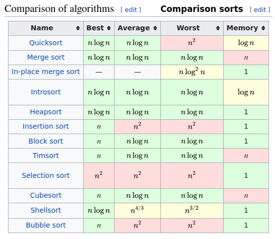


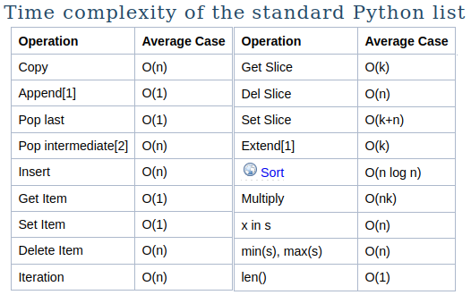

---

### Measure CPU time of instructions

`timeit` will run your instruction many times and give you average execution duration and statistics.

From an interactive interpreter with a *line-magic*:
```python
import math, numpy

%timeit math.sqrt(25)
# 63.7 ns ± 0.445 ns per loop (mean ± std. dev. of 7 runs, 10000000 loops each)

%timeit numpy.sqrt(25)   
# 788 ns ± 3.3 ns per loop (mean ± std. dev. of 7 runs, 1000000 loops each)

```
For magics dealing with cells instead of a single line, use `%%timeit`

---
From a Python module:
```python
from timeit import timeit
import math, numpy

print(timeit("math.sqrt(25)", globals=globals()))
print(timeit("numpy.sqrt(25)", globals=globals()))

```
🚨 timeit is a benchmarking tool, its results depend of your current CPU load

[🐍 Learn more about timeit](https://docs.python.org/3/library/timeit.html)

---

## Iterators & generators

An **iterable** is a data structure on which one can iterate over: list, tuple...

An **iterator** is an object that performs the actual iteration on an iterable.

Once an iterator has been consumed it cannot be rewound (but an iterable can)

`iter(l)` returns an iterator on iterable `l`

`next(i)` generates the next element of iterator `i`

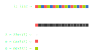

---

Duck typing considers that:
- objects with a `__iter__` method are **iterables**
- objects with a `__next__` method are **iterators**

```python
class DivisorsOfIntegerIterator:
    def __init__(self, n: int):
        self.__n = n
        self.__last_divisor_tested = n // 2 + 1

    def __iter__(self):    # This magic makes this class an iterable
        return self
    
    def __next__(self):    # This magic makes this class an iterator
        if self.__last_divisor_tested == 1:
            raise StopIteration("There is no more divisor")
        divisor = self.__last_divisor_tested - 1
        self.__last_divisor_tested = divisor
        return divisor if self.__n % divisor == 0 else next(self)
```
---
An iterable would then return a new iterator every time `__iter__()` is called,
causing the iteration to reset every time:
```python
class DivisorsOf:       # This is an iterable
    def __init__(self, n: int):
        self.n = n
    def __iter__(self): # __iter__ returns an iterator
        return DivisorsOfIntegerIterator(self.n)
```

```python
divisors = DivisorsOf(50)
for d in divisors:
    print(d, "is a divisor")
```

You can also get the iterator itself and iterate with manual calls to `next()`:
```python
it = iter(DivisorsOf(2))
print(next(it), "is the first divisor")  # 2 is the first divisor
print(next(it), "is the second divisor") # 1 is the second divisor
print(next(it), "is the third divisor")  # StopIteration: There is no more divisor
```


---
### The Generator
A **generator** is a specific type of iterator created via a function instead of a class:

```python
def divisors_of(n: int):
    for i in range(n // 2 + 1):
        if n % i == 0:
            yield i
```

Again, an iterable can be built out of the generator:
```python
class DivisorsOf: # This is an iterable
    def __init__(self, n: int):
        self.n = n

    def __iter__(self):              # __iter__ returns an iterator...
        for i in range(1, self.n // 2 + 1):  # ...or more precisely, a generator
            if self.n % i == 0:
                yield i
```

---

When you would you use **iterators** or **generators**:
- when the iterable is **infinite**
- when the **space** complexity would be too high with a regular list
- when the **time** complexity would be too high with a regular list
- when the list elements **are unknown** at the time the list is constructed
- when it would be adapted to generate the list elements **on demand**

e.g. declare an iterator of `(r, g, b)` color pattern for your outdoor lights
e.g. generate an iterator of HTML pages to be retrieved when network is available
e.g. generate an iterator of thousands of 100MiB images


The [🐍 itertools](https://docs.python.org/3/library/itertools.html) module contains tools to create efficient iterators

---
# CHARACTERISTICS AND PARADIGMS OF PYTHON
Python is multi-paradigm:
- **Imperative**: *instructions create state changes*
- **Object-oriented**: *instructions are grouped with their data in objects/classes*
- **Functional**: *instructions are math function evaluations*

All 3 paradigms are popular in the Python community, and often mixed all together, e.g:

```python
sentence = "How do you do?"
"".join(map(lambda x: x.capitalize(), sentence.split(" ")))

# Out[0]: 'How Do You Do?'
```
---
## Object-oriented programming (OOP)

Reminder of the class implementation syntax and inherence syntax
```python
class Apartment:
    def __init__(self, surface):
        self._surface = round(surface)
    
    def get_description(self):
        return "This flat has {}m²".format(self._surface)


class FurnishedApartment(Apartment):
    def __init__(self, surface, furniture=("bed", "sofa")):
        super().__init__(surface)
        self.furniture = list(furniture)

    def get_description(self):
        return "This flat of {}m² has: {}".format(self._surface, self.furniture)

FurnishedApartment(surface=50).get_description()    
```

---
### Virtual methods
In Python, all methods are virtual.

It means that when accessing a method e.g. `a.method()` the interpreter will first try to resolve that method in class `type(a)`, and if not present, in parent classes. 

### Polymorphism
**Generic definition**: Using heterogeneous data types in the same scope

```python
10 + 20.0
```

---
#### How does polymorphism apply to OOP?
- **ad-hoc**: same name from different classes
```python
["H", "e", "y"].index("e")
"Hey".index("y")
```
- **parametric**: same method with different parameter types (⚠️ overloading in Java)
```python
def f(var):
    return 42 if isinstance(var, int) else 4.2
```
- **inheritance**: method is inherited from a different (parent) type

```python
class MyUpperCaseStr(UserString): pass

isinstance(MyUpperCaseStr(), str) # True: mystr() is of type "str"

MyUpperCaseStr(1e3).split(".") # Methods & attributes inherited from the parent
# Out[0]: ['1000', '0']
```
---
### Reminder about public, protected and private scopes
*In C++, the scope of attributes or methods can be:*
- **private**: read and write access from methods of the same class only
- **protected**: read and write access from methods of the same class or its child classes only
- **public**: read and write access from methods of any class

Python has similar concepts but does not enforce them:
- **private** attributes or methods start with a double underscore
- **protected** attributes or methods start with an underscore
- otherwise they are **public**

---

```python
class Foo:
    def __init__(self):
        self.public = 0
        self._protected = 0
        self.__private = 0        # ⚠️ Name mangling applies here
```

Respect of protected attributes is not enforced but private ones rely on name mangling:

```python
class BankAccount:
     def __init__(self):
         self.__balance = 3000
         
class Client:
     def make_transaction(self, bank_account: "BankAccount"):
         bank_account.__balance += 1000
         
Client().make_transaction(BankAccount())
# AttributeError: 'BankAccount' object has no attribute '_Client__balance'
```

Name mangling applies to all private attributes and methods but magic methods.

---
### Class methods

While a regular method `f(self)` is an **instance method** because it applies to instance `self`, **class methods** apply to the class instead. 

Their first parameter is no longer the instance `self` but the class type `cls`:

```python
class Animal:
    @classmethod
    def define(cls):
        return "An " + str(cls) + " is an organism in the biological kingdom Animalia."
```

Thus it is possible to call the class method from the class or the instance:

```python
Animal.define()
Animal().define()
```

---
### Static methods
Unlike instance methods and class methods, static methods do not receive any implicit parameter such as `self` or `cls`:


```python
class Animal:
    @staticmethod
    def define():
        return "Animals are organisms in the biological kingdom Animalia."
```

They can be called on a class or an instance:

```python
Animal.define()
Animal().define()
```

💡 Class and static methods are close concepts, but use the first only if you need the class type in parameter.

---
### Properties, getters and setters


A Python **property** is an entity able to get, set or delete the attribute of an object

*Its C++ equivalent are getters and setters e.g. `car.getSpeed()` & `car.setSpeed(1.0)`*


Properties are useful to add code filters to public attributes
- **Example**: raise exceptions when attributes are set to inconsistent values
- **Example:** make sure that the `self.month` integer is between 1 and 12
- **Example** make an attribute read-only (with a getter but no setter)

---

Create a property with the `property()` function or the `@property` decorator

```python
property(fget=None, fset=None, fdel=None, doc=None)
```

Where:
- `fget` is a function to get the value of the attribute (the getter)
- `fset` is a function to set the value of the attribute (the setter)
- `fdel` is a function to delete the attribute
- `doc` is a docstring

---
```python
class Date:
    def __init__(self):
        self.__month = 0
    
    def get_month(self):
        if self.__month == 0:
            raise ValueError("This date has not been initialised")
        return self.__month

    def set_month(self, new_month: int):
        if not 1 <= new_month <= 12:
            raise ValueError("Month can only be set between 1 and 12")
        self.__month = new_month
    
    month = property(get_month, set_month, doc="The integer month (1-12) of this date")
```

```python
d = Date()
print(d.month)    # Will raise "This date has not been initialised"
d.month = 99      # Will raise "Month can only be set between 1 and 12"
```

---

Usually, properties are used as a decorator instead of a function:

```python
class Date:
    def __init__(self):
        self.__month = 0
    
    @property
    def month(self):
        if self.__month == 0:
            raise ValueError("This date has not been initialised")
        return self.__month

    @month.setter
    def month(self, new_month: int):
        if not 1 <= new_month <= 12:
            raise ValueError("Month can only be set between 1 and 12")
        self.__month = new_month
```

```python
d = Date()
print(d.month)    # Will raise "This date has not been initialised"
d.month = 99      # Will raise "Month can only be set between 1 and 12"
```

---

#### Magic methods
These method exist in any class with a default behaviour...unless you override them:

```python
appart1 + appart2: Appartement.__add__(self, other)    # Addition
appart1 * appart2: Appartement.__mul__(self, other)    # Multiplication
appart1 == appart2: Appartement.__eq__(self, other)    # Equality test
str(appart): Appartement.__str__(self)                 # Readable string
repr(appart): Appartement.__repr__(self)               # Unique string
```

But also... (thank you duck-typing):
```python
getattr(appart, "price"): Appartement.__getattr__(self, name)  # Get an attribute 
setattr(app, "price", 1): Appartement.__setattr__(self, n, v)  # Set an attribute
delattr(app, "price"): Appartement.__detattr__(self, name)     # Drop an attribute
```

---
These magic methods may alter the class type of an instance itself during runtime:
```python
In [1]: class Example: 
   ...:     def __init__(self): 
   ...:         self.some_attribute = 1 

In [2]: example=Example()

In [3]: example.some_attribute 
Out[3]: 1

In [4]: delattr(example, "some_attribute")

In [5]: example.some_attribute           
-------------------------------------------------------------------------
AttributeError: 'Example' object has no attribute 'some_attribute'

In [6]: type(example)  # The attribute no longer exists for this object...
Out[6]: Example        # ... but the type is still the same
```

---
### Reminder about class inheritance

All overriden methods are `virtual`: Methods of the child classes are resolved first.

```python
class Animal:
    def adopt(self):
        raise NotImplementedError("Sorry {} cannot be adopted".format(__class__))

class Cat(Animal):
    def adopt(self):
        print("Thank you for adopting a 🐱!")

class Fly(Animal):
    pass
```

```python
Cat().adopt()       # Thank you for adopting a 🐱!
Animal().adopt()    # Sorry class 'Animal' cannot be adopted
Fly().adopt()       # Sorry class 'Fly' cannot be adopted
```
This is how we implement `abstract` classes in Python, or class interfaces.


---
### Multiple inheritance: the basic case

[🐍 Learn more](https://docs.python.org/3/tutorial/classes.html#multiple-inheritance). Simple example: the tiger's taxonomy
```python
class Animal:
    def avglifetime(self):
        return 67

class Mammalia:
    def avglifetime(self):
        return 35

class Felidae:
    pass

class Tiger(Felidae, Mammalia, Animal):
    pass
```

```python
Tiger().avglifetime() # Returns 35: left-to-right resolution
```

---

### Multiple inheritance: the MRO
Now let's consider that Mamalia & Felidae are also Animal:
```python
class Animal:
    def avglifetime(self):
        return 67

class Mammalia(Animal):
    def avglifetime(self):
        return 35

class Felidae(Animal):
    def avglifetime(self):
        return 30

class Tiger(Animal, Mammalia):
    pass
```
There are now multiple paths for `Tiger.avglifetime()`

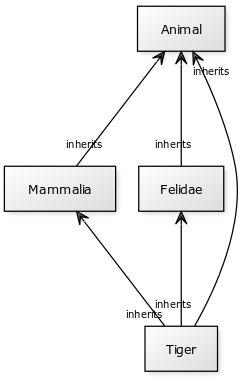


---
Python 3 uses the C3 linearization algorithm. Resolution order is in a class attribute:

```python
Tiger.mro()
# [__main__.Tiger, __main__.Felidae, __main__.Mammalia, __main__.Animal, object]
```
In some situations though, the MRO may be inconsistent:
```python
class Animal: pass

class Mammalia(Animal): pass
  
class Tiger(Animal, Mammalia): pass  # The superclass Animal is before Mammalia

# TypeError: Cannot create a consistent method resolution order (MRO)
#   for bases Animal, Mammalia
```
A consistent MRO requires to validate the following:
- All classes appear before their parents
- All classes keep the same parent class order than their `class` statement

---
## Metaclasses

A **metaclass** is to a **class** what a **class** is to an **object**.

A **metaclass** creates a **new class** at runtime.

```python
type(int)    # Returns "type" 
type(type)   # Returns "type" 🤯
```
Just like `int` is a child class of `type`, `type` is a child class `type` (a child of itself).

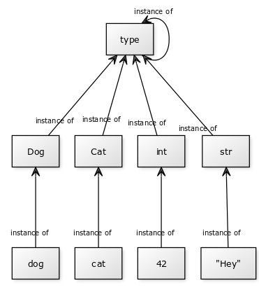

---

The role of a metaclass is to generate a class.
The type of the metaclass can be a class or a function.`type` is both.

Here is `type` as a function:

```python
NewClass = type(name, bases, methods)
# name = name of the new class
# bases = tuple of base classes, if any
# methods = dictionary of methods (keys = method names, values = functions)
```

Then we can define a new class at runtime:
```python
def init(self, petname):
    self.petname = petname

Dog = type("Dog", (), {"__init__": init})
cooper = Dog("Cooper")
```

---
Metaclasses can also be created by inheritance:

```python
animals = {
    "Dog": {"bark": lambda self: "WAF!"},
    "Cat": {"meow": lambda self: "MEOW"}
}

class ClassGenerator(type):
    def __new__(cls, name, bases, methods):
        return super().__new__(cls, name, bases, methods)


Dog = ClassGenerator("Dog", (), animals["Dog"])
Cat = ClassGenerator("Cat", (), animals["Cat"])

Dog().bark()    # WAF!
Cat().meow()    # MEOW!
```

---

Metaprogramming may also involve the `__new__` magic method to build an instance:
```python
class Fly:
    def __new__(cls):
        # __new__ is to construct an instance
    
    def __init__(self):
        # __init__ is to initialize this instance
```

**Example**: substitute the current class:

```python
class MyFilePathClass:
    def __new__(cls):
        cls = WindowsFilePathClass if os.name == 'nt' else UnixFilePathClass
        return cls.__new__(cls)
    
    def __init__(self, path: str):
        self.path = "./" + path
```

---

Some usecases of metaclasses:
- Class generation at runtime (e.g. from classes described in a configuration file)
- Class checking (e.g. check the existance of compulsory/forbidden methods or attributes)
- Class mutation (e.g. remove some existing methods when inheriting from another class)
- Class substitution (e.g. construct this object with another class)

⚠️ Use metaprogramming carefully. It makes the code difficult to read and the wished behaviour can often be reached without metaprogramming

---
## Functional programming

In functional programming your program is the result of the mathematical composition of several function calls that all take an input and return an output:

`f ∘ g ∘ h` or in Python `h(g(f(x)))`

In strict functional programming, no side effect is allowed, which means that even variable assignment is forbidden!

[🐍 Learn more](https://docs.python.org/3/howto/functional.html)

---

### Comprehensions
A **comprehension** is an inline notation to build a new sequence (list, dict, set).
Here is a **list-comprehension**:
```python
l = [i*i for i in range(10)]  # Select i*i for each i in the original "range" sequence
# Returns [0, 1, 4, 9, 16, 25, 36, 49, 64, 81]
```

You may optionally filter the selected values with an `if` statement:

```python
l = [i*i for i in range(100) if i*i % 10 == 0]  # Select values that are multiple of 10
# Returns [0, 100, 400, 900, 1600, 2500, 3600, 4900, 6400, 8100]

l = [(i, 2*i, 3*i) for i in range(5)] # Here we select tuples of integers:
# Returns [(0, 0, 0), (1, 2, 3), (2, 4, 6), (3, 6, 9), (4, 8, 12)]
```

Dict-comprehensions also work:
```python
d = {i: i*i for i in range(10)}
# Returns {0: 0, 1: 1, 2: 4, 3: 9, 4: 16, 5: 25, 6: 36, 7: 49, 8: 64, 9: 81}
```

---
### Lambda functions

A lambda function (aka unnamed function) is an inline function definition with no name.

```python
lambda x: x*x
```
This lambda is the function that takes `x` in input and returns `x*x` in output.

Like any other type, function can then be assigned to variables ... and called:
```python
squared = lambda x: x*x
type(squared)           # Returns "function"
squared(5)              # Returns 25
```

It is then equivalent to the regular function definition:
```python
def squared(x):
    return x*x
```
---
### Mapping

The `map()` function applies a function to every element from an iterable.

```python
map(f, l)

map(squared, [-5, 15, 10, -20])  # Returns [25, 225, 100, 400]
```

**Mapping example**: Get all hexadecimal notations of a list of integers
 
```python
hex(1024)          # Returns the hexadecimal notation of an integer (here "0x400")

map(hex, [2**x for x in range(5)])  # Returns ['0x1', '0x2', '0x4', '0x8', '0x10']
```

---
**Functional programming example**: capitalize each word
```python
sentence = "hello my friend"
```
How can we generate this string with each word capitalized? i.e. `"Hello My Friend"`?

```python
sentence.capitalize()   # returns "Hello my friend"

" ".join(map(lambda x: x.capitalize(), sentence.split(" "))
```
If we do not want to cheat with `str.capitalize()`:
```python
" ".join(map(lambda x: x[0].upper() + x[1:], sentence.split(" ")))
```
If we do not want to cheat with `str.upper()` (*only with ASCII lowercase strings*):
```python
" ".join(map(lambda x: chr(ord(x[0]) - 32) + x[1:], sentence.split(" ")))
```

---
## Decorators
The role of a decorator is to **alter** the behaviour of the function that follows with no need to modify the implementation to the function itself.

It can be seen as adding "options" to a function, in the form of a wrapper code.

```python
@decorator
def function():
    pass
```
In that case the call of `function()` will be equivalent to `decorator(function())`.

Decorators can take parameters in input, independant from parameters of the function.

[🐍 Learn more](https://docs.python.org/3/glossary.html#term-decorator)

---
**Example 1:** `@classmethod` is a decorator that passes the class type `cls` passed as the first parameter to the following function.

```python
class Animal:
    @classmethod
    def define(cls):
        return "An " + str(cls) + " is an organism in the biological kingdom Animalia."
```

---
**Example 2:** Web frameworks usually use decorators to associate a function e.g. `get_bookings_list()` to:
- an endpoint e.g. `/bookings/list`
- a HTTP method e.g. `GET`

Here is how Flask works:
```python
app = Flask()   # We create a web app

@app.route("/bookings/list", method="GET")
def get_bookings_list():
    return "<ul><li>Booking A</li><li>Booking B</li></ul>"
```

---
To define your own decorator, you need to write a function returning a function:
```python
from functools import wraps

def log_this(f):
    @wraps(f)
    def __wrapper_function(*args, **kwargs):
        print("Call with params", args, kwargs)
        f(*args, **kwargs)
    return __wrapper_function
```
```python
@log_this
def mean(a, b, round=False):
    m = (a + b)/2
    return int(m) if round else m
```

```python
mean(5, 15, round=True) # shows: Call with params (5, 15) {'round': True}
```

The [`functools` module](https://docs.python.org/3/library/functools.html) is a set of decorators intended to alter functions. 

---
## Context manager: the `with` statement

The keyword `with` is a context manager that protects a resource to make sure it is actually teared down after allocation in any case.

```python
f = open("file.json", "w")
f.write()
# PROCESSING WRITING [...] 
f.write()
f.close()
```

What if an exception occurs during the processing of the file? It wouldn't be closed.

The context manager ensures that the resource is automatically closed in any case:

```python
with open("file.json", "w") as f:
    f.write()
```

---
The standard library is compatible with context managers for files, locks, and synchronisation primitives. But you may also create your own:

```python
class ProtectedResource:
   def __enter__(self):
       print("The resource is being open")

   def __exit__(self, type, value, traceback):
       print("The resource is being closed, with or without exception")
```

```python
resource = ProtectedResource()
with resource:
    raise ValueError("Let's see if it works")

# The resource is being open
# The resource is being closed, with or without exception
# Traceback (most recent call last):
#  File "<input>", line 3, in <module>
# ValueError: Let's see if it works
```


<!--#####################################################################################################-->
---
#  DAY 2
# CODE WITH QUALITY

---
## Type annotations and docstrings

With [PEP484](https://www.python.org/dev/peps/pep-0484/), all function parameters, function outputs, variables and attributes can be typed:
```python
def sum(a: int, b: int) -> int:
    return a+b

my_value : int = sum(5, 5)   # OK: Type checking passes

s: bool = sum(5.0, 5)
# Linter warning: Expected "int", got "float" instead
# Linter warning: Expected "bool", got "int" instead
sum(5, 5).capitalize()
# Linter warning:  Unresolved attribute reference "capitalize" for "int"
```
Mistakes will NOT raise exception or prevent the interpreter from running the code in any way, only an (optional) type checker would notice.

---
To specify more complex annotations, import them from `typing`:
- `Any`: every type
- `Union[X, Y, Z]`: one among several types (e.g. `int`, `float` or `str`)
- `Callable[[X], Y]`: function that takes X in input and returns Y
- `Optional[X]`: either X or NoneType

```python
from typing import Union

def sum(a: Union[int, float], b: Union[int, float]) -> Union[int, float]:
    return a+b

sum(5.0, 5)
# Now this call is valid for the type checker
```

Data containers can also be fully typed, e.g. `list[list[int]]`, `dict[str: float]`


---

If you are referring to classes, use quotes with Python < 3.10:
```python
class Foo:
    def bar(self, foo:"Foo"):
        pass
```

Here is an example to limit accepted literals to only a subset:
```python
from typing import Literal

UInt3 = Literal[0, 1, 2, 3, 4, 5, 6, 7]

def accepts_only_uint3(x: UInt3) -> None:
    pass

accepts_only_uint3(10)
# Expected type Literal[0, 1, 2, 3, 4, 5, 6, 7], got Literal[10] instead
```

[🐍 Learn more about type annotations](https://docs.python.org/3/library/typing.html)

---

### Python docstrings

[PEP 257](https://www.python.org/dev/peps/pep-0257/) describes how RST documentation strings should be inserted in Python code:

```python
def is_same_sign_than_or_positive(a: Union[float, int], b: Optional[Union[float, int]] = None) -> bool:
    """
    Returns True if :
       * either both parameters are of the same sign or equal
       * or if the first parameter is positive, in case no second parameter is provided
    Returns False otherwise

    :Example:

    is_same_sign_than_or_positive(5, None)
    is_same_sign_than_or_positive(5.6, -5)
    is_same_sign_than_or_positive(-1.5)

    ..warning: if parameters are float, strict equality is not guaranteed

    :param a: First element to be compared
    :param b: Optional second element to be compared, or None
    :return: True if a and b have the same sign or equal, False otherwise
    """
    return a * b >= 0 if b is not None else a > 0
```

---
**What should have a docstring?**
Everything that is exported by a module:
- modules
- functions
- classes
- public methods (including the `__init__(self)` constructor)
- packages (via their `__init__.py`) 

Let your IDE (e.g. Pycharm) autocomplete the docstring syntax for you!


The docstring can be accessed with the magic `__doc__` (used by `help()`):
```python
print(is_same_sign_than_or_positive.__doc__)
```
---
## Logging
Python has a module dedicated to **logging**. It classes each log entry in levels of criticity: debug, info, warning, error and allows to filter them. [🐍 Learn more](https://docs.python.org/3/howto/logging.html)


```python
logging.debug('Debug message')  # Lowest priority
logging.info('Info message')    # Higher priority
```

```python
# Prefer the use of lazy evaluation
%timeit logging.info("%s", 42)
# 645 ns ± 43.1 ns per loop
%timeit logging.info(f"{42}")
# 787 ns ± 51.1 ns per loop
%timeit logging.info("{}".format(42))
# 876 ns ± 54.9 ns per loop
```

---

The **logging** library uses  modular approach to organize logs in a big app. Usually every module has its own logger named as itself:

```python
logger = logging.getLogger(__name__)
# foo/bar.py will be named "foo.bar"
```

Hierarchy of module allows to propagate messages

When a message is posted to logger L:

1. L decides whether to handle the event based on the level/filters
2. Handlers of L get notified and react if their own level/filter match
3. L's parent is notified, if appropriate

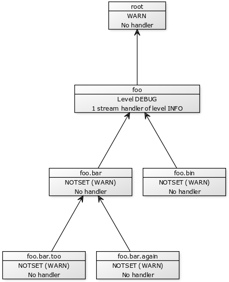

---
**Example**: activate a stream handler for level DEBUG
```python
h = logging.StreamHandler()
h.setLevel("DEBUG")

l = logging.getLogger("mymodule.submodule.subsubmodule")
l.setLevel("DEBUG")

l.addHandler(h)
```
Both the logger and the handler(s) must accept the level so that the message is printed

The simple config is a quick way to activate a stream handler for all loggers. But the output will be fussy since logs from **all** modules will be printed (including your imports):  

```python
logging.basicConfig(stream=sys.stderr, level=logging.DEBUG)
```
```python
logging.basicConfig(filename='app.log', level=logging.INFO)
```

---
## Virtual environments (venv)

**Context:** All installed packages go into the `site-packages` directory of the interpreter.

> The venv module provides support for creating lightweight “virtual environments” with their own site directories, optionally isolated from system site directories.

> Each virtual environment has its own Python binary (which matches the version of the binary that was used to create this environment) and can have its own independent set of installed Python packages in its site directories.

[🐍 Learn more](https://docs.python.org/3/library/venv.html)

---
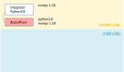

---
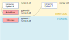

---
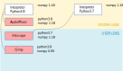

---
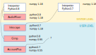

---
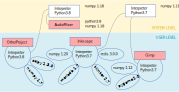

---
For each new project you create/clone, create it its own dedicated virtual environment:
```bash
/usr/bin/python3.7 -m venv dev/Training2022/venv
```

Then, every time you work on this project, activate its environment first:
```bash
source Training2022/venv/bin/activate
```

Your terminal must prefix the prompt with the name of the env:
```bash
(venv) yoan@humancoders ~/dev/Training2022 $
```
And quit the venv every time you stop working on the project:
```bash
(venv) yoan@humancoders ~/dev/Training2022 $ deactivate
yoan@humancoders ~/dev/Training2022 $ 
```

---
In an activated venv, every call to the interpreter and every package installation will target the isolated virtual environment:

```bash
(venv) yoan@humancoders ~/dev/Training2022 $ python
```
will run the Python version targeted by the venv

```bash
(venv) yoan@humancoders ~/dev/Training2022 $ pip install numpy
```
will install the latest numpy version into the venv

```bash
(venv) yoan@humancoders ~/dev/Training2022 $ pip install numpy==1.21.0
```
will install the specific numpy version into the venv

---
In practice, your IDE can handle venv creation, activation and deactivation automatically for you when you create or open/close a project.

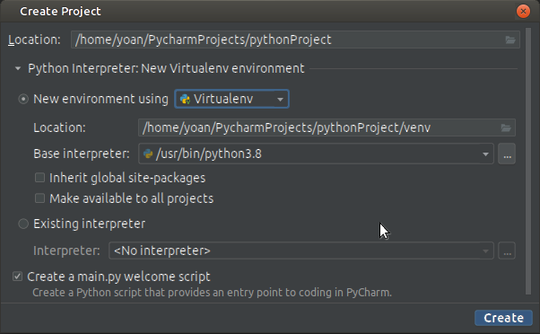

---

## Python Enhancement Proposals (PEPs)
The [PEPs](https://www.python.org/dev/peps/pep-0008/) rule the Python language. In their lifetime the PEPs are proposed, debated, rejected/accepted and implemented.

They are usually not very user-friendly but allow to understand some implementation choices and the implementation of the interpreter.

[PEP 484](https://www.python.org/dev/peps/pep-0484/) is about type hints, [PEP 257](https://www.python.org/dev/peps/pep-0257/) about RST docstrings ...

---
In particular, the [PEP 8](https://www.python.org/dev/peps/pep-0008/) is the style guide for Python code.

PEP8 codes start with E (Errors) or W (Warnings)

|   Types   |     Category     ||   Types   |     Category     |
|:---------:|:----------------:|-|:---------:|:----------------:|
| 100       | Indentation              || 500       | Line lengths             |   
| 200       | Whitespaces              || 600       | Deprecation              |   
| 300       | Blank lines              || 700       | Statements               |   
| 400       | imports                  || 900       | Syntax                   |

Most IDEs embed linters that emit warnings if you do not respect rules from the PEP 8.

Linters can usually be configured to change their behaviour (e.g. max line length).

---
## Quality control tools

### [Pyflakes](pyflakes), the semantic analyser
Pyflakes only focuses on the semantics (what your code stands for) but is not concerned about style.

```python
import logging
variable = inexisting_variable
```

```
./main.py:2: 'logging' imported but unused
./main.py:3: undefined name 'inexisting_variable'
```

Pyflakes and all linters presented here can be installed and invoked the same way:
```bash
pip install pyflakes
pyflakes mymodule.py
```

---
### Flake8
Flake8 = PEP 8 + Pyflakes (syntax + semantic analysis)

```python
import numpy

def f():
    print("Hello world!")
```

```
main.py:1:1: F401 'numpy' imported but unused              # Semantic
main.py:3:1: E302 expected 2 blank lines, found 1          # Style
```

---

### Pytype, the typing checker for untyped code
Pytype infers types of your code and performs a static check.

```python
def f(i):
    return i + 1

f(None)
```
```bash
FAILED: No attribute '__add__' on 'i: None' or '__radd__' on '1: int'
```

---

### Mypy, the static typing checker for annotated code
Mypy performs type checking on annotated code.

```python
def talk(i: int) -> None:
    print(f"There are {i} potatoes in the bucket")

talk([1, 2, 3])
```

```bash
error: Argument 1 to "talk" has incompatible type "List[int]"; expected "int"
```

---
## Testing
- Packages `pytest`, `unittest` or `tox` are frequently used to test Python apps
- `unittest` relies on the regular test framework:
  - **Setup**: Prepare every prerequisite for the test
  - **Call**: call the tested function with input parameters setuped before
  - **Assertion**: an assert is a ground truth that must be true
  - **Tear down**: Cleanup everything that has been created for this test
- `pytest` is a light test framework
- On top of these, `tox` allows to run tests in multiple environments (e.g. Python versions)

---

Test files are often placed in a `tests/` directory, file names are prefixed with `test_*.py` and test function names are also prefixed with `test_`

```bash
pyproject.toml
mypkg/
    __init__.py
    app.py
    view.py
tests/
    test_app.py
    test_view.py
    ...
```
Naming tests according to these conventions will allow auto-discovery of tests by the test tool: it will go through all directories and subdirectories looking for tests to execute.

---

```python
# water_tank.py
class WaterTank:
    def __init__(self):
        self.level = 10
    def pour_into(self, recipient_tank: "WaterTank", quantity: int):
        self.level -= quantity
        recipient_tank.level += quantity
```

```python
# test_water_tank.py
from water_tank import WaterTank
def test_water_transfer():
    a = WaterTank()
    b = WaterTank()
    a.pour_into(b, 6)
    assert a.level == 4 and b.level == 16 
```
Then just type `pytest` and the test report will be printed in the terminal!

```
============ 1 test passed in 0.01s ============
```

---
# PACKAGE AND DISTRIBUTE
## Reminders about Modules and packages

A **module** is a Python file, e.g. `mymodule.py`. The module name is `mymodule`

Either the module is made to be:
- imported: it is a **package**: `import mymodule`
- executed: it is a **script**: `python mymodule.py`

A package can also be a folder containing modules and sub-packages.

---
### Shebangs of Python scripts

On UNIX OSes (UNIX, Linux, MacOS), a `shebang` is a header of a Python script that tells the system shell which interpreter is to be called to execute this Python module.

Usually, we invoke the `env` command to tell which is the interpreter for `python3` with such header:

```python
#!/usr/bin/env python3
```

Direct call to the interpreter is possible but NOT recommended, since it will force the interpreter bby ignoring any virtual environment you could be in:
```python
#!/usr/local/bin/python3
```

The Windows shell ignore shebangs.

---
### Structure of Python packages

All packages and sub-packages must contain an `__init__.py` file each

In general `__init__.py` is empty but may contain code to be executed at import time

The package's hierarchy is inherited from the files-and-folders hierarchy.

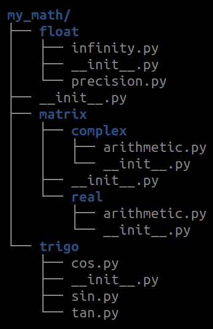

---

Module names use the dotted notation:

```python
import my_math.matrix.complex.arithmetic

print(my_math.matrix.complex.arithmetic.__name__)
# my_math.matrix.complex.arithmetic

print(my_math.matrix.complex.arithmetic.__file__)
# /usr/[...]/my_math/matrix/comple/arithmetic.py
```
```python
from my_math.matrix.complex import arithmetic
# Also works: loads arithmetic in the global scope
```
```python
from my_math.matrix.complex.arithmetic import product
# Also works: loads a single function from the module
```


---
Optionally, a (sub-)package can by "executed" from command-line with the `-m` option:
```bash
python -m my_math.float
```
only if a module `__main__.py` has been placed at the root of the sub-package.

Then, executing the sub-package consists into running code in `__main__.py`

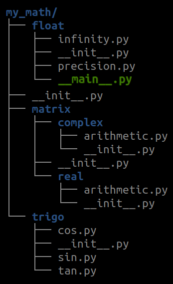

---

### Relative imports (Imports internal to a package)
Relative import from the same folder:
```python
from .my_math import my_sqrt
value = my_sqrt(25)
```

Relative import from a parent folder:
```python
from ..my_math import my_sqrt
value = my_sqrt(25)
```

- Do not put any slash such as ~~`import ../my_math`~~
- Only current and parent folders can be retrieved with a relative import

Relative imports are forbidden when run from a module **outside** a package.

---

### Choose the exported resources

By default, Python will export all resources (classes, constants, instances...) if they do not start with a `_`.

An user of your package will only "see" exported names. i.e. both autocompletion and `from yourpackage import *` will only concern exported names.

If it is required to limit the exported names to only some resources you can use the magic `__all__`:

```python
__all__ = ["Class1", "Class2", "Class3"]
```

---

### The `sys.path` variable

When importing a package with the `import` statement, the interpreter seeks for it in `sys.path`. 

This is a regular Python list and it can be modified at runtime (with `append`) to add paths to your libraries.

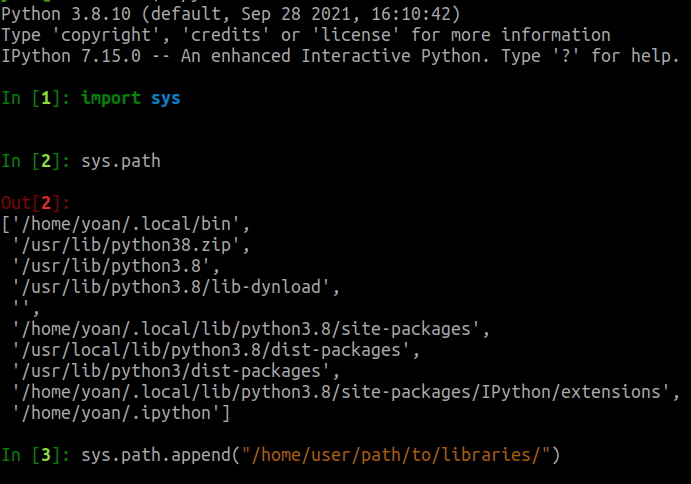


---
## The Python Package Index (PyPI)
**PyPI** is a global server that allows to find, install and share Python packages.

It is operated by the **Python Packaging Authority (PyPA)**: a working group from the **Python Software Foundation (PSF)**.

The command-line tool **Package Installer for Python (pip)** can be used to install packages by their name, e.g. `bottle`. It can install from various sources (Link to code repos, ZIP file, local server...) and automatically seeks on PyPI if no source is given:

```bash
pip install git+https://gitlab.com/bottlepy/bottle
pip install https://gitlab.com/bottlepy/bottle/archive/refs/heads/master.zip
pip install path/to/my/python/package/folder/
pip install path/to/my/python/package/zip/file.zip
pip install numpy    # Will seek on PyPI
```

---

Pip installs packages in the current Python installation's `site-packages` directory which is, depending the situation:
1. Inside your virtual environment if some venv is activated
2. Inside your local home directory `/home/<user>/.local/lib` if you cannot write to system directories (i.e. you are not root)
3. Inside system's directories such as `/usr/lib/python3.8/` if you are root (🚨 This is dangerous and not advisable in general)

---
### PyPI Security warning 🚨
[PyPI packages caught stealing credit card numbers & Discord tokens](https://www.bleepingcomputer.com/news/security/pypi-packages-caught-stealing-credit-card-numbers-discord-tokens/)


---
### Perform sanity checks before installing a package

- Is the package still maintained **and** documented?
```
Last update: November, 2017
```
- Does the developer consider bugs and improvements?
```
# of solved Gitlab issues
```
- Is the package developer reliable?
```
Moral entity or individual, which company, experience...
```
- If not opensource, is the development of this package likely to continue?
```
# of opensource users, # of clients, company financial health if not opensource, ...
```

---
### PyPI Typosquatting warning 🚨

```python
pip install -r requirements.txt
# 🚨 pip install requirements.txt

pip install rabbitmq
# 🚨 pip install rabitmq

pip install matplotlib
# 🚨 pip install matploltib
```

---
## Package distribution
`setuptools` simplifies the package distribution. [🐍 Learn more](https://setuptools.readthedocs.io/en/latest/setuptools.html)

You need a  `pyproject.toml` file (or `setup.cfg`) that tells:
- The package name and version number
- The list of deps on other packages from PyPI, git repos, ...
- The entry points (executables, commands, ...)
- How to build the package (using `hatching`, `setuptools`...)


`setuptools` replaces the legacy `distutils` deprecated in 3.10.

The `setup.py` dynamic file is now discouraged in place of `pyproject.toml` but is still used in many projects.


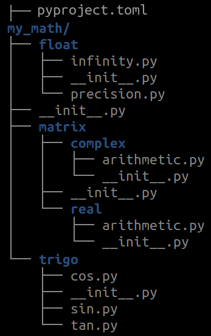

---

```toml
# pyproject.toml example file

[build-system]
requires = ["setuptools"]
build-backend = "setuptools.build_meta"

[project]
name = "my_package"
description = "My package description"
readme = "README.rst"
requires-python = ">=3.7"
license = {text = "BSD 3-Clause License"}
classifiers = [
    "Framework :: Django",
    "Programming Language :: Python :: 3",
]
dependencies = [
    "requests",
]

[project.scripts]
my-script = "my_package.module:function"
```

---
The TOML file then offers distribution tools:
- Install the package in the current environement:
```bash
pip install .
```

- Build distribution:
  - sdist : Source distribution
  - bdist_wheel : Binary distribution 

```bash
pip install build  # The latest recommended build tool by PyPA
python3 -m build   # Will build both a sdist and bdist

-rw-rw-r-- 1 16699  nov.  12 00:00 hampy-1.4.2-py3-none-any.whl
-rw-rw-r-- 1 326913 nov.  12 00:00 hampy-1.4.2.tar.gz
```
[🐍 Learn more about package distribution: PyPA docs](https://packaging.python.org/tutorials/packaging-projects/)

---

### Remarks about binary distribution bdist_*
- Binary format at platform-dependant (OS, arch, Python implementation and ABI)
- `.egg` files are just zip files containing sdist or bdist, you can unzip them
- Several binary formats exist: wheel, egg... As of 2021, `wheel` format is preferred
- wheel files are named this way: `my_math-3.0.4-py3-none-any.whl` where:
  - `my_math` is your package name
  - `3.0.4` is your package version
  - `py3` is the Python implementation tag
  - `none` is the ABI tag ([the C API for Python](https://docs.python.org/3/c-api/stable.html))
  - `any` is the platform (x86_64, arm, macos...)


 [🐍 Learn more about package distribution: Python docs](https://docs.python.org/fr/3/distributing/index.html)

---
## Uploading your package distribution on PyPI
Once sdist and/or bdist are available, several pipelines exist to share your project.

As of 2021, uploading to PyPI with `twine` is the preferred option:
1. Create an account on [PyPI](https://pypi.org/account/register/) or in the sandbox [TestPyPI](https://test.pypi.org/account/register/) if you're just testing
2. ` pip install twine`
3. `twine upload dist/* --repository testpypi`
   - Drop the `--repository` argument if you want to upload to the regular pypi
   - `--repository` can also target your company's own pypi server [Learn more](https://packaging.python.org/guides/hosting-your-own-index/)

---

### Optional: use `poetry` to handle dependencies
`poetry` is a package manager for Python such as `pip` or `conda`, with the following benefits:
- Populates dependencies automatically according to your source code
- Keep track of the version of dependencies in `poetry.lock`
- Generates a `pyproject.toml` for you
- Interacts with a prompt
- Embeds a venv manager with dev and prod

[🐍 Poetry doc](https://python-poetry.org/docs/)

---
### Deploy Python package with Continuous Integration (GitLab CI + gitops)

This example pipeline for GitLab CI will run the unit tests (from tox) and upload the new version on PyPI, every time a new tag is pushed to git.
```yaml
pypi:
    image: python:3.11
    stage: release
    script:
        - pip install -U tox build twine
        - tox
        - python -m build
        - twine upload dist/*
    only:
        - tags

```
This pipeline requires `TWINE_PASSWORD` tobe set to the right PyPI API key.

<!--#####################################################################################################-->
---
#  DAY 3
# OPTIMIZATION AND GOOD PRACTICES
<!--#####################################################################################################-->

---
## Kind reminder about complexities

Check the complexity of your code:

- [🐍 Time complexity of Python structures](https://wiki.python.org/moin/TimeComplexity)

- [🐍 Time complexity of sorting algorithms](https://en.wikipedia.org/wiki/Sorting_algorithm#Comparison_of_algorithms)


---

## Refactor your code by keeping complexity in mind

If you wish to optimize your program in time and/or space, check time or space the complexity of any:
- **data structure** that you are using
- **function** that you are using
- **algorithm** that you are using

The final complexity of your program depends of all of these.

---
ℹ️ Complexity is not the only metric to look at when you optimize your program. You may also want to:
- Increase code coverage: how much of your code that is actually run [🐍 Learn more](https://wiki.python.org/moin/CodeCoverage)
- Identify slow/heavy operations with a profiler [🐍 Learn more](https://docs.python.org/3/library/profile.html)
- Use state-of-the-art algorithms instead of custom ones e.g. scipy, numpy...
- Refactor your code: prevent multiple computations of the same value, ... 
- Optimize the infrastructure: use caching in the database, web server, change hard drive for a SSD...
- Use another Python env in production: Pypy and Extensions compiled with Cython (.pyx) are powerful alternatives (most popular Python interpreter is CPython)

---
## Profiling

**Profiling** measures time complexity of programs, in terms of CPU time spent in each function and number of function calls.

A profiler usually returns a table of each function call during execution, with:

- `ncalls`: the number of calls of this function
- `tottime`: the total time spent in the internal body of the function only
- `cumtime`: the total time spent in the function + all functions that this function called

If a function does not call any other then `tottime=cumtime`. Some tools draw profiles:


---

## Alternative package managers
Not happy with PyPI and pip? Here are other ones:
- `anaconda`: 
   - `conda` package manager +
   - many datascience libraries +
   - Python interpreter
   Also useful if you also deal with non-Python dependencies. 
   Compatible with Ruby, Java, JS, C/ C++, FORTRAN, ...
- `miniconda`: Minimal `conda` + Python interpreter
- `mamba`: Ultrafast `conda` reimplementation in C++
- `micromamba`: ...

The bad news is that package managers are not compatible with each other.

---
## Common design patterns

**Design patterns** are patterns of code solving common software problems be reused in any object-oriented programming language.

They were introduced in 1994 for C++ language by [Gamma et al](https://www.eyrie.org/~eagle/reviews/books/0-201-63361-2.html).


A few patterns are presented here.

---
### The factory 

A **factory** is a function that builds a class instance with the right type and parameters:

```python
class Animal:
    def __init__(self, type:str, vocalization:str):
        self._type = type
        self._vocalization = vocalization
    
    @classmethod
    def make_dog(cls):
        return cls("dog", "bark")
```

```python
class Fox: pass

class Duck: pass

def make_animal(animal: str):
    return Fox() if animal == "fox" else Duck()
```

---
### The singleton

A **singleton** is a class that must have only one instance.

```python
class USBJoystickController:
    __controller : "USBJoystickController" = None

    @staticmethod
    def get_controller():
        if USBJoystickController.__controller is None:
            USBJoystickController()
        return USBJoystickController.__controller

    def __init__(self):
        if USBJoystickController.__controller is not None:
            raise ValueError("Singleton already existing, use get_controller()")
        USBJoystickController.__controller = self
```

---
### The Interface / Abstract Base Class

The **Interface** class describes the structure & semantics that classes must comply with. 

We say that a class **implements** an interface. Interfaces are usually named *xxxxx-able*.

* the `Car` class may implement interfaces `Movable` and `Drivable`.
* the `Bird` class may implement interfaces `Movable` and `Cryable`.

Classes implementing `Movable` must define a method to **move** them e.g. `car_or_bird.move_to(self, x: float, y: float, z: float)`

Classes implementing `Drivable` must define a method to associate a **driver** e.g. `car.set_driver(self, d: Driver)`.

Classes implementing `Cryable` must define a method to make the animal **cry** e.g. `bird.cry(self)`

---
In Python, an **Abstract Base Class** is the closest concept to create an interface.

```python
from abc import ABC, abstractmethod   # This is the Abstract Base Class module

class Cryable(ABC):
    @abstractmethod
    def cry(self):
        raise NotImplementedError("cry() must be overriden")

class Dog(Cryable): # Inheriting from the ABC means that Dog implements the ABC
    def cry(self):
        print("WAF!")

class Cat(Cryable): pass   # This class does not comply with the ABC
```
Here, `cry()` must be overriden in subclasses or `TypeError` is raised at instanciation. At runtime, calling `super().cry()` raises `NotImplementedError`.

---

If you are dealing with types for which you do not own the implementation (e.g. `tuple` or `list`) you can still state that it complies with your ABC by registering it explicitely:

```python
MyABC.register(tuple)
MyABC.register(list)

def f(p: MyABC): pass # list and tuple are valid for p because registered
```

Registering an ABC not only forces registered classes to comply with:
- the **structure** of the ABC (e.g. method `cry()` exist)
- the **semantics** of the ABC, described in the ABC's documentation

**Drawback**: Explicit registering or inheritence is somehow unpythonic since **duck typing** is usually sufficient to decide if a class is accepted or not.

---
#### Protocols: duck typing for static type checking

Protocols fulfill the same need without need of an explicit registration or subclassing.


```python
from typing import Protocol

class Cryable(Protocol):
    vocalization: str
    def cry(self):
        raise NotImplementedError("cry() must be overriden")
```
```python
class Cat:  # No need to subclass Cryable here
    def __init__(self):
        self.vocalization = "meow" 
    def cry(self):
        pass
```
```python
animal: Cryable = Cat() # Cat instance is accepted bcz Cat implements Cryable
```
A protocol has benefits for static type checking. At runtime it just acts as an ABC.

---

# PARALLELIZE PYTHON APPLICATIONS

---
## Multithreading, multiprocessing and asynchronous IO
**Definitions**:

- **Multithreading**: Split work into several threads within the same process and CPU.
- **Multiprocessing**: Split work into several processes dispatched to several CPUs.
- **Asynchronous tasks**: Release the CPU and yield to another task when an IO is needed (e.g. network or hard disk response) 

---

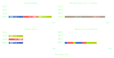

---
### The bottleneck of Python Multithreading: the reference counter
The interpreter holds a counter counting how many references point to a literal.

```ipython
In [1]: s = "Hello world!" 

In [2]: sys.getrefcount(s)
Out[2]: 2

In [3]: s2 = s             

In [4]: sys.getrefcount(s)
Out[4]: 3

In [5]: del s2             

In [6]: sys.getrefcount(s)
Out[6]: 2
```
If the counter reaches 0, the literal is destroyed. This is how Python frees memory.

---
### The Python Global Interpreter Lock (GIL)
The GIL is a mutex that protects access to the reference counters of Python objects.

However it prevents multiple threads from executing Python bytecodes at once. It offers poor performance for multi-threaded programs, if they are CPU-bound.

Several implementations of the Python interpreter exist, for instance:
- CPython (By far the most popular)
- Jython
- IronPython
- PyPy

Only some of them "suffer" from the GIL. If it is an issue, use another implementation.
[The GIL is a regular debate within the Python community](https://wiki.python.org/moin/GlobalInterpreterLock)

---
Because of the GIL, multiprocessing is way more efficient that multithreading.

But also harder to deal with since processes are insulated in their own memory spaces. Solutions exist:
- Use stdin and stdout from the [`subprocess`](https://docs.python.org/fr/3.8/library/subprocess.html) library (call a binary and read/write std in/out)
- Use queues and pipes from the [`multiprocessing`](https://docs.python.org/3.7/library/multiprocessing.html) library (Python only)
- Use network messaging libraries [`zmq`](https://zeromq.org/), [`rabbitmq`](https://www.rabbitmq.com/), [`redis`](https://redis.io/)... (language-agnostic)

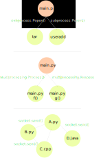

---
When to use these libs?
- **`subprocess`**: call a system command (e.g. `traceroute`, `tar`, `useradd`...) or an existing executable whose code cannot be changed, from a Python module.
- **`multiprocessing`**: split a Python-only program from which you write all the code into processes to improve performance.
- **messaging libs**: build a decentralized application made of multiple technologies and languages (e.g. on top of a cloud infrastructure OVH, Gandi, AWS, ...)

---
### Multithreading example
```python
import time, threading
def second_thread():
    for i in range(10):
        print("Hello from the second thread!")
        time.sleep(1)

new_thread = threading.Thread(target=second_thread)
new_thread.start()

for i in range(10):
    print("Hello from the main thread!")
    time.sleep(1)

new_thread.join()
```
```bash
Hello from the second thread! # We can't tell in which order the prints will happen
Hello from the main thread!   # The OS schedules threads as fairly as possible
Hello from the main thread!   # ...according to the system load.
Hello from the second thread! # The GIL limits Python to 1 CPU 
```
---
### Multiprocessing example
```python
import time, multiprocessing
def second_process():
    for i in range(10):
        print("Hello from the second process!")
        time.sleep(1)

new_process = multiprocessing.Process(target=second_process)
new_process.start()

for i in range(10):
    print("Hello from the first process!")
    time.sleep(1)

new_process.join()
```
```bash
Hello from the first process!  # Pretty much the same as threads
Hello from the second process! # But mutliprocessing may use  all CPUs
Hello from the second process! # The OS schedules the processes on the CPUs
Hello from the first process!
```
---
What if we want to communicate between between 2 threads?
`threading` relies on thread-safe* synchronization primitives:
- `threading.Lock` (aka Mutex): authorizes a single thread at once
- `threading.Semaphore`: authorizes a maximum of `n` threads at once
- `threading.Event`: an event can be emitted `event.set()` by a thread and waited by other threads (`event.wait()`) 

```python
lock = threading.Lock()  # Lock share dby all threads
my_list = [0]            # List shared by all threads

with lock:               # All threads lock the lock before writing the list 
    my_list[0] += 1  # += is not an atomic operation: not thread-safe
```
**thread-safe**: ability to be manipulate by several threads at once with no risk of unintended interaction with unpredictable issue

---
What if we want to communicate between between 2 processes?
`multiprocessing` relies on thread-safe synchronization primitives:
- `multiprocessing.Lock` (aka Mutex): authorizes a single process at once
- `multiprocessing.Semaphore`: authorizes a maximum of `n` processes at once
- `multiprocessing.Event`: an event can be emitted `event.set()` by a process and waited by other processes (`event.wait()`) 
- `multiprocessing.Queue`: shared queue between all processes. They can put data into it and retrieve data from it
- `multiprocessing.Pipe`: bidirectionnal pipe with only two ends to put an retrieve data between a maximum of 2 processes
- It is also possible to share lists, dicts, ...
---

## Asynchronous programming (Python coroutines)

A **coroutine** is an asynchronous function. To execute it you must schedule it in an event loop. Scheduling is cooperative-based: coroutines must yield the execution flow.

The OS is **NOT** involved with coroutines: Python handles coroutine executions by itself.

A **future** is a placeholder in which a future result value will be stored later.

A **task** is an execution scheduling of a coroutine. It knows when a coroutine is done: if it returned a value, a result, or an exception. 

An **awaitable** is anything that can be awaited with `await`: a coroutine, a task, or future

An async program is built as a concurrent one but it is a **single-threaded process**.


---
Here is a regular (synchronous) function: 
```python
def say(sentence):
    print(sentence)

say("Hello world!")
```


Let's make it a coroutine by adding the keyword `async`:
```python
async def say(sentence):
    print(sentence)

say("Hello world!")
# Returns a <coroutine object say at 0x7fe4f837dbc0>
```
*Note: asyncio evolves fast, our slides are based on Python 3.7+*.


---

If we want to execute a coroutine, we can:
- call it in `asyncio.run()` i.e:
```python 
asyncio.run(say("Hello"))  # It also creates an event loop
```
- await it with keyword `await` i.e:
```python 
await say("Hello")     # It does NOT create an event loop
```
- create a task from it i.e:
 ```python 
asyncio.create_task(say("Hello"))     # It does NOT create an event loop
```
The event loop is declared in the main thread (outermost scope).
As a consequence, `await` and `create_task` are forbidden outside an async function

---

A the heart of the async app there is an **event loop**: This is a **scheduler**: you register tasks to be executed in the future ; and you retrieve them when they are done.


---

```python
async def waiting_coro(duration):
    await asyncio.sleep(duration)
    print("Finished to wait {}secs".format(duration))

async def main():
    l3 = asyncio.create_task(waiting_coro(3))   # Plan for execution asap
    l5 = asyncio.create_task(waiting_coro(5))   # Plan for execution asap
    await asyncio.wait([l3, l5]) # Your moment of glory: don't abandon tasks

asyncio.run(main())        # Creates and destroys the event loop
```

Forgetting to await a task is like giving birth to a child and forgetting it: **DON'T**. Thus, keep track of the task and await it:
- with `await task` ; or
- with: `asyncio.wait(task)` (or equivalent) 

Grouping task creations and waiting for them in the same function is handy because `asyncio.run()` creates and destroys the event loop ; everything inside requires a loop

---
**No synchronous code** (e.g. `time.sleep()` or `requests.get()`) or heavy code (e.g. a `while loop` that will take years) should be mixed with async code.

AsyncIO is single-threaded, the event loop uses it too. If you block it with synchronous code, the event loop will be delayed as well as all other planned tasks.

If needed though, [executors](https://docs.python.org/3/library/asyncio-eventloop.html#executing-code-in-thread-or-process-pools) can run synchronous code in thread or process pools.

---
Not all coroutines have to run *asap*. Some will first:
- wait for another coroutine to end: `await` is made for it
- wait for a returned value: `asyncio.Future` is made for it
- wait for aquiring the right to access a resource: `asyncio.Lock` is made for it
- wait for an event to happen: `asyncio.Event` is made for it
- wait for a specific time or delay: `asyncio.sleep` is made for it

ℹ️ These [Synchronization primitives](https://docs.python.org/3/library/asyncio-sync.html) are the same as the `threading` module, but they are not thread-safe.

⚠️ Do not mix primitives from `threading`, `multiprocessing` and `asyncio`. Even if they share the same name e.g. `Lock`, they suit for a specific parallelization method.

---
### Example of task synchronisation with Event
```python
async def coroutine(go):
    await go.wait()  # The coroutine waits for the event to happen
    print("I've received your go!")
    go.clear()   # The vent is clear so that it can be set again

async def trigger_event(go):
    await asyncio.sleep(5)
    go.set()

async def main():
    go = asyncio.Event()  # We trigger this event to launch the coroutine
    event_receiver = asyncio.create_task(coroutine(go))
    event_emitter = asyncio.create_task(trigger_event(go))
    await asyncio.wait([event_receiver, event_emitter])

asyncio.run(main())   
```
---
### Example of fetching a web page (sync vs async)

```python
import requests
response = requests.get("http://example.com")
print("Status:", response.status_code)
print("Content-type:", response.headers['content-type'])
print(response.content[:15], "...")
```

```python
import asyncio, aiohttp
async def fetch(url):
    async with aiohttp.ClientSession() as session:
        async with session.get(url) as response:

            print("Status:", response.status)
            print("Content-type:", response.headers['content-type'])

            html = await response.text()
            print("Body:", html[:15], "...")

asyncio.run(fetch("http://example.com"))
```

---
### Async streams

Streams provide async tools made for network communication where you need to:
- Read from the recipient: using a `StreamReader` instance
- Write to the recipient: using a `StreamWriter` instance

### Async transports and protocols


<!--#####################################################################################################-->
---
# ANNEXES / EXTRA-CURRICULAR TOPICS

<!--#####################################################################################################-->

---
## Python for datascience
### numpy
`numpy` (numerical python) is the Python library dedicated to numerical calculus.

`numpy` adds features to Python based on objects and classes that behaves the same way a mathematician would expect.

The core feature in `numpy` is the multi-dimensional array type `numpy.array` aka `numpy.ndarray`. Here is a 3-dimensional array:

```python
pixels = numpy.array([[[255, 255, 255], [255, 0, 0], [0, 0, 255],
                     [255, 0, 255], [255, 255, 0], [0, 255, 255],
                     [0, 255, 255], [255, 0, 255], [0, 255, 255]]])
```
---
With a regular Python list, default operators apply:
```python
2 * [1, 2, 3, 4]
# will repeat the list:  [1, 2, 3, 4, 1, 2, 3, 5]
```

With a numpy array, operators behave differently:
```python
import numpy
2 * numpy.array([1, 2, 3, 4])
# will run an element-wise multiplication:  numpy.array([2, 4, 6, 8])
```

---
Example 2:
Without numpy, try to compute several images by a function:
```python
import math
x = [-3.14, -1.57, 0, 1.57, 3.14]
math.sin(x)   # raises a TypeError because sin() expects float, not list 
```

With numpy:
```python
import numpy
x = numpy.linspace(-3.14, 3.14, 100000) # 100000 values in range [-3.14, 3.14]
numpy.sin(x)  # 100000 images of x by the sin() function
```


---
### Matplotlib

```python
import matplotlib.pyplot as plt
import numpy as np

t = np.arange(0.0, 2.0, 0.01)
s = 1 + np.sin(2 * np.pi * t)

plt.plot(t, s)

plt.xlabel('time (s)')
plt.ylabel('voltage (mV)')
plt.title('About as simple as it gets, folks')
plt.grid()

plt.show()
```


---


