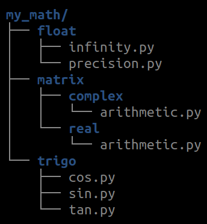
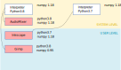
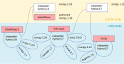

<!-- 
class: invert
paginate: true
footer: 'Python advanced training – course – Yoan Mollard – CC-BY-NC-SA'
-->


# **Python advanced training**

Yoan Mollard, for **Human Coders**

http://files.aubrune.eu/formations/humancoders


---
# Pictograms

🐍  Reference to the Python official documentation


---

# Programme

+-------------------+
+-------------------+

---

# DAY 1
# ADVANCED PROGRAMMING TECHNIQUES
(Including reminders)

---
# Python terminology reminder
## Modules and packages

* A **module** is a Python file e.g. `math.py`, the module's name is the filename without extension e.g. `math`
* A module can either made to be:
  * executable: this is a **Python script**
  * imported from another module: this is a **Python package**

---

* Packages and sub-packages allow to bring a hierarchy to your code
* The package's hierarchy is inherited from the files-and-folders hierarchy 
* Modules hold resources that can be imported later on, e.g.:
  * Constants
  * Classes
  * Functions...


---
* All packages and sub-packages must contain an `__init__.py` file each
* In general `__init__.py` is empty but may contain code to be executed at import time


Then the package or its sub-packages can be imported:
```python
import my_math.trigo
my_math.trigo.sin.sinus(0)
```
Specific resources can also be imported:
```python
from my_math.matrix.complex.arithmetic import product
```
---
Optionally, a (sub-)package can by "executed" from command-line with the `-m` option:
```bash
python -m my_math.float
```
only if a module `__main__.py` has been placed a the root of the sub-package.

Then, executing the sub-package consists into running code in `__main__.py`


---

### Relative imports (Imports internal to a package)
Relative import from the same folder:
```python
from .my_math import my_sqrt
value = my_sqrt(25)
```

Relative import from a parent folder:
```python
from ..my_math import my_sqrt
value = sqrt(25)
```

* Do not put any slash such as ~~`import ../my_math`~~
* Only current and parent folders can be retrieved with a relative import


---
## Package distribution
`setuptools`, and particulary file `setup.py` at the parent root of your package, simplifies the package distribution. The setup file holds:
* The list of modules and data files embedded in the package (*replaces the `MANIFEST` file*)
* Package version number
* The list of dependencies on other packages from PyPI, git repos, ...
* The entry points (executables, commands, ...)
* ... [🐍 Learn more about setuptools](https://setuptools.readthedocs.io/en/latest/setuptools.html)

Note: `setuptools` replaces the legacy `distutils`


---
Most basic setup file to distribute a single module:

```python
# File setup.py within package "my_math"

from setuptools import setup

setup(name='foo',
      version='1.0',
      py_modules=['foo'],
      )
```

This setup file distributes a single module `foo.py` under name `foo`.

Now let's see a more complete setup file distributing a package:


---
```python
from setuptools import setup, find_packages

setup(name='my_math',
      version='2.0',
      description='Custom math tools and functions',
      license='MIT',
      author='Yoan Mollard',
      author_email='yoan@aubrune.eu',
      url='https://github.com/ymollard/my_math',
      packages=find_packages(),                 # Embedded (sub-)packages
      install_requires=['numpy', 'matplotlib']  # Dependencies to install
     )
```

We rely on `find_packages()` to search for all valid (sub)-packages:
`['my_math', 'my_math.trigo', 'my_math.float', 'my_math.matrix', 'my_math.matrix.complex', 'my_math.matrix.real']`

There is 1 sub-package per `__init__.py` file.

---
The setup file then offers distribution tools:
* Install the package in the current environement:
```bash
pip install .
python setup.py install   # equivalent but deprecated because pip is cool 😎
```

* Build a source distribution (sdist):
```bash
python setup.py sdist
```
A **source distribution** is just a copy of all source files from your package.

* Build a binary distribution (`bdist_*`: `bdist_wheel`, `bdist_egg`, `bdist_rpm`...):
```bash
pip install wheel
python setup.py bdist_wheel
```

---

### Remarks about binary distribution bdist_*
* Binary format at platform-dependant (OS, arch, Python implementation and ABI)
* `.egg` files are just zip files containing sdist or bdist, you can unzip them
* Optional `setup.cfg` customizes the setup behaviour (e.g. ignore some flake8...)
* Several binary formats exist: wheel, egg... As of 2021, `wheel` format is preferred
* wheel files are named this way: `my_math-3.0.4-py3-none-any.whl` where:
  * `my_math` is the package name
  * `3.0.4` is the version
  * `py3` is the Python implementation tag
  * `none` is the ABI tag ([the C API for Python](https://docs.python.org/3/c-api/stable.html))
  * `any` is the platform (x86_64, arm, macos...)


 [🐍 Learn more about package distribution with setuptools](https://docs.python.org/fr/3/distributing/index.html)

---
## Uploading your package distribution on PyPI
Once sdist and/or bdist are available, several pipelines exist to share your project.

As of 2021, uploading to PyPI with `twine` is the preferred option:
1. Create an account on [PyPI](https://pypi.org/account/register/) or in the sandbox [TestPyPI](https://test.pypi.org/account/register/) if you're just testing
2. ` pip install twine`
3. `twine upload dist/* --repository testpypi`
   * Drop the `--repository` argument if you want to upload to the regular pypi
   * `--repository` can also target your company's own pypi server [Learn more](https://packaging.python.org/guides/hosting-your-own-index/)

---
## Python typing
Python typing is **dynamic** and infered from the value: **duck typing** 🦆

### Primitive types
```python
i = 9999999999999999999999999                   # Unbound integer
f = 1.0                                         # float
b = True                                        # bool
c = 1 + 1j                                      # complex
```

---
### Sequences
#### Immutable sequences
```python
s = "A string is immutable"
t = ("A", "tuple", "is", "immutable")
```
Example: put the first letter of these sequences in lower case:
```python
# s = "This does not work"[0] = "t"
s = "t" + "This works!"[1:]

# t = ("This", "does", "not", "work")[0] = "this"
t = "this" + ("This", "works!")[1:]
```

---
#### Mutable sequences
##### The list

```python
l = ["The", "list", "type", "is", "central", "in", "Python"]
l = list(("Conversion", "tuple", "to", "list"))
l = list("Hello")
l = "".join(["H", "e", "l", "l", "o"])
```

---
##### The dictionary
```python
d = {}
dict(zip(("article", "price", "stock"), ("Logitech M180", 99.90, 5)))
d.update({"foo": "bar"})
d.keys()     # dict_keys
d.values()   # dict_values
```

Regular dictionaries 

---
##### The ordered dictionary

```python
d = {}


for k, v in d.items():
    print(k, v)   # Will print 

from collections import OrderedDict

```

---
## Module vs scripts
A **module** is a Python file, e.g. `mymodule.py`. The module name is `mymodule`

Either the module is made to be:
* imported: it is a **package**: `import mymodule`
* executed: it is a **script**: `python mymodule.py`

A package is a folder containing modules.
Modules can also be bindings, e.g. Python bindings to a C++ library.

---
## Namespaces
**Definition**: a namespace is a specific mapping of variable values to variable names

e.g. `pi = 3.14`... from which namespace the variable `pi` is changed? Local to the module `numpy.pi`? Global to the script? Local to the function? ...

Python creates, evaluates and destroys namespaces automatically during the lifetime of your program . All you need to know is which namespace you're using when performing a variable read or write.

[🐍 Learn more](https://docs.python.org/3/tutorial/classes.html#python-scopes-and-namespaces)

---
The interpreter resolves names according to this priority:
1. The innermost scope: which is searched first, contains the local names
2. Inner scopes: from enclosing function calls
3. Module scope, if any, or `__main__`
4. Last scope: Built-in

the next-to-last scope contains the current module’s global names

the outermost scope (searched last) is the namespace containing built-in names

---
**Case 1**: Built-in namespace

Namespace is:
* created when the interpreter starts
* destroyed when the interpreter closes

```bash
python -c "print('Hello')"
```
In this namespace, `print()` is mapped to `builtins.print()`

```python
def print(thing): 
    raise NotImplementedError("I do not want to print")
print("Hello")            # Will raise exception
builtins.print("Hello")   # Will print because builtins still resolves to builtins
```


---
**Case 2**: Local namespace to a function

Namespace is:
* created when entering the function call (⚠️ not definition)
* destroyed when leaving the function call

```python
variable = 1                                                                                                

def print_var():
    print(variable)

variable = 2

print_var()       # Will print ??? because ??? 
```

---
Example from the Python doc:


```python
def middle_scope():
    def do_local():
        spam = "local"

    def do_nonlocal():
        nonlocal spam
        spam = "nonlocal"

    def do_global():
        global spam
        spam = "global"

    spam = "middle"
    do_local()
    print("After local assignment:", spam)     # middle
    do_nonlocal()
    print("After nonlocal assignment:", spam)  # nonlocal
    do_global()
    print("After global assignment:", spam)    # nonlocal

scope_test()
print("In global scope:", spam)                # global
```

---
## Mutable default parameters
```python
def add_fruit(fruit, recipient=[]):
    recipient.append(fruit)
    return recipient

fridge = add_fruit("apple")
print("Content of the fridge:", fridge)   # Will print ["apple"]

trash = add_fruit("apple")
print("Content of the trash:", trash)     # Guess what's in the trash??
```

---

```python
def add_fruit(fruit, recipient=[]):
    recipient.append(fruit)
    return recipient

fridge = add_fruit("apple")
print("Content of the fridge:", fridge)   # Will print ["apple"]

trash = add_fruit("apple")
print("Content of the trash:", trash)     # Will print ["apple", "apple"]
```

Default parameters are evaluated **during function definition**!

Thus, if the default parameter is mutable (*list, dict, object...*), later on it will refer to the same instance every time the default parameter is invoked.

**Good practice**: use only immuable types for default parameters, e.g. `recipient=()`

---
## Name a function so that its behavior is explicit

* What is the difference between `sort()` and `sorted()`?
* What is the difference between `revert()` and `reverted()`?


---
**Good practice**: make it explicit if a function has a side effect or returns a copy
```python
"""
Normalize a 3D vector [x, y, z]
:param vector: the iterable to be normlized by side effect 
"""
def normalize(vector):
    vector_sum = sum(vector)
    for i in range(len(vector)):
        vector[i] /= vector_sum
"""
Get a normalized copy of a 3D vector [x, y, z]
:param vector: the iterable to be normlized
:return: a normalized copy of param vector
"""
def normalized(vector):
    vector_sum = sum(vector)
    new_vector = []
    for value in vector:
        new_vector.append(value/vector_sum)
    return new_vector 
```

---
# Programming paradigms in Python
Python is multi-paradigm:
* **Imperative**: *instructions create state changes*
* **Object-oriented**: *instructions are grouped with their data in objects/classes*
* **Functional**: *instructions are math function evaluations*

All 3 paradigms are popular in the Python community, and often mixed all together, e.g:

```python
sentence = "How do you do?"
"".join(map(lambda x: x.capitalize(), sentence.split(" ")))

# Out[0]: 'How Do You Do?'
```
---
## Object-oriented programming (OOP)

```python
class Apartment():
    def __init__(self, surface):
        self.surface = round(surface)
    
    def __str__(self):
        return "This flat has {}m²".format(self.surface)


class FurnishedApartment(Apartment):
    def __init__(self, surface, furniture=("bed", "sofa")):
        super(FurnishedApartment, self).__init__(surface)
        self.furniture = list(furniture)

    def __str__(self):
        return "This flat of {}m² has: {}".format(self.surface, self.furniture)

str(FurnishedApartment(50))    # All methods are virtual in Python
```

---
### Polymorphism
**Generic definition**: Using heterogeneous data types in the same scope

```python
10 + 20.0
```

---
#### How does polymorphism apply to OOP?
* **ad-hoc**: same name from different classes
```python
["H", "e", "y"].index("e")
"Hey".index("y")
```
* **parametric**: same method with different parameter types (⚠️ overloading in Java)
```python
print("It is", True, "that the Ultimate Question of Life is", 42)
```
* **inheritance**: method is inherited from a different (parent) type

```python
class mystr(str): pass

isinstance(mystr(), str) # True: mystr() is of type "str"

mystr(1e3).split(".")    # Methods & attributes inherited from the parent
# Out[0]: ['1000', '0']
```
---
### Reminder about public, protected and private scopes
*In C++, the scope of attributes or methods can be:*
* **private**: read and write access from methods of the same class only
* **protected**: read and write access from methods of the same class or its child classes only
* **public**: read and write access from methods of any class

---
Python has similar concepts but does not enforce them:
* **private** attributes or methods start with a double underscore (name mangling)
* **protected** attributes or methods start with an underscore
* otherwise they are **public**

```python
class Foo:
    def __init__(self):
        self.public = 0
        self._protected = 0
        self.__private = 0        # ⚠️ Name mangling
```

---
### Properties, getters and setters


A Python **property** is an entity able to get, set or delete the attribute of an object

*Its C++ equivalent are getters and setters e.g. `car.getSpeed()` & `car.setSpeed(1.0)`*


Properties are useful to add code filters to public attributes
* **Example**: raise exceptions when attributes are set to inconsistent values
* **Example:** make sure that the `self.month` integer is between 1 and 12

---

Create a property with the `property()` function or the `@property` decorator

```python
property(fget=None, fset=None, fdel=None, doc=None)
```

Where:
* `fget` is a function to get the value of the attribute (the getter)
* `fset` is a function to set the value of the attribute (the setter)
* `fdel` is a function to delete the attribute
* `doc` is a docstring

---
```python
class Date:
    def __init__(self):
        self.__month = 0
    
    def get_month(self):
        if self.__month == 0:
            raise ValueError("This date has not been initialised")
        return self.__month

    def set_month(self, new_month: int):
        if not 1 <= new_month <= 12:
            raise ValueError("Month can only be set between 1 and 12")
        self.__month = new_month
    
    month = property(get_month, set_month, doc="The integer month (1-12) of this date")
```

```python
d = Date()
print(d.month)    # Will raise "This date has not been initialised"
d.month = 99      # Will raise "Month can only be set between 1 and 12"
```

---
TODO: parler de décorateur d'abord

Usually, properties are used as a decorator instead of a function:

```python
class Date:
    def __init__(self):
        self.__month = 0
    
    @property
    def month(self):
        if self.__month == 0:
            raise ValueError("This date has not been initialised")
        return self.__month

    @month.setter
    def month(self, new_month: int):
        if not 1 <= new_month <= 12:
            raise ValueError("Month can only be set between 1 and 12")
        self.__month = new_month
```

```python
d = Date()
print(d.month)    # Will raise "This date has not been initialised"
d.month = 99      # Will raise "Month can only be set between 1 and 12"
```

---
TODO: Exercice idea: read-only property with a getter but no setter full_name 

---
#### Class methods and class attributes
*In C++ class methods and attributes are similar to static methods and attributes (but different)
TODO

---

#### Magic methods
These method exist in any class with a default behaviour...unless you override them:

```python
appart1 + appart2: Appartement.__add__(self, other)    # Addition
appart1 * appart2: Appartement.__mul__(self, other)    # Multiplication
appart1 == appart2: Appartement.__eq__(self, other)    # Equality test
str(appart): Appartement.__str__(self)                 # Readable string
repr(appart): Appartement.__repr__(self)               # Unique string
```

But also... (thank you duck-typing):
```python
getattr(appart, "price"): Appartement.__getattr__(self, name)  # Get an attribute 
setattr(app, "price", 1): Appartement.__setattr__(self, n, v)  # Set an attribute
detattr(app, "price"): Appartement.__detattr__(self, name)     # Drop an attribute
```

---
These magic methods may alter the class type of an instance itself during runtime:
```python
In [1]: class Example: 
   ...:     def __init__(self): 
   ...:         self.some_attribute = 1 

In [2]: example=Example()

In [3]: example.some_attribute 
Out[3]: 1

In [4]: delattr(example, "some_attribute")

In [5]: example.some_attribute           
-------------------------------------------------------------------------
AttributeError: 'Example' object has no attribute 'some_attribute'

In [6]: type(example)  # The attribute no longer exists for this object...
Out[6]: Example        # ... but the type is still the same
```

---
### Reminder about class inheritance

All overriden methods are `virtual`: Methods of the child classes are resolved first.

```python
class Animal:
    def adopt(self):
        raise NotImplementedError("Sorry {} cannot be adopted".format(__class__))

class Cat(Animal):
    def adopt(self):
        print("Thank you for adopting a 🐱!")

class Fly(Animal):
    pass
```

```python
Cat().adopt()       # Thank you for adopting a 🐱!
Animal().adopt()    # Sorry class 'Animal' cannot be adopted
Fly().adopt()       # Sorry class 'Fly' cannot be adopted
```
This is how we implement `abstract` classes in Python, or class interfaces.


---
### Multiple inheritance: the basic case

[🐍 Learn more](https://docs.python.org/3/tutorial/classes.html#multiple-inheritance). Simple example: the tiger's taxonomy
```python
class Animal:
    def avglifetime(self):
        return 67

class Mammalia:
    def avglifetime(self):
        return 35

class Felidae:
    pass

class Tiger(Felidae, Mammalia, Animal):
    pass
```

```python
Tiger().avglifetime()   # Will return 35, left-to-right resolution happens
```

---

### Multiple inheritance: the MRO
Now let's consider that Mamalia and Felidae are also Animal:
```python
class Animal:
    def avglifetime(self):
        return 67

class Mammalia(Animal):
    def avglifetime(self):
        return 35

class Felidae(Animal):
    pass

class Tiger(Felidae, Mammalia, Animal):
    pass
```
There are now multiple paths for resolving `Tiger.avglifetime()` 

TODOOOO REPRENDRE ICI

---
##### Classes hide dictionaries
Behind the scenes all mutable attributes and methods from a class are stored in dictionaries:

```python
class Car:
    IS_VEHICLE = True
    def __init__(self):
        self.speed = 0
```

---
## Functional programming

---
# Distribution of Python packages and programs

---
## PyPI Security warning 🚨
[PyPI packages caught stealing credit card numbers & Discord tokens](https://www.bleepingcomputer.com/news/security/pypi-packages-caught-stealing-credit-card-numbers-discord-tokens/)


---
### PyPI Typosquatting warning 🚨

```python
pip install -r requirements.txt
# 🚨 pip install requirements.txt

pip install rabbitmq
# 🚨 pip install rabitmq

pip install matplotlib
# 🚨 pip install matploltib
```

---
### Perform sanity checks before installing a package

* Is the package still maintained **and** documented?
```
Last update: November, 2017
```
* Does the developer consider bugs and improvements?
```
# of solved Github issues
```
* Is the package developer reliable?
```
Moral entity or individual, which company, experience...
```
* If not opensource, is the development of this package likely to continue?
```
# of opensource users, # of clients, company financial health if not opensource, ...
```

<!--#####################################################################################################-->
---
# DAY 2
# CODE WITH QUALITY

---
## Virtual environments (venv)

**Context:** All installed packages go into the `site-packages` directory of the interpreter.

> The venv module provides support for creating lightweight “virtual environments” with their own site directories, optionally isolated from system site directories.

> Each virtual environment has its own Python binary (which matches the version of the binary that was used to create this environment) and can have its own independent set of installed Python packages in its site directories.

[🐍 Learn more](https://docs.python.org/3/library/venv.html)

### Example
---


---


---


---


---


---
For each new project you create/clone, create it its own dedicated virtual environment:
```bash
/usr/bin/python3.7 -m venv dev/Training2021/venv
```

Then, every time you work on this project, activate its environment first:
```bash
source Training2021/venv/bin/activate
```

Your terminal must prefix the prompt with the name of the env:
```bash
(venv) yoan@humancoders ~/dev/Training2021 $
```
And quit the venv every time you stop working on the project:
```bash
(venv) yoan@humancoders ~/dev/Training2021 $ deactivate
yoan@humancoders ~/dev/Training2021 $ 
```
---
## Quality control tools
### [PEP 8](https://www.python.org/dev/peps/pep-0008/), the style guide for Python code

> This document gives coding conventions for the Python code

PEP8 codes start with E (Errors) or W (Warnings)

|   Types   |     Category     ||   Types   |     Category     |
|:---------:|:----------------:|-|:---------:|:----------------:|
| 100       | Indentation              || 500       | Line lengths             |   
| 200       | Whitespaces              || 600       | Deprecation              |   
| 300       | Blank lines              || 700       | Statements               |   
| 400       | imports                  || 900       | Syntax                   |

---
Linters can be customized in configuration files in:
* `~/.config/pep8` if it's user-wide
* `<PROJECT_ROOT>/setup.cfg` or `<PROJECT_ROOT>/tox.ini` if it's project-wide

Example:
```conf
[flake8]
ignore = E501,E731,E741
max-line-length = 160
exclude = build,dist,*.egg-info,doc/*,tests/*
```

---
### [Pyflakes](pyflakes), the semantic analyser
Pyflakes only focuses on the semantics (what your code stands for) but is not concerned about style.

```python
import logging
variable = ScrapyCommand
```


```
./main.py:2: 'logging' imported but unused
./main.py:3: undefined name 'ScrapyCommand'
```

---
### Flake8 (also Pylint, Pychecker)
Flake8 = PEP 8 + Pyflakes (syntax + semantic analysis)

```python
import numpy

def f():
    print("Hello world!")
```

```
main.py:1:1: F401 'numpy' imported but unused              # Semantic
main.py:3:1: E302 expected 2 blank lines, found 1          # Style
```


<!--#####################################################################################################-->

<!--#####################################################################################################-->
---
# DAY 3
# PERFORMANCE OPTIMIZATION
<!--#####################################################################################################-->

---
# Multithreading and multiprocessing
**Multithreading**: Split work into several threads within the same process and CPU.
**Multiprocessing**: Split work into several processes dispatched to several CPUs.

Multithreading is much less efficient in most cases, but Python makes it even worse because of the GIL.

---
## The reference counter
The interpreter holds a counter counting how many references point to a literal.

```ipython
In [1]: s = "Hello world!" 

In [2]: sys.getrefcount(s)
Out[2]: 2

In [3]: s2 = s             

In [4]: sys.getrefcount(s)
Out[4]: 3

In [5]: del s2             

In [6]: sys.getrefcount(s)
Out[6]: 2
```
If the counter reaches 0, the literal is destroyed. This is how Python frees memory.

---
## The Python Global Interpreter Lock (GIL)
The GIL is a mutex that protects access to the reference counters of Python objects.

However it prevents multiple threads from executing Python bytecodes at once. It offers poor performance for multi-threaded programs, if they are CPU-bound.

Several implementations of the Python interpreter exist, for instance:
* CPython (By far the most popular)
* Jython
* IronPython
* PyPy

Only some of them "suffer" from the GIL. If it is an issue, use another implementation.
[The GIL is a regular debate within the Python community](https://wiki.python.org/moin/GlobalInterpreterLock)

---
Because of the GIL, multiprocessing is way more efficient that multithreading.

But also harder to deal with since processes are insulated in their own memory spaces. Solutions exist:
* Use stdin and stdout from the [`subprocess`](https://docs.python.org/fr/3.8/library/subprocess.html) library (call a binary and read/write std in/out)
* Use queues and pipes from the [`multiprocessing`](https://docs.python.org/3.7/library/multiprocessing.html) library (Python only)
* Use network messaging libraries [`zmq`](https://zeromq.org/), [`rabbitmq`](https://www.rabbitmq.com/), [`redis`](https://redis.io/)... (language-agnostic)


---
When to use these libs?
* **`subprocess`**: call a system command (e.g. `traceroute`, `tar`, `useradd`...) or an existing executable whose code cannot be changed, from a Python module.
* **`multiprocessing`**: split a Python-only program from which you write all the code into processes to improve performance.
* **messaging libs**: build a decentralized application made of multiple technologies and languages (e.g. on top of a cloud infrastructure OVH, Gandi, AWS, ...)

---
## Alternative package managers
Not happy with PyPI and pip? Here are other ones:
* `conda`: Useful if you also deal with non-Python dependencies. Compatible with Ruby, Java, JS, C/ C++, FORTRAN, ...
* `miniconda`: Minimal conda
* `mamba`: Ultrafast conda reimplementation in C++
* `micromamba`: ...

The bad news is that package managers are not compatible with each other.

---
## Measure CPU time of instructions

`timeit` will run your instruction many times and give you average execution duration and statistics.

From an interactive interpreter with a *line-magic*:
```ipython
In [1]: import math, numpy                                                                                           

In [2]: %timeit math.sqrt(25)                                                                                        
# 63.7 ns ± 0.445 ns per loop (mean ± std. dev. of 7 runs, 10000000 loops each)

In [3]: %timeit numpy.sqrt(25)                                                                                       
# 788 ns ± 3.3 ns per loop (mean ± std. dev. of 7 runs, 1000000 loops each)

```
For magics dealing with cells instead of a single line, use `%%timeit`

---
From a Python module:
```python
from timeit import repeat
import math, numpy
print(timeit("math.sqrt(25)", globals=globals()))
print(timeit("numpy.sqrt(25)", globals=globals()))

```
🚨 timeit is a benchmarking tool, its results depend of your current CPU load

[🐍 Learn more](https://docs.python.org/3/library/timeit.html)

---
## Reminders about collections (ADT - abstract data types)
```python
l = [42, 12, -1, 0, 15] # List: ordered; insertion and deletion anywhere, associative access to indexes
d = {KKKKKKK} # Dictionary: 
```

---
## Reminders about time complexity

> Time complexity is the computational complexity that describes the amount of computer time it takes to run an algorithm. 

From [Wikipedia](https://en.wikipedia.org/wiki/Time_complexity)


### Time complexity of Python collections
[🐍 Learn more about time complexity of Python collections](https://wiki.python.org/moin/TimeComplexity)

