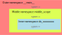

<!-- 
class: invert
paginate: true
footer: 'Python advanced training, Yoan Mollard, CC-BY-NC-SA'
-->


# **Python advanced training**

Yoan Mollard, for **Human Coders**

http://files.aubrune.eu/formations/humancoders


---
# Pictograms

🐍  Reference to the Python documentation


---

# Programme

+-------------------+
+-------------------+

---

# DAY 1
# ADVANCED PROGRAMMING TECHNIQUES
(Including reminders)

---
# Python typing reminder
Python typing is **dynamic** and infered from the value: **duck typing** 🦆

## Primitive types
```python
i = 9999999999999999999999999                   # Unbound integer
f = 1.0                                         # float
b = True                                        # bool
c = 1 + 1j                                      # complex
```

---
## Sequences
### Immutable sequences
```python
s = "A string is immutable"
t = ("A", "tuple", "is", "immutable")
```
Example: put the first letter of these sequences in lower case:
```python
# s = "This does not work"[0] = "t"
s = "t" + "This works!"[1:]

# t = ("This", "does", "not", "work")[0] = "this"
t = "this" + ("This", "works!")[1:]
```

---
### Mutable sequences
#### The list

```python
l = ["The", "list", "type", "is", "central", "in", "Python"]
l = list(("Conversion", "tuple", "to", "list"))
l = list("Hello")
l = "".join(["H", "e", "l", "l", "o"])
```

---
#### The dictionary
```python
d = {}
dict(zip(("article", "price", "stock"), ("Logitech M180", 99.90, 5)))
d.update({"foo": "bar"})
d.keys()     # dict_keys
d.values()   # dict_values
```

Regular dictionaries 

---
#### The ordered dictionary


---
## Module vs scripts
A **module** is a Python file, e.g. `mymodule.py`. Th module name is `mymodule`

Either the module is made to be:
* imported; it is a **package**: `import mymodule`
* executed: it is a **script**: `python mymodule.py`

---
## Namespaces
**Definition**: a namespace is a specific mapping of variable values to variable names

e.g. `pi = 3.14`... from which namespace the variable `pi` is changed? Local to the module `numpy.pi`? Global to the script? Local to the function? ...

Python creates, evaluates and destroys namespaces automatically during the lifetime of your program . All you need to know is which namespace you're using when performing a variable read or write.

[🐍 Learn more](https://docs.python.org/3/tutorial/classes.html#python-scopes-and-namespaces)

---
The interpreter resolves names according to this priority:
1. The innermost scope: which is searched first, contains the local names
2. Inner scopes: from enclosing function calls
3. Module scope, if any, or `__main__`
4. Last scope: Built-in

the next-to-last scope contains the current module’s global names

the outermost scope (searched last) is the namespace containing built-in names

---
**Case 1**: Built-in namespace

Namespace is:
* created when the interpreter starts
* destroyed when the interpreter closes

```bash
python -c "print('Hello')"
```
In this namespace, `print()` is mapped to `builtins.print()`

```python
def print(thing): 
    raise NotImplementedError("I do not want to print")
print("Hello")            # Will raise exception
builtins.print("Hello")   # Will print because builtins still resolves to builtins
```


---
**Case 2**: Local namespace to a function

Namespace is:
* created when entering the function call (⚠️ not definition)
* destroyed when leaving the function call

```python
variable = 1                                                                                                

def print_var():
    print(variable)

variable = 2

print_var()       # Will print ??? because ??? 
```

---
Example from the Python doc:



```python
def middle_scope():
    def do_local():
        spam = "local"

    def do_nonlocal():
        nonlocal spam
        spam = "nonlocal"

    def do_global():
        global spam
        spam = "global"

    spam = "middle"
    do_local()
    print("After local assignment:", spam)     # middle
    do_nonlocal()
    print("After nonlocal assignment:", spam)  # nonlocal
    do_global()
    print("After global assignment:", spam)    # nonlocal

scope_test()
print("In global scope:", spam)                # global
```

---
## Mutable default parameters
```python
def add_fruit(fruit, recipient=[]):
    recipient.append(fruit)
    return recipient

fridge = add_fruit("apple")
print("Content of the fridge:", fridge)   # Will print ["apple"]

trash = add_fruit("apple")
print("Content of the trash:", trash)     # Guess what's in the trash??
```

---

```python
def add_fruit(fruit, recipient=[]):
    recipient.append(fruit)
    return recipient

fridge = add_fruit("apple")
print("Content of the fridge:", fridge)   # Will print ["apple"]

trash = add_fruit("apple")
print("Content of the trash:", trash)     # Will print ["apple", "apple"]
```

Default parameters are evaluated **during function definition**!

Thus, if the default parameter is mutable (*list, dict, object...*), later on it will refer to the same instance every time the default parameter is invoked.

**Good practice**: use only immuable types for default parameters, e.g. `recipient=()`

---
## Name a function so that its behavior is explicit

* What is the difference between `sort()` and `sorted()`?
* What is the difference between `revert()` and `reverted()`?


---
**Good practice**: make it explicit if a function has a side effect or returns a copy
```python
"""
Normalize a 3D vector [x, y, z]
:param vector: the iterable to be normlized by side effect 
"""
def normalize(vector):
    vector_sum = sum(vector)
    for i in range(len(vector)):
        vector[i] /= vector_sum
"""
Get a normalized copy of a 3D vector [x, y, z]
:param vector: the iterable to be normlized
:return: a normalized copy of param vector
"""
def normalized(vector):
    vector_sum = sum(vector)
    new_vector = []
    for value in vector:
        new_vector.append(value/vector_sum)
    return new_vector 
```

---
# Programming paradigms in Python
Python is multi-paradigm:
* **Imperative**: *instructions create state changes*
* **Object-oriented**: *instructions are grouped with their data in objects/classes*
* **Functional**: *instructions are math function evaluations*

All 3 paradigms are popular in the Python community, and often mixed all together, e.g:

```python
sentence = "How do you do?"
"".join(map(lambda x: x.capitalize(), sentence.split(" ")))

# Out[0]: 'How Do You Do?'
```
---
## Object-oriented programming (OOP)

```python
class Apartment():
    def __init__(self, surface):
        self.surface = round(surface)
    
    def __str__(self):
        return "This flat has {}m²".format(self.surface)


class FurnishedApartment(Apartment):
    def __init__(self, surface, furniture=("bed", "sofa")):
        super(FurnishedApartment, self).__init__(surface)
        self.furniture = list(furniture)

    def __str__(self):
        return "This flat of {}m² has: {}".format(self.surface, self.furniture)

str(FurnishedApartment(50))    # All methods are virtual in Python
```

---
### Polymorphism
**Generic definition**: Using heterogeneous data types in the same scope

```python
10 + 20.0
```

---
#### How does polymorphism apply to OOP?
* **ad-hoc**: same name from different classes
```python
["H", "e", "y"].index("e")
"Hey".index("y")
```
* **parametric**: same method with different parameter types (⚠️ overloading in Java)
```python
print("It is", True, "that the Ultimate Question of Life is", 42)
```
* **inheritance**: method is inherited from a different (parent) type

```python
class mystr(str): pass

isinstance(mystr(), str) # True: mystr() is of type "str"

mystr(1e3).split(".")    # Methods & attributes inherited from the parent
# Out[0]: ['1000', '0']
```
---
### Reminder about public, protected and private scopes
*In C++, the scope of attributes or methods can be:*
* **private**: read and write access from methods of the same class only
* **protected**: read and write access from methods of the same class or its child classes only
* **public**: read and write access from methods of any class

---
Python has similar concepts but does not enforce them:
* **private** attributes or methods start with a double underscore (name mangling)
* **protected** attributes or methods start with an underscore
* otherwise they are **public**

```python
class Foo:
    def __init__(self):
        self.public = 0
        self._protected = 0
        self.__private = 0        # ⚠️ Name mangling
```

---
### Properties, getters and setters


A Python **property** is an entity able to get, set or delete the attribute of an object

*Its C++ equivalent are getters and setters e.g. `car.getSpeed()` & `car.setSpeed(1.0)`*


Properties are useful to add code filters to public attributes
* **Example**: raise exceptions when attributes are set to inconsistent values
* **Example:** make sure that the `self.month` integer is between 1 and 12

---

Create a property with the `property()` function or the `@property` decorator

```python
property(fget=None, fset=None, fdel=None, doc=None)
```

Where:
* `fget` is a function to get the value of the attribute (the getter)
* `fset` is a function to set the value of the attribute (the setter)
* `fdel` is a function to delete the attribute
* `doc` is a docstring

---
```python
class Date:
    def __init__(self):
        self.__month = 0
    
    def get_month(self):
        if self.__month == 0:
            raise ValueError("This date has not been initialised")
        return self.__month

    def set_month(self, new_month: int):
        if not 1 <= new_month <= 12:
            raise ValueError("Month can only be set between 1 and 12")
        self.__month = new_month
    
    month = property(get_month, set_month, doc="The integer month (1-12) of this date")
```

```python
d = Date()
print(d.month)    # Will raise "This date has not been initialised"
d.month = 99      # Will raise "Month can only be set between 1 and 12"
```

---
TODO: parler de décorateur d'abord

Usually, properties are used as a decorator instead of a function:

```python
class Date:
    def __init__(self):
        self.__month = 0
    
    @property
    def month(self):
        if self.__month == 0:
            raise ValueError("This date has not been initialised")
        return self.__month

    @month.setter
    def month(self, new_month: int):
        if not 1 <= new_month <= 12:
            raise ValueError("Month can only be set between 1 and 12")
        self.__month = new_month
```

```python
d = Date()
print(d.month)    # Will raise "This date has not been initialised"
d.month = 99      # Will raise "Month can only be set between 1 and 12"
```

---
TODO: Exercice idea: read-only property with a getter but no setter full_name 

---
#### Class methods and class attributes
*In C++ class methods and attributes are similar to static methods and attributes (but different)
TODO


---
### Reminder about class inheritance

All overriden methods are `virtual`: Methods of the child classes are resolved first.

```python
class Animal:
    def adopt(self):
        raise NotImplementedError("Sorry {} cannot be adopted".format(__class__))

class Cat(Animal):
    def adopt(self):
        print("Thank you for adopting a 🐱!")

class Fly(Animal):
    pass
```

```python
Cat().adopt()       # Thank you for adopting a 🐱!
Animal().adopt()    # Sorry class 'Animal' cannot be adopted
Fly().adopt()       # Sorry class 'Fly' cannot be adopted
```
This is how we implement `abstract` classes in Python, or class interfaces.


---
### Multiple inheritance: the basic case

[🐍 Learn more](https://docs.python.org/3/tutorial/classes.html#multiple-inheritance). Simple example: the tiger's taxonomy
```python
class Animal:
    def avglifetime(self):
        return 67

class Mammalia:
    def avglifetime(self):
        return 35

class Felidae:
    pass

class Tiger(Felidae, Mammalia, Animal):
    pass
```

```python
Tiger().avglifetime()   # Will return 35, left-to-right resolution happens
```

---

### Multiple inheritance: the MRO
Now let's consider that Mamalia and Felidae are also Animal:
```python
class Animal:
    def avglifetime(self):
        return 67

class Mammalia(Animal):
    def avglifetime(self):
        return 35

class Felidae(Animal):
    pass

class Tiger(Felidae, Mammalia, Animal):
    pass
```
There are now multiple paths for resolving `Tiger.avglifetime()` 

TODOOOO REPRENDRE ICI

---
##### Classes hide dictionaries
Behind the scenes all mutable attributes and methods from a class are stored in dictionaries:

```python
class Car:
    IS_VEHICLE = True
    def __init__(self):
        self.speed = 0
```

---
## Functional programming

---
# Distribution of Python packages and programs

---
## PyPI Security warning 🚨
[PyPI packages caught stealing credit card numbers & Discord tokens](https://www.bleepingcomputer.com/news/security/pypi-packages-caught-stealing-credit-card-numbers-discord-tokens/)


---
### PyPI Typosquatting warning 🚨

```python
pip install -r requirements.txt
# 🚨 pip install requirements.txt

pip install rabbitmq
# 🚨 pip install rabitmq

pip install matplotlib
# 🚨 pip install matploltib
```

---
### Perform sanity checks before installing a package

* Is the package still maintained **and** documented?
```
Last update: November, 2017
```
* Does the developer consider bugs and improvements?
```
# of solved Github issues
```
* Is the package developer reliable?
```
Moral entity or individual, which company, experience...
```
* If not opensource, is the development of this package likely to continue?
```
# of opensource users, # of clients, company financial health if not opensource, ...
```


<!--#####################################################################################################-->
---
# DAY 3
# PERFORMANCE OPTIMIZATION
<!--#####################################################################################################-->


