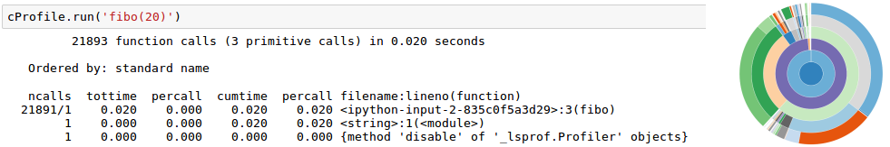

<!-- 
class: invert
paginate: true
footer: 'Python advanced training – course – Yoan Mollard – CC-BY-NC-SA [🔗](https://advanced.python.training.aubrune.eu/)'
-->

<style>
    .hljs-string {
    color: #cd9067;
}
</style>


#  **Python advanced training**

Yoan Mollard, for **Human Coders**

https://advanced.python.training.aubrune.eu/


---
#  Pictograms

🐍  Reference to the Python official documentation


---

#  Programme DAY 1

1. [ ADVANCED PROGRAMMING TECHNIQUES](#6)
    1.1. [ Python typing](#7)
    1.2. [ Complexity and the `Big-O` notation](#18)
2. [ CHARACTERISTICS AND PARADIGMS OF PYTHON](#25)
    2.1. [ Object-oriented programming (OOP)](#26)
    2.2. [ Metaclasses](#44)
    2.3. [ Functional programming](#49)
    2.4. [ Decorators](#58)
    2.5. [ Namespaces](#61)
    2.6. [ Mutable default parameters](#66)

---

#  Programme DAY 2

3. [ CODE WITH QUALITY](#68)
    3.1. [ Type annotations](#69)
    3.2. [ Python docstrings](#71)
    3.3. [ Logging](#73)
    3.4. [ Virtual environments (venv)](#75)
    3.5. [ Quality control tools](#84)
    3.6. [ Name a function so that its behavior is explicit](#88)
4. [ PACKAGE AND DISTRIBUTE](#90)
    4.1. [ Reminders about Modules and packages](#90)
    4.2. [ The Python Package Index (PyPI)](#98)
    4.3. [ PyPI Security warning 🚨](#100)
    4.4. [ Package distribution](#103)
    4.5. [ Uploading your package distribution on PyPI](#108)

---

#  Programme DAY 3

5. [ PERFORMANCE OPTIMIZATION](#110)
    5.1. [ Refactor your code by keeping complexity in mind](#110)
    5.2. [ Multithreading, multiprocessing ans asynchronous IO](#112)
    5.3. [ Asynchronous code (Python coroutines)](#122)
    5.4. [ Profiling](#131)
    5.5. [ Alternative package managers](#132)
6. [ ANNEXES / EXTRA-CURRICULAR TOPICS](#133)
    6.1. [ Python for datascience](#134)
    6.2. [ Common design patterns](#139)

---

#  DAY 1
# ADVANCED PROGRAMMING TECHNIQUES
(Including reminders)

---
## Python typing
Python typing is **dynamic** and infered from the value: **duck typing** 🦆

### Primitive types
```python
i = 9999999999999999999999999                   # Unbound integer
f = 1.0                                         # float
b = True                                        # bool
c = 1 + 1j                                      # complex
```
---
🚨 **Beware with floats**

Python's floats are IEE754 floats with mathematically incorrect rounding precision:
```python
0.1 + 0.1 + 0.1 - 0.3 == 0    # This is WRONG :(
print(0.1 + 0.1 + 0.1 - 0.3)  # Returns 5.551115123125783e-17 but not 0
```
Also, they are not able to handle large differences of precisions:
```python
1e-10 + 1e10 == 1e10          # This is True :(
```
When you deal with float number and if precision counts, use the decimal module!
```python
from decimal import Decimal
Decimal("1e-10") + Decimal("1e10") == Decimal("1e10")   # This is True
```
Beware not to initialize `Decimal` with float since the precision is already lost: `Decimal(0.1)` will show `Decimal('0.10000000000000000555111512312578270215')`

---

### Python collections (data containers)
Collections allow to store data in structures. General purpose built-in containers are `dict`, `list`, `set`, and `tuple`. Other containers exist in module `collections`.

**Definition**: Some Python collections are said **mutable** because they can be updated and modified at any moment during runtime.

---
#### Mutable collections
##### The list

```python
l = ["The", "list", "type", "is", "central", "in", "Python"]
l = list(("Conversion", "tuple", "to", "list"))
l = list("Hello")
l = "".join(["H", "e", "l", "l", "o"])
l.append("element") # Append at the end (right side)
l.pop()             # Remove from the end. pop(0) removes from the start
```

##### The dictionary (no guarantee about order)
```python
d = {}
dict(zip(("article", "price", "stock"), ("Logitech M180", 99.90, 5)))
d.update({"foo": "bar"})
d.keys()     # dict_keys
d.values()   # dict_values
```

---
##### The ordered dictionary

```python
from collections import OrderedDict
scores = OrderedDict()

scores["Anna"] = 900                                                      
scores["Mathew"] = 500                                                    
scores["Alfredo"] = 450                                                  

print(scores)                                                            
# OrderedDict([('Anna', 900), ('Mathew', 500), ('Alfredo', 450)])
```
Hence, an `OrderDict` has additional methods unavailable in regular dicts:
```python
# Say that Anna has now a score of 300, the OrderedDict must be reordered:
scores.move_to_end("Anna", last=True)
```

---
##### The deque (queue)
A deque is great to append or remove elements at both extremities:  
```python
from collections import deque
queue = deque(["Kylie", "Albert", "Josh"])
queue.appendleft("Anna")   # list.insert(0, "Anna") would be slow here: O(n)
queue.popleft()    # list.pop(0) would be slow here: O(n)
```
Deques have O(1) performance for appendleft() and popleft() while lists have O(n) performance for insert(0, value) and pop(0).

---
#### Immutable sequences
**Definition:** An **immutable** data structure can be assigned to values only once at creation, then it cannot mutate (cannot change).
##### The string
```python
s = "A string is immutable"
t = ("A", "tuple", "is", "immutable")
```
Example: put the first letter of these sequences in lower case:
```python
# s = "This does not work"[0] = "t"
s = "t" + "This works!"[1:]

# t = ("This", "does", "not", "work")[0] = "this"
t = "this" + ("This", "works!")[1:]
```

---
##### The tuple
The tuple is the Python version of an **array**.
```python
tuple1 = (42, -15, None, 5.0)
tuple2 = True, True, 42.5
```
It is also used during unpacking:
```python
a, b = b, a   # Value swapping
```
And this is the type used for returning several values in a function:
```python
def compute(a, b):
    return a+b, a-b

sum, difference = compute(5, 5)
results = compute(5, 5)
```


---
##### The named tuple
Compared to a tuple, the named tuple can be accessed by keys.
Compared to a dict, the named tuple is immutable.

```python
from collections import namedtuple

# We declare a new type
HighScores = namedtuple("HighScores", ("name", "gender", "score"))
tiffany = HighScores(name="Tiffany", gender="f", score=900)               

tiffany.score
# Will return 900

tiffany.name
# Will return 'Tiffany'
```
---

**Exercise**: With `timeit`, compare performance of:
1. Multiple declarations of:
   * instances of type `HighScores` (namedtuple)
   * instances of type `dict` (with equivalent data fields)
   * instances of type `tuple` (with equivalent data sequence)
2. Multiple access to the score of:
   * the `HighScores` (namedtuple)
   * the `dict` 
   * the `tuple`

**Conclusion:** The Python dict inherits from benefits from the tuple (for fast creation and access) and named tuples (for readibilitythanks to key-access), and it is mutable!

---
### Subclassing existing types

If you require a data structure than behaves like an existing one (`dict`, `list`, `strings`...) you may implement you own type by inheriting from existing classes.

In module `collections`, three types are made specifically for this purpose: `UserDict`, `UserString` and `UserList`.

```python
class UpperCaseString(UserString):
    def __init(args):
        super(UpperCaseString, self).__init__. TODOOOOOOO
```


---
## Complexity and the `Big-O` notation
In computer science, optimization consists into improving:
* **Time complexity**: the quantity of CPU/GPU cycles used by an operation
* **Space complexity**: the quantity of memory used by an operation 

Optimizing **time** often requires **more space**.
Optimizing **space** often requires **more time**. 

The less complex an operation is in terms of time / space, the better it is optimized. 

According to the usecase, we may opt for a best optimization in space or in time.

An optimized program is **faster**, **greener** and **more economic**, since both time (CPUs and GPUs) and space (Hard drives and networks) consume energy.

---
`Big-O` is a notation that helps measure complexity (in time or space) of programs.

It describes how greedy an operation is according the size of its input, in terms of time (CPU cycles) or space (Memory space). It is thus a function of the input size (`n`).

Examples:
* `O(n)` in time = for an input of size `n`, the operation requires `n` CPU cycles 
* `O(n*n)` in time = for an input of size `n`, the oepration requires `n*n` CPU cycles

ℹ️ Here, *CPU cycle* and `n` do not refer to a precise quantity (e.g. bytes, assembly instructions, time in seconds...), only the order of magnitude is important.

ℹ️ Big-O usually measures complexity in **the worst case scenario**.


---
### Table of common `big-O` complexities
From best to worst performance:

|         Big-O complexity                |  Complexity Name   |  Example of time complexity with a list |
|:------------------------------------:|:------------------------:|:------------------------:|
| O(1)                        |   Constant  | Read value at index `[i]`
| O(n)               | Linear                         | A single `for i in range(n)` loop |
| O(n.log(n)))        | Logarithmic | Sort list (with the quicksort method)
| O(2*n), O(3*n) ... | Linear                         | Several consecutive `for` loops |
| O(n²), O(n³) ...                    | Polynomial       | `for` loops nested inside `for` loops |
| O(2ⁿ), O(10ⁿ) ...          | Exponential | Single `for i in range(k**n)` loop
| O(2^(2ⁿ))          | Superexponential  | Nested `for i in range(k**n)` loops

---
### Deal with complexity in practice
If you wish to optimize your program in time and/or space, check time or space the complexity of any:
* **data structure** that you are using
* **function** that you are using
* **algorithm** that you are using

The final complexity of your program depends of all of these.

**Conclusion**: If performance matters for your application, read the documentation about any data structure/function/algorithm that you are willing to use, and be careful about their behaviour and performance.

---


---

### Measure CPU time of instructions

`timeit` will run your instruction many times and give you average execution duration and statistics.

From an interactive interpreter with a *line-magic*:
```python
import math, numpy

%timeit math.sqrt(25)
# 63.7 ns ± 0.445 ns per loop (mean ± std. dev. of 7 runs, 10000000 loops each)

%timeit numpy.sqrt(25)   
# 788 ns ± 3.3 ns per loop (mean ± std. dev. of 7 runs, 1000000 loops each)

```
For magics dealing with cells instead of a single line, use `%%timeit`

---
From a Python module:
```python
from timeit import repeat
import math, numpy
print(timeit("math.sqrt(25)", globals=globals()))
print(timeit("numpy.sqrt(25)", globals=globals()))

```
🚨 timeit is a benchmarking tool, its results depend of your current CPU load

[🐍 Learn more](https://docs.python.org/3/library/timeit.html)


---
# CHARACTERISTICS AND PARADIGMS OF PYTHON
Python is multi-paradigm:
* **Imperative**: *instructions create state changes*
* **Object-oriented**: *instructions are grouped with their data in objects/classes*
* **Functional**: *instructions are math function evaluations*

All 3 paradigms are popular in the Python community, and often mixed all together, e.g:

```python
sentence = "How do you do?"
"".join(map(lambda x: x.capitalize(), sentence.split(" ")))

# Out[0]: 'How Do You Do?'
```
---
## Object-oriented programming (OOP)

```python
class Apartment():
    def __init__(self, surface):
        self.surface = round(surface)
    
    def __str__(self):
        return "This flat has {}m²".format(self.surface)


class FurnishedApartment(Apartment):
    def __init__(self, surface, furniture=("bed", "sofa")):
        super(FurnishedApartment, self).__init__(surface)
        self.furniture = list(furniture)

    def __str__(self):
        return "This flat of {}m² has: {}".format(self.surface, self.furniture)

str(FurnishedApartment(50))    # All methods are virtual in Python
```

---
### Polymorphism
**Generic definition**: Using heterogeneous data types in the same scope

```python
10 + 20.0
```

---
#### How does polymorphism apply to OOP?
* **ad-hoc**: same name from different classes
```python
["H", "e", "y"].index("e")
"Hey".index("y")
```
* **parametric**: same method with different parameter types (⚠️ overloading in Java)
```python
print("It is", True, "that the Ultimate Question of Life is", 42)
```
* **inheritance**: method is inherited from a different (parent) type

```python
class mystr(str): pass

isinstance(mystr(), str) # True: mystr() is of type "str"

mystr(1e3).split(".")    # Methods & attributes inherited from the parent
# Out[0]: ['1000', '0']
```
---
### Reminder about public, protected and private scopes
*In C++, the scope of attributes or methods can be:*
* **private**: read and write access from methods of the same class only
* **protected**: read and write access from methods of the same class or its child classes only
* **public**: read and write access from methods of any class

---
Python has similar concepts but does not enforce them:
* **private** attributes or methods start with a double underscore (name mangling)
* **protected** attributes or methods start with an underscore
* otherwise they are **public**

```python
class Foo:
    def __init__(self):
        self.public = 0
        self._protected = 0
        self.__private = 0        # ⚠️ Name mangling
```

---
### Class methods

While a regular method `f(self)` is an **instance method** because it applies to instance `self`, **class methods** apply to the class instead. 

Their first parameter is no longer the instance `self` but the class type `cls`:

```python
class Animal:
    @classmethod
    def define(cls):
        return "An " + str(cls) + " is an organism in the biological kingdom Animalia."
```

Thus it is possible to call the class method from the class or the instance:

```python
Animal.define()
Animal().define()
```

---
### Static methods
Unlike instance methods and class methods, static methods do not receive any implicit parameter such as `self` or `cls`:


```python
class Animal:
    @staticmethod
    def define():
        return "Animals are organisms in the biological kingdom Animalia."
```

They can be called on a class or an instance:

```python
Animal.define()
Animal().define()
```

💡 Class and static methods are close concepts, but use the first only if you need the class type in parameter.

---
### Properties, getters and setters


A Python **property** is an entity able to get, set or delete the attribute of an object

*Its C++ equivalent are getters and setters e.g. `car.getSpeed()` & `car.setSpeed(1.0)`*


Properties are useful to add code filters to public attributes
* **Example**: raise exceptions when attributes are set to inconsistent values
* **Example:** make sure that the `self.month` integer is between 1 and 12

---

Create a property with the `property()` function or the `@property` decorator

```python
property(fget=None, fset=None, fdel=None, doc=None)
```

Where:
* `fget` is a function to get the value of the attribute (the getter)
* `fset` is a function to set the value of the attribute (the setter)
* `fdel` is a function to delete the attribute
* `doc` is a docstring

---
```python
class Date:
    def __init__(self):
        self.__month = 0
    
    def get_month(self):
        if self.__month == 0:
            raise ValueError("This date has not been initialised")
        return self.__month

    def set_month(self, new_month: int):
        if not 1 <= new_month <= 12:
            raise ValueError("Month can only be set between 1 and 12")
        self.__month = new_month
    
    month = property(get_month, set_month, doc="The integer month (1-12) of this date")
```

```python
d = Date()
print(d.month)    # Will raise "This date has not been initialised"
d.month = 99      # Will raise "Month can only be set between 1 and 12"
```

---

Usually, properties are used as a decorator instead of a function:

```python
class Date:
    def __init__(self):
        self.__month = 0
    
    @property
    def month(self):
        if self.__month == 0:
            raise ValueError("This date has not been initialised")
        return self.__month

    @month.setter
    def month(self, new_month: int):
        if not 1 <= new_month <= 12:
            raise ValueError("Month can only be set between 1 and 12")
        self.__month = new_month
```

```python
d = Date()
print(d.month)    # Will raise "This date has not been initialised"
d.month = 99      # Will raise "Month can only be set between 1 and 12"
```

---
TODO: Exercice idea: read-only property with a getter but no setter full_name 

---

#### Magic methods
These method exist in any class with a default behaviour...unless you override them:

```python
appart1 + appart2: Appartement.__add__(self, other)    # Addition
appart1 * appart2: Appartement.__mul__(self, other)    # Multiplication
appart1 == appart2: Appartement.__eq__(self, other)    # Equality test
str(appart): Appartement.__str__(self)                 # Readable string
repr(appart): Appartement.__repr__(self)               # Unique string
```

But also... (thank you duck-typing):
```python
getattr(appart, "price"): Appartement.__getattr__(self, name)  # Get an attribute 
setattr(app, "price", 1): Appartement.__setattr__(self, n, v)  # Set an attribute
delattr(app, "price"): Appartement.__detattr__(self, name)     # Drop an attribute
```

---
These magic methods may alter the class type of an instance itself during runtime:
```python
In [1]: class Example: 
   ...:     def __init__(self): 
   ...:         self.some_attribute = 1 

In [2]: example=Example()

In [3]: example.some_attribute 
Out[3]: 1

In [4]: delattr(example, "some_attribute")

In [5]: example.some_attribute           
-------------------------------------------------------------------------
AttributeError: 'Example' object has no attribute 'some_attribute'

In [6]: type(example)  # The attribute no longer exists for this object...
Out[6]: Example        # ... but the type is still the same
```

---
### Reminder about class inheritance

All overriden methods are `virtual`: Methods of the child classes are resolved first.

```python
class Animal:
    def adopt(self):
        raise NotImplementedError("Sorry {} cannot be adopted".format(__class__))

class Cat(Animal):
    def adopt(self):
        print("Thank you for adopting a 🐱!")

class Fly(Animal):
    pass
```

```python
Cat().adopt()       # Thank you for adopting a 🐱!
Animal().adopt()    # Sorry class 'Animal' cannot be adopted
Fly().adopt()       # Sorry class 'Fly' cannot be adopted
```
This is how we implement `abstract` classes in Python, or class interfaces.


---
### Multiple inheritance: the basic case

[🐍 Learn more](https://docs.python.org/3/tutorial/classes.html#multiple-inheritance). Simple example: the tiger's taxonomy
```python
class Animal:
    def avglifetime(self):
        return 67

class Mammalia:
    def avglifetime(self):
        return 35

class Felidae:
    pass

class Tiger(Felidae, Mammalia, Animal):
    pass
```

```python
Tiger().avglifetime() # Returns 35: left-to-right resolution
```


---

### Multiple inheritance: the MRO
Now let's consider that Mamalia and Felidae are also Animal:
```python
class Animal:
    def avglifetime(self):
        return 67

class Mammalia(Animal):
    def avglifetime(self):
        return 35

class Felidae(Animal):
    def avglifetime(self):
        return 30

class Tiger(Animal, Mammalia):
    pass
```
There are now multiple paths for resolving `Tiger.avglifetime()`?

---
Python 3 uses the C3 linearization algorithm. Resolution order is in a class attribute:

```python
Tiger.mro()
# [__main__.Tiger, __main__.Felidae, __main__.Mammalia, __main__.Animal, object]
```
In some situations though, the MRO may be inconsistent:
```python
class Animal: pass

class Mammalia(Animal): pass
  
class Tiger(Animal, Mammalia): pass  # The superclass Animal is before Mammalia

# TypeError: Cannot create a consistent method resolution order (MRO)
#   for bases Animal, Mammalia
```
A consistent MRO requires to validate the following:
* The first superclasses list must be before in the MRO than the ones it lists later.
* A class in the MRO must be before its superclasses: `Tiger(Mammalia, Animal)`

---
## Metaclasses
While an **instance** of a class is an **object** ; an instance of a **metaclass** is a **class**.
In other words, a metaclass is made to create new classes (yes, at runtime).

```python
type(int)    # Returns "type" 
type(type)   # Returns "type" 🤯
```
Just like `int` is a child class of `type`, `type` is a child class `type` (a child of itself).


---

The role of a metaclass is to generate a class.
The type of the metaclass can be a class or a function. `type` is both. First, a function:

```python
NewClass = type(name, bases, methods)
# name = name of the new class
# bases = tuple of base classes, if any
# methods = dictionary of methods (keys = method names, values = functions)
```

Then we can define a new class at runtime:
```python
def init(self, petname):
    self.petname = petname

Dog = type("Dog", (), {"__init__": init})
cooper = Dog("Cooper")
```

---
Metaclasses can also be created by inheritance:

```python
animals = {
    "Dog": {"bark": lambda self: "WAF!"},
    "Cat": {"meow": lambda self: "MEOW"}
}

class ClassGenerator(type):
    def __new__(cls, name, bases, methods):
        methods.update(animals[name])
        return super(ClassGenerator, cls).__new__(cls, name, bases, methods)


Dog = ClassGenerator("Dog", (), animals["Dog")
Cat = ClassGenerator("Cat", (), animals["Cat"])

Dog().bark()    # WAF!
Cat().meow()    # MEOW!
```

---

Some usecases of metaclasses:
* Class generation at runtime (e.g. from classes described in a configuration file)
* Class checking (e.g. check the existance of compulsory/forbidden methods or attributes)
* Class mutation (e.g. remove some existing mathods when inheriting from another class)

---
##### Classes hide dictionaries
Behind the scenes all mutable attributes and methods from a class are stored in dictionaries:

```python
class Car:
    IS_VEHICLE = True
    def __init__(self):
        self.speed = 0
```

---
## Functional programming

In functional programming your program is the result of the mathematical composition of several function calls that all take an input and return an output:

`f ∘ g ∘ h` or in Python `h(g(f(x)))`

In strict functional programming, no side effect is allowed, which means that even variable assignment is forbidden!

[🐍 Learn more](https://docs.python.org/3/howto/functional.html)

---
### Inline unpacking
```python
# Unpack from iterables
a, b, c = 1, 2, 3
a, b, c = [1, 2, 3]
a, b, c = "abc"

# It can also be used to swap elements
a, b = b, a

# Unpacking requires a consistent number of data to process
a, b = 1, 2, 3             
-------------------------------------------------------------------------
ValueError                              Traceback (most recent call last)
----> 1 a, b = 1, 2, 3
ValueError: too many values to unpack (expected 2)
```

---
During a function call, if `l` is a list, the starred expression `*l` is the unpacking of all elemnts from `l` into parameters
```python
random.gauss(mu, sigma) # Returns a random float with gaussian
                        # distribution of mean "mu" and deviation "sigma"

my_distribution = [0, 10]

random.gauss(my_distribution)     # gauss() does not accept list as input

# Starred expression: Unpacking arbitrary number of elements
random.gauss(*my_distribution)
```

---
During a function call, if `d` is a dict, the double-starred expression `**d` is the unpacking of all elemnts from `d` into named parameters (aka keyword arguments)

```python
my_distribution = {"sigma": 15, "mu": 1}

random.gauss(**my_distribution)

random.gauss(sigma=15, mu=1)           # This is equivalent
```

---
During a function defintition, packing is widely used under function parameters named `*args` and `**kwargs` to accept unlimited number of respectively parameters and named parameters.

```python
def f(*args, **kwargs):
    # Stared parameters are received as lists
    for arg in args:
        print("You passed {} as a parameter".format(arg))
    
    # Double-stars parameters are received as dicts
    for arg_key, arg_val in kwargs.items():
        print("You passed {} as a parameter named {}".format(arg_val, arg_key))

f(1, 2, mu=3, sigma=4)

# You passed 1 as a parameter
# You passed 2 as a parameter
# You passed 3 as a parameter named mu
# You passed 4 as a parameter named sigma
```
---

Popular use of `args` and `kwargs`: transmit all parameters to another function:

```python
class Example:
    def __init__(self, *args, **kwargs):
        super(Example, self).__init__(self, *args, **kwargs)
```

---
### Lambda functions

A lambda function (aka unnamed function) is an inline function definition with no name.

```python
lambda x: x*x
```
This lambda is the function that takes `x` in input and returns x*x in output.

Like any other type, function can then be assigned to variables ... and called:
```python
squared = lambda x: x*x
type(squared)           # Returns "function"
squared(5)              # Returns 25
```

It is then equivalent to the regular function definition:
```python
def squared(x):
    return x*x
```
---
### Mapping

The `map()` function applies a function to every element from an ierable.

```python
map(f, l)

map(squared, [-5, 15, 10, -20])  # Returns [25, 225, 100, 400]
```

### Mapping example: Get all hexadecimal notations of a list of integers
 
```python
hex(1024)          # Returns the hexadecimal notation of an integer (here "0x400")

map(hex, [2**x for x in range(5)])  # Returns ['0x1', '0x2', '0x4', '0x8', '0x10']
```

---
### Functional programming example: capitalize each word
```python
sentence = "hello my friend"
````
How can we generate this string with each word capitalized? i.e. `"Hello My Friend"`?

```python
sentence.capitalize()   # returns "Hello my friend"

" ".join(map(lambda x: x.capitalize(), sentence.split(" "))
```
If we do not want to with `str.capitalize()`:
```python
" ".join(map(lambda x: x[0].upper() + x[1:], sentence.split(" ")))
```
If we do not want to cheat with `str.upper()` (only with ASCII lowercase strings):
```python
" ".join(map(lambda x: chr(ord(x[0]) - 32) + x[1:], sentence.split(" ")))
```

---
## Decorators
The role of a decorator is to **alter** the behaviour of the function that follows with no need to modify the implementation to the function itself.

It can be seen as adding "options" to a function, in the form of a wrapper code.

```python
@decorator
def function():
    pass
```
In that case the call of `function()` will be equivalent to `decorator(function())`.

Decorators can take parameters in input, independant from parameters of the function.

[🐍 Learn more](https://docs.python.org/3/glossary.html#term-decorator)

---
**Example 1:** `@classmethod` is a decorator that passes the class type `cls` passed as the first paramter to the following function.

```python
class Animal:
    @classmethod
    def define(cls):
        return "An " + str(cls) + " is an organism in the biological kingdom Animalia."
```

---
**Example 2:** Web frameworks usually use decorators to associate a function e.g. `get_bookings_list()` to:
* an endpoint e.g. `/bookings/list`
* a HTTP method e.g. `GET`

Here is how Flask works:
```python
app = Flask()   # We create a web app

@app.route("/bookings/list", method="GET")
def get_bookings_list():
    return "<ul><li>Booking A</li><li>Booking B</li></ul>"
```

---
## Namespaces
**Definition**: a namespace is a specific mapping of variable values to variable names

e.g. `pi = 3.14`... from which namespace the variable `pi` is changed? Local to the module `numpy.pi`? Global to the script? Local to the function? ...

Python creates, evaluates and destroys namespaces automatically during the lifetime of your program . All you need to know is which namespace you're using when performing a variable read or write.

[🐍 Learn more](https://docs.python.org/3/tutorial/classes.html#python-scopes-and-namespaces)

---
The interpreter resolves names according to this priority:
1. The innermost scope: which is searched first, contains the local names
2. Inner scopes: from enclosing function calls
3. Module scope, if any, or `__main__`
4. Last scope: Built-in

the next-to-last scope contains the current module’s global names

the outermost scope (searched last) is the namespace containing built-in names

---
**Case 1**: Built-in namespace

Namespace is:
* created when the interpreter starts
* destroyed when the interpreter closes

```bash
python -c "print('Hello')"
```
In this namespace, `print()` is mapped to `builtins.print()`

```python
def print(thing): 
    raise NotImplementedError("I do not want to print")
print("Hello")            # Will raise exception
builtins.print("Hello")   # Will print because builtins still resolves to builtins
```


---
**Case 2**: Local namespace to a function

Namespace is:
* created when entering the function call (⚠️ not definition)
* destroyed when leaving the function call

```python
variable = 1                                                                                                

def print_var():
    print(variable)

variable = 2

print_var()       # Will print ??? because ??? 
```

---
Example from the Python doc:


```python
def middle_scope():
    def do_local():
        spam = "local"

    def do_nonlocal():
        nonlocal spam
        spam = "nonlocal"

    def do_global():
        global spam
        spam = "global"

    spam = "middle"
    do_local()
    print("After local assignment:", spam)     # middle
    do_nonlocal()
    print("After nonlocal assignment:", spam)  # nonlocal
    do_global()
    print("After global assignment:", spam)    # nonlocal

scope_test()
print("In global scope:", spam)                # global
```

---
## Mutable default parameters
```python
def add_fruit(fruit, recipient=[]):
    recipient.append(fruit)
    return recipient

fridge = add_fruit("apple")
print("Content of the fridge:", fridge)   # Will print ["apple"]

trash = add_fruit("apple")
print("Content of the trash:", trash)     # Guess what's in the trash??
```

---

```python
def add_fruit(fruit, recipient=[]):
    recipient.append(fruit)
    return recipient

fridge = add_fruit("apple")
print("Content of the fridge:", fridge)   # Will print ["apple"]

trash = add_fruit("apple")
print("Content of the trash:", trash)     # Will print ["apple", "apple"]
```

Default parameters are evaluated **during function definition**!

Thus, if the default parameter is mutable (*list, dict, object...*), later on it will refer to the same instance every time the default parameter is invoked.

**Good practice**: use only immuable types for default parameters, e.g. `recipient=()`

<!--#####################################################################################################-->
---
#  DAY 2
# CODE WITH QUALITY

---
## Type annotations

```python
def sum(a, b):
    return a+b
```
The same function, with annotations:
```python
def sum(a: int, b: int) -> int:
    return a+b

my_value : int = sum(5, 5)

s: bool = sum(5.0, 5)
# Linter warning: Expected "int", got "float" instead
# Linter warning: Expected "bool", got "int" instead
sum(5, 5).capitalize()
# Linter warning:  Unresolved attribute reference "capitalize" for "int"
```
Mistakes will NOT raise exception or prevent the interpreter from running the code in any way, only an (optional) linter would notice.

---
To specify more complex annotations, import them from `typing`:
* `Any`: every type
* `Union[X, Y, Z]`: one among several types (e.g. `int`, `float` or `str`)
* `Tuple[X, Y, Z]`: tuple (sequence) of several types (e.g. `bool`, `str`)
* `Callable[[X], Y]`: function that takes X in input and returns Y
* `TypeVar`: a name of variable type

```python
from typing import Union
def sum(a: Union[int, float], b: Union[int, float]) -> Union[int, float]:
    return a+b

sum(5.0, 5)
# Now this call is valid for the linter
```

[🐍 Learn more](https://docs.python.org/3/library/typing.html)

---
## Python docstrings

[PEP 257](https://www.python.org/dev/peps/pep-0257/) describes how RST documentation strings should be inserted in Python code:

```python
def is_same_sign_than_or_positive(a: Union[float, int], b: Optional[Union[float, int]] = None) -> bool:
    """
    Returns True if :
       * either both parameters are of the same sign or equal
       * or if the first parameter is positive, in case no second parameter is provided
    Returns False otherwise

    :Example:

    is_same_sign_than_or_positive(5, None)
    is_same_sign_than_or_positive(5.6, -5)
    is_same_sign_than_or_positive(-1.5)

    ..warning: if parameters are float, strict equality is not guaranteed

    :param a: First element to be compared
    :type a: float
    :param b: Optional second element to be compared, or None
    :type b: float
    :type b: NoneType
    :return: True if a and b have the same sign or equal, False otherwise
    """
    return a * b >= 0 if b is not None else a > 0
```

---
### What should have a docstring?
Everything that is exported by a module:
* modules
* functions
* classes
* public methods (including the __init__ constructor)
* packages (via their `__init__.py`) 

Let your IDE (e.g. Pycharm) autocomplete the docstring syntax for you!


The docstring can be accessed with the magic `__doc__` (used by `help()`):
```python
print(is_same_sign_than_or_positive.__doc__)
```
---
## Logging
Python has a module dedicated to **logging**. It classes each log entry in levels of criticity: debug, info, warning, error and allows to filter them. [🐍 Learn more](https://docs.python.org/3/howto/logging.html)

```python
logging.basicConfig(filename='app.log', level=logging.INFO)
logging.debug('Debug message')  # Won't print because DEBUG is < INFO
logging.info('Info message')    # Will print
```

---

The **logging** library uses  modular approach to organize logs in a big app. Usually every module has its own logger named as itself:

```python
logger = logging.getLogger(__name__)
# foo/bar.py will be named "foo.bar"
```

Hierarchy of module allows to propagate messages

When a message is posted to logger L:

1. L decides whether to handle the event based on the level/filters
2. Handlers of L get notified and react if their own level/filter match
3. L's parent is notified, if appropriate


---
## Virtual environments (venv)

**Context:** All installed packages go into the `site-packages` directory of the interpreter.

> The venv module provides support for creating lightweight “virtual environments” with their own site directories, optionally isolated from system site directories.

> Each virtual environment has its own Python binary (which matches the version of the binary that was used to create this environment) and can have its own independent set of installed Python packages in its site directories.

[🐍 Learn more](https://docs.python.org/3/library/venv.html)

---


---


---


---


---


---
For each new project you create/clone, create it its own dedicated virtual environment:
```bash
/usr/bin/python3.7 -m venv dev/Training2021/venv
```

Then, every time you work on this project, activate its environment first:
```bash
source Training2021/venv/bin/activate
```

Your terminal must prefix the prompt with the name of the env:
```bash
(venv) yoan@humancoders ~/dev/Training2021 $
```
And quit the venv every time you stop working on the project:
```bash
(venv) yoan@humancoders ~/dev/Training2021 $ deactivate
yoan@humancoders ~/dev/Training2021 $ 
```

---
In an activated venv, every call to the interpreter and every package installation will target the isolated virtual environment:

```bash
(venv) yoan@humancoders ~/dev/Training2021 $ python
```
will run the Python version targeted by the venv

```bash
(venv) yoan@humancoders ~/dev/Training2021 $ pip install numpy
```
will install the latest numpy version into the venv

```bash
(venv) yoan@humancoders ~/dev/Training2021 $ pip install numpy==1.21.0
```
will install the specific numpy version into the venv

---
In practice, your IDE can handle venv creation, activation and deactivation automatically for you when you create or open/close a project.


---
## Quality control tools
### [PEP 8](https://www.python.org/dev/peps/pep-0008/), the style guide for Python code

> This document gives coding conventions for the Python code

PEP8 codes start with E (Errors) or W (Warnings)

|   Types   |     Category     ||   Types   |     Category     |
|:---------:|:----------------:|-|:---------:|:----------------:|
| 100       | Indentation              || 500       | Line lengths             |   
| 200       | Whitespaces              || 600       | Deprecation              |   
| 300       | Blank lines              || 700       | Statements               |   
| 400       | imports                  || 900       | Syntax                   |

---
Linters can be customized in configuration files in:
* `~/.config/pep8` if it's user-wide
* `<PROJECT_ROOT>/setup.cfg` or `<PROJECT_ROOT>/tox.ini` if it's project-wide

Example:
```conf
[flake8]
ignore = E501,E731,E741
max-line-length = 160
exclude = build,dist,*.egg-info,doc/*,tests/*
```

---
### [Pyflakes](pyflakes), the semantic analyser
Pyflakes only focuses on the semantics (what your code stands for) but is not concerned about style.

```python
import logging
variable = inexisting_variable
```


```
./main.py:2: 'logging' imported but unused
./main.py:3: undefined name 'inexisting_variable'
```

---
### Flake8 (also Pylint, Pychecker)
Flake8 = PEP 8 + Pyflakes (syntax + semantic analysis)

```python
import numpy

def f():
    print("Hello world!")
```

```
main.py:1:1: F401 'numpy' imported but unused              # Semantic
main.py:3:1: E302 expected 2 blank lines, found 1          # Style
```

---
## Name a function so that its behavior is explicit

Name variables and objects so that their behavior is explicit

* What is the difference between `sort()` and `sorted()`?
* What is the difference between `revert()` and `reverted()`?
* What is the difference between `users` and `user`?

---
**Good practice**: make it explicit if a function has a side effect or returns a copy
```python
"""
Normalize a 3D vector [x, y, z]
:param vector: the iterable to be normlized by side effect 
"""
def normalize(vector):
    vector_sum = sum(vector)
    for i in range(len(vector)):
        vector[i] /= vector_sum
"""
Get a normalized copy of a 3D vector [x, y, z]
:param vector: the iterable to be normlized
:return: a normalized copy of param vector
"""
def normalized(vector):
    vector_sum = sum(vector)
    new_vector = []
    for value in vector:
        new_vector.append(value/vector_sum)
    return new_vector 
```

---
# PACKAGE AND DISTRIBUTE
## Reminders about Modules and packages

A **module** is a Python file, e.g. `mymodule.py`. The module name is `mymodule`

Either the module is made to be:
* imported: it is a **package**: `import mymodule`
* executed: it is a **script**: `python mymodule.py`

A package is a folder containing modules.
Modules can also be bindings, e.g. Python bindings to a C++ library.

---
### Shebangs of Python scripts

On UNIX OSes (UNIX, Linux, MacOS), a `shebang` is a header of a Python script that tells the system shell which interpreter is to be called to execute this Python module.

Usually, we invoke the `env` command to tell which is the interpreter for `python3` with such header:

```python
#!/usr/bin/env python3
```

Direct call to the interpreter is possible but NOT recommanded, since it will force the interpreter bby ignoring any virtual environment you could be in:
```python
#!/usr/local/bin/python3
```

The Windows shell ignore shebangs.

---
### Structure of Python packages
* Packages and sub-packages allow to bring a hierarchy to your code
* The package's hierarchy is inherited from the files-and-folders hierarchy 
* Modules hold resources that can be imported later on, e.g.:
  * Constants
  * Classes
  * Functions...


---
* All packages and sub-packages must contain an `__init__.py` file each
* In general `__init__.py` is empty but may contain code to be executed at import time


Then the package or its sub-packages can be imported:
```python
import my_math.trigo
my_math.trigo.sin.sinus(0)
```
Specific resources can also be imported:
```python
from my_math.matrix.complex.arithmetic import product
```
---
Optionally, a (sub-)package can by "executed" from command-line with the `-m` option:
```bash
python -m my_math.float
```
only if a module `__main__.py` has been placed a the root of the sub-package.

Then, executing the sub-package consists into running code in `__main__.py`


---

### Relative imports (Imports internal to a package)
Relative import from the same folder:
```python
from .my_math import my_sqrt
value = my_sqrt(25)
```

Relative import from a parent folder:
```python
from ..my_math import my_sqrt
value = sqrt(25)
```

* Do not put any slash such as ~~`import ../my_math`~~
* Only current and parent folders can be retrieved with a relative import

---

### The `sys.path` variable

When importing a package with the `import` statement, the interpreter seeks for it in `sys.path`. 

This is a regular Python list and it can be modified at runtime (with `append`) to add paths to your libraries.


---

### Choose the exported resources

By default, Python will export all resources (classes, constants, instances...) if they do not start with a `_`.

An user of your package will only "see" exported names. i.e. both autocompletion and `from yourpackage import *` will only concern exported names.

If it is required to limit the exported names to only some resources you can use the magic `__all__`:

```python
__all__ = ["Class1", "Class2", "Class3"]
```

---
## The Python Package Index (PyPI)
**PyPI** is a global server that allows to find, install and share Python packages.

It is operated by the **Python Packaging Authority (PyPA)**: a working group from the **Python Software Foundation (PSF)**.

The command-line tool **Package Installer for Python (pip)** can be used to install packages by their name, e.g. `bottle`. It can install from various sources (Link to code repos, ZIP file, local server...) and automatically seeks on PyPI if no source is given:

```bash
pip install git+https://github.com/bottlepy/bottle
pip install https://github.com/bottlepy/bottle/archive/refs/heads/master.zip
pip install path/to/my/python/package/folder/
pip install path/to/my/python/package/zip/file.zip
pip install numpy    # Will seek on PyPI
```

---

Pip installs packages in the current Python installation's `site-packages` directory which is, depending the situation:
1. Inside your virtual environment if some venv is activated
2. Inside your local hoem directory `/home/<user>/.local/lib` if you cannot write to system directories (i.e. you are not root)
3. Inside system's directories such as `/usr/lib/python3.8/` if you are root (🚨 This is dangerous and not advisable in general)

---
## PyPI Security warning 🚨
[PyPI packages caught stealing credit card numbers & Discord tokens](https://www.bleepingcomputer.com/news/security/pypi-packages-caught-stealing-credit-card-numbers-discord-tokens/)


---
### PyPI Typosquatting warning 🚨

```python
pip install -r requirements.txt
# 🚨 pip install requirements.txt

pip install rabbitmq
# 🚨 pip install rabitmq

pip install matplotlib
# 🚨 pip install matploltib
```

---
### Perform sanity checks before installing a package

* Is the package still maintained **and** documented?
```
Last update: November, 2017
```
* Does the developer consider bugs and improvements?
```
# of solved Github issues
```
* Is the package developer reliable?
```
Moral entity or individual, which company, experience...
```
* If not opensource, is the development of this package likely to continue?
```
# of opensource users, # of clients, company financial health if not opensource, ...
```


---
## Package distribution
`setuptools`, and particulary file `setup.py` at the parent root of your package, simplifies the package distribution. The setup file holds:
* The list of modules and data files embedded in the package (*replaces the `MANIFEST` file*)
* Package version number
* The list of dependencies on other packages from PyPI, git repos, ...
* The entry points (executables, commands, ...)
* ... [🐍 Learn more about setuptools](https://setuptools.readthedocs.io/en/latest/setuptools.html)

Note: `setuptools` replaces the legacy `distutils`


---
Most basic setup file to distribute a single module:

```python
# File setup.py within package "my_math"

from setuptools import setup

setup(name='foo',
      version='1.0',
      py_modules=['foo'],
      )
```

This setup file distributes a single module `foo.py` under name `foo`.

Now let's see a more complete setup file distributing a package:


---
```python
from setuptools import setup, find_packages

setup(name='my_math',
      version='2.0',
      description='Custom math tools and functions',
      license='MIT',
      author='Yoan Mollard',
      author_email='yoan@aubrune.eu',
      url='https://github.com/ymollard/my_math',
      packages=find_packages(),                 # Embedded (sub-)packages
      install_requires=['numpy', 'matplotlib']  # Dependencies to install
     )
```

We rely on `find_packages()` to search for all valid (sub)-packages:
`['my_math', 'my_math.trigo', 'my_math.float', 'my_math.matrix', 'my_math.matrix.complex', 'my_math.matrix.real']`

There is 1 sub-package per `__init__.py` file.

---
The setup file then offers distribution tools:
* Install the package in the current environement:
```bash
pip install .
python setup.py install   # equivalent but deprecated because pip is cool 😎
```

* Build a source distribution (sdist):
```bash
python setup.py sdist
```
A **source distribution** is just a copy of all source files from your package.

* Build a binary distribution (`bdist_*`: `bdist_wheel`, `bdist_egg`, `bdist_rpm`...):
```bash
pip install wheel
python setup.py bdist_wheel
```

---

### Remarks about binary distribution bdist_*
* Binary format at platform-dependant (OS, arch, Python implementation and ABI)
* `.egg` files are just zip files containing sdist or bdist, you can unzip them
* Optional `setup.cfg` customizes the setup behaviour (e.g. ignore some flake8...)
* Several binary formats exist: wheel, egg... As of 2021, `wheel` format is preferred
* wheel files are named this way: `my_math-3.0.4-py3-none-any.whl` where:
  * `my_math` is the package name
  * `3.0.4` is the version
  * `py3` is the Python implementation tag
  * `none` is the ABI tag ([the C API for Python](https://docs.python.org/3/c-api/stable.html))
  * `any` is the platform (x86_64, arm, macos...)


 [🐍 Learn more about package distribution with setuptools](https://docs.python.org/fr/3/distributing/index.html)

---
## Uploading your package distribution on PyPI
Once sdist and/or bdist are available, several pipelines exist to share your project.

As of 2021, uploading to PyPI with `twine` is the preferred option:
1. Create an account on [PyPI](https://pypi.org/account/register/) or in the sandbox [TestPyPI](https://test.pypi.org/account/register/) if you're just testing
2. ` pip install twine`
3. `twine upload dist/* --repository testpypi`
   * Drop the `--repository` argument if you want to upload to the regular pypi
   * `--repository` can also target your company's own pypi server [Learn more](https://packaging.python.org/guides/hosting-your-own-index/)

---
### Python package deployment with Continuous Integration (Github actions)
```yaml
name: my-package-name
on: [push]
jobs:
  build:
    runs-on: ubuntu-latest
    strategy:
      matrix:
        python-version: [3.6, 3.7, 3.8, 3.9]
    steps:
      - uses: actions/checkout@v2
      - name: Set up Python ${{ matrix.python-version }}
        uses: actions/setup-python@v2
        with:
          python-version: ${{ matrix.python-version }}
      - name: Install dependencies
        run: |
          pip install build websocket
      - name: Test package with unittest (flake8 linter also goes here)
        working-directory: tests
        run: python -m unittest discover
      - name: Build package with Python 3.8
        if: ${{ github.event_name == 'push' }}
      - name: Publish package relying on pypa/gh-action-pypi-publish with Python 3.8
        uses: pypa/gh-action-pypi-publish
        if: ${{ github.event_name == 'push' && startsWith(github.ref, 'refs/tags') }}
        with:
          user: __token__
          password: ${{ secrets.PYPI_API_TOKEN }}
```


<!--#####################################################################################################-->
---
#  DAY 3
# PERFORMANCE OPTIMIZATION
<!--#####################################################################################################-->

## Refactor your code by keeping complexity in mind

If you wish to optimize your program in time and/or space, check time or space the complexity of any:
* **data structure** that you are using
* **function** that you are using
* **algorithm** that you are using

The final complexity of your program depends of all of these.

[🐍 Learn more about time complexity of Python structures](https://wiki.python.org/moin/TimeComplexity)
[🐍 Learn more about complexity of sorting algorithms](https://en.wikipedia.org/wiki/Sorting_algorithm#Comparison_of_algorithms)

---
TODO EXTEND
ℹ️ Complexity is not the only metric to look at when you optimize your program. You may also want to:
* Increase code coverage: how much of your code that is actually run [🐍 Learn more](https://wiki.python.org/moin/CodeCoverage)
* Identify slow/heavy operations with a profiler [🐍 Learn more](https://docs.python.org/3/library/profile.html)
* Use state-of-the-art algorithms instead of custom ones e.g. scipy, numpy...
* Refactor your code: prevent multiple computations of the same value, ... 
* Optimize the infrastructure: use caching in the database, web server, change hard drive for a SSD...
* Use another Python env in production: Pypy and Extensions compiled with Cython (.pyx) are powerful alternatives (most popular Python interpreter is CPython)


---
## Multithreading, multiprocessing ans asynchronous IO
**Definitions**:

* **Multithreading**: Split work into several threads within the same process and CPU.
* **Multiprocessing**: Split work into several processes dispatched to several CPUs.
* **Asynchronous tasks**: Release the CPU and yield to another task when an IO is needed (e.g. network or hard disk response) 

---


---
### The reference counter
The interpreter holds a counter counting how many references point to a literal.

```ipython
In [1]: s = "Hello world!" 

In [2]: sys.getrefcount(s)
Out[2]: 2

In [3]: s2 = s             

In [4]: sys.getrefcount(s)
Out[4]: 3

In [5]: del s2             

In [6]: sys.getrefcount(s)
Out[6]: 2
```
If the counter reaches 0, the literal is destroyed. This is how Python frees memory.

---
### The Python Global Interpreter Lock (GIL)
The GIL is a mutex that protects access to the reference counters of Python objects.

However it prevents multiple threads from executing Python bytecodes at once. It offers poor performance for multi-threaded programs, if they are CPU-bound.

Several implementations of the Python interpreter exist, for instance:
* CPython (By far the most popular)
* Jython
* IronPython
* PyPy

Only some of them "suffer" from the GIL. If it is an issue, use another implementation.
[The GIL is a regular debate within the Python community](https://wiki.python.org/moin/GlobalInterpreterLock)

---
Because of the GIL, multiprocessing is way more efficient that multithreading.

But also harder to deal with since processes are insulated in their own memory spaces. Solutions exist:
* Use stdin and stdout from the [`subprocess`](https://docs.python.org/fr/3.8/library/subprocess.html) library (call a binary and read/write std in/out)
* Use queues and pipes from the [`multiprocessing`](https://docs.python.org/3.7/library/multiprocessing.html) library (Python only)
* Use network messaging libraries [`zmq`](https://zeromq.org/), [`rabbitmq`](https://www.rabbitmq.com/), [`redis`](https://redis.io/)... (language-agnostic)


---
When to use these libs?
* **`subprocess`**: call a system command (e.g. `traceroute`, `tar`, `useradd`...) or an existing executable whose code cannot be changed, from a Python module.
* **`multiprocessing`**: split a Python-only program from which you write all the code into processes to improve performance.
* **messaging libs**: build a decentralized application made of multiple technologies and languages (e.g. on top of a cloud infrastructure OVH, Gandi, AWS, ...)

---
### Multithreading example
```python
import time, threading
def second_thread():
    for i in range(10):
        print("Hello from the second thread!")
        time.sleep(1)

new_thread = threading.Thread(target=second_thread)
new_thread.start()

for i in range(10):
    print("Hello from the main thread!")
    time.sleep(1)

new_thread.join()
```
```bash
Hello from the second thread! # We can't tell in which order the prints will happen
Hello from the main thread!   # The OS schedules threads as fairly as possible
Hello from the main thread!   # ...according to the system load.
Hello from the second thread! # The GIL limits Python to 1 CPU 
```
---
### Multiprocessing example
```python
import time, multiprocessing
def second_process():
    for i in range(10):
        print("Hello from the second process!")
        sleep(1)

new_process = multiprocessing.Process(target=second_process)
new_process.start()

for i in range(10):
    print("Hello from the first process!")
    sleep(1)

new_process.join()
```
```bash
Hello from the first process!  # Pretty much the same as threads
Hello from the second process! # But mutliprocessing may use  all CPUs
Hello from the second process! # The OS schedules the processes on the CPUs
Hello from the first process!
```
---
What if we want to communicate between between 2 threads?
`threading` relies on thread-safe* synchronization primitives:
 * `threading.Lock` (aka Mutex): authorizes a single thread at once
 * `threading.Semaphore`: authorizes a maximum of `n` threads at once
 * `threading.Event`: an event can be emitted `event.set()` by a thread and waited by other threads (`event.wait()`) 

```python
lock = threading.Lock()  # Lock share dby all threads
my_list = [0]            # List shared by all threads

with lock:               # All threads lock the lock before writing the list 
    my_list[0] += 1  # += is not an atomic operation: not thread-safe
```
**thread-safe**: ability to be manipulate by several threads at once with no risk of unintended interaction with unpredictable issue

---
What if we want to communicate between between 2 processes?
`multiprocessing` relies on thread-safe* synchronization primitives:
 * `multiprocessing.Lock` (aka Mutex): authorizes a single process at once
 * `multiprocessing.Semaphore`: authorizes a maximum of `n` processes at once
 * `multiprocessing.Event`: an event can be emitted `event.set()` by a process and waited by other processes (`event.wait()`) 
 * `multiprocessing.Queue`: shared queue between all processes. They can put data into it and retrieve data from it
 * `multiprocessing.Pipe`: bidiretionnal pipe with only two ends to put an retrieve data between a maximum of 2 processes
 * It is also possible to share lists, dicts, ...
---

## Asynchronous code (Python coroutines)

A **coroutine** is an asynchronous function. To be executed it must be awaited or run in an event loop.

A **task** is an execution scheduling of a coroutine. It knows when a coroutine is done (if it returned a value, a result, or an exception).

A **future** is a placeholder in which a future result value will be stored later.

An **awaitable** is anything that can be awaited with `await`: a coroutine, a task, or future

An async program is built as a concurrent one but it is a **single-threaded process**.

The OS is **NOT** involved with `asyncio`: the library handles parrallelization by itself. 

---
```python
def say(sentence):
    print(sentence)

say("Hello world!")
```


Let's add the keyword `async`:
```python
async def say(sentence):
    print(sentence)

say("Hello world!")
# Returns a <coroutine object say at 0x7fe4f837dbc0>
```
*Note: asyncio evolves fast, our slides are based on Python 3.7+*.


---

If we want to execute a coroutine, we can:
* call it in `asyncio.run()` i.e:
```python 
asyncio.run(say("Hello"))  # It also creates an event loop
```
* await it with keyword `await` i.e:
```python 
await say("Hello")     # It does NOT create an event loop
```
* create a task from it i.e:
 ```python 
asyncio.create_task(say("Hello"))     # It does NOT create an event loop
```
The event loop is declared in the main thread (outermost scope).
As a consequence, `await` and `create_task` are forbidden outside an async function

---

A the heart of the async app there is an **event loop**: This is a **scheduler**: you register tasks to be executed in the future ; and you retrieve them when they are done.


---

```python
async def wait(duration):
    await asyncio.sleep(duration)
    print("Finished to wait {}secs".format(duration))

async def main():
    l3 = asyncio.create_task(wait(3))   # Plan for execution asap
    l5 = asyncio.create_task(wait(5))   # Plan for execution asap
    await asyncio.wait([l3, l5]) # Your moment of glory: don't abandon tasks

asyncio.run(main())        # Creates and destroys the event loop
```

Forgetting to await a task is like giving birth to a child and forgetting it: **DON'T**. Thus, keep track of the task and await it:
* with `await task` ; or
* with: `asyncio.wait(task)` (or equivalent) 

Grouping task creations and waiting for them in the same function is handy because `asyncio.run()` creates and destroys the event loop ; everything inside requires a loop

---
**No synchronous code** (e.g. `time.sleep()` or `requests.get()`) or heavy code (e.g. a `while loop` that will take years) should be mixed with async code.

AsynIO is single-threaded, the event loop uses it too. If you block it with synchronous code, the event loop will be delayed as well as all other planned tasks.

If needed though, [executors](https://docs.python.org/3/library/asyncio-eventloop.html#executing-code-in-thread-or-process-pools) can run synchronous code in thread or process pools.

---
Not all coroutines have to run *asap*. Some will first:
* wait for another coroutine to end: `await` is made for it
* wait for a returned value: `asyncio.Future` is made for it
* wait for aquiring the right to access a resource: `asyncio.Lock` is made for it
* wait for an event to happen: `asyncio.Event` is made for it
* wait for a specific time or delay: `asyncio.sleep` is made for it

These [Synchronization primitives](https://docs.python.org/3/library/asyncio-sync.html) are the same as the `threading` module, but they are not thread-safe.

---
### Example of task synchronisation with Event
```python
async def coroutine(go):
    await go.wait()  # The coroutine waits for the event to happen
    print("I've received your go!")
    go.clear()   # The vent is clear so that it can be set again

async def trigger_event(go):
    await asyncio.sleep(5)
    go.set()

async def main():
    go = asyncio.Event()  # We trigger this event to launch the coroutine
    event_receiver = asyncio.create_task(coroutine(go))
    event_emitter = asyncio.create_task(trigger_event(go))
    await asyncio.wait([event_receiver, event_emitter])

asyncio.run(main())   
```
---
### Example of fetching a web page (sync vs async)

```python
import requests
response = requests.get("http://example.com")
print("Status:", response.status_code)
print("Content-type:", response.headers['content-type'])
print(response.content[:15], "...")
```

```python
import asyncio, aiohttp
async def fetch(url):
    async with aiohttp.ClientSession() as session:
        async with session.get(url) as response:

            print("Status:", response.status)
            print("Content-type:", response.headers['content-type'])

            html = await response.text()
            print("Body:", html[:15], "...")

asyncio.run(fetch("http://example.com"))
```
---
## Profiling

**Profiling** measures time complexity of programs, in terms of CPU time spent in each function and number of function calls.

A profiler usually returns a table of each function call during execution, with:

* `ncalls`: the number of calls of this function
* `tottime`: the total time spent in the internal body of the function only
* `cumtime`: the total time spent in the function + all functions that this function called

If a function does not call any other then `tottime=cumtime`. Some tools draw profiles:



---
## Alternative package managers
Not happy with PyPI and pip? Here are other ones:
* `conda`: Useful if you also deal with non-Python dependencies. Compatible with Ruby, Java, JS, C/ C++, FORTRAN, ...
* `miniconda`: Minimal conda
* `mamba`: Ultrafast conda reimplementation in C++
* `micromamba`: ...

The bad news is that package managers are not compatible with each other.


<!--#####################################################################################################-->
---
# ANNEXES / EXTRA-CURRICULAR TOPICS

##  Python for datascience 
##  Common design patterns
<!--#####################################################################################################-->

---
## Python for datascience
### numpy
`numpy` (numerical python) is the Python library dedicated to numerical calculs.

`numpy` adds features to Python based on objects and classes that behaves the same way a mathematician would expect.

The core feature in `numpy` is the multi-dimensional array type `numpy.array` aka `numpy.ndarray`. Here is a 3-dimensional array:

```python
pixels = numpy.array([[[255, 255, 255], [255, 0, 0], [0, 0, 255],
                     [255, 0, 255], [255, 255, 0], [0, 255, 255],
                     [0, 255, 255], [255, 0, 255], [0, 255, 255]]])
```
---
With a regular Python list, default operators apply:
```python
2 * [1, 2, 3, 4]
# will repeat the list:  [1, 2, 3, 4, 1, 2, 3, 5]
```

With a numpy array, operators behave differently:
```python
import numpy
2 * numpy.array([1, 2, 3, 4])
# will run an element-wise multiplication:  numpy.array([2, 4, 6, 8])
```

---
Example 2:
Without numpy, try to compute several images by a function:
```python
import math
x = [-3.14, -1.57, 0, 1.57, 3.14]
math.sin(x)   # raises a TypeError because sin() expects float, not list 
```

With numpy:
```python
import numpy
x = numpy.linspace(-3.14, 3.14, 100000) # 100000 values in range [-3.14, 3.14]
numpy.sin(x) # 100000 images of x elemets by the sin function
```


-> Ideal for plots

---
### Matplotlib

```python
import matplotlib.pyplot as plt
import numpy as np

t = np.arange(0.0, 2.0, 0.01)
s = 1 + np.sin(2 * np.pi * t)

plt.plot(t, s)

plt.xlabel('time (s)')
plt.ylabel('voltage (mV)')
plt.title('About as simple as it gets, folks')
plt.grid()

plt.show()
```


---


---
## Common design patterns

**Design patterns** are patterns of code solving common software problems be reused in any object-oriented programming language.

They were introduced in 1994 for C++ language by [Gamma et al](https://www.eyrie.org/~eagle/reviews/books/0-201-63361-2.html).


A few patterns are presented here.

---
### The factory 

A **factory** is a function that builds an instance with the right type and parameters:

```python
class Animal:
    def __init__(self, type:str, vocalization:str):
        self._type = type
        self._vocalization = vocalization
    
    @classmethod
    def make_dog(cls):
        return cls("dog", "bark")
```

```python
class Fox: pass

class Duck: pass

def make_animal(animal: str):
    return Fox() if animal == "fox" else Duck()
```

---
### The singleton

A **singleton** is a class that must have only one instance.

```python
class USBJoystickController:
    __controller : "USBJoystickController" = None

    @staticmethod
    def get_controller():
        if USBJoystickController.__controller is None:
            USBJoystickController()
        return USBJoystickController.__controller

    def __init__(self):
        if USBJoystickController.__controller is not None:
            raise ValueError("Singleton already existing, use get_controller()")
        USBJoystickController.__controller = self
```

---
### Iterators

An **iterator** is an object that iterates over a structure but agnostic about what it contains.

```python
class DivisorsOf:
    def __init__(self, n: int):
        self.__last_divisor_tested = n // 2 + 1

    def __iter__(self): # The definition of __iter__ makes DivisorsOf iterable
        return self
    
    def __next__(self):
        if self.__last_divisor_tested == 1:
            raise StopIteration("There is no more divisor")

        divisor = self.__last_divisor_tested - 1
        self.__last_divisor_tested = divisor
        return divisor if divisor % 2 == 0 else next(self)
```
---
The `__iter__` magic transforms this class into an iterable, that can be iterated just as any regular iterable:

```python
for i in DivisorsOf(500):
    print(i, "is a divisor")
```
Or also:
```python
it = DivisorsOf(2)
print(next(it), "is the first divisor")   # 2 is the first divisor
print(next(it), "is the second divisor") # 1 is the second divisor
print(next(it), "is the third divisor") # StopIteration: There is no more divisor
```
All basic iterables (tuples, lists, dicts) also work this way with `__iter__` & `__next__`:
```python
t = 1, 2, 3   # Tuple
t.__next__()
```

---
### The generator
A **generator** is a specific type of iterator created via a function instead of a class:

```python
def divisors_of(n: int):
    for i in range(n // 2 + 1):
        if i % 2 == 0:
            yield i
```
It can then be used this way:
```python
for divisor in divisors_of(50):
    print(it, "is the next divisor")
```
`StopIteration`is raised automatically when there is no more `yield`.
**Note:** Iterators and generators do not have to stop: useful to generate infinite patterns.

---
### The interface

An **interface** is a class that cannot be instanciated but only used to define subclasses.
It it used to define a model so that all subclasses implement compulsory methods.

```python
from abc import abstractmethod   # THis is the Abstract Base Classe module

class Animal:
    @abstractmethod
    def vocalize(self):
        raise NotImplementedError("vocalize() must be overriden")

class Dog(Animal):
    def vocalize(self):
        print("WAF!")

class Cat(Animal): pass
```
In this example the linter will report that `vocalize()` must be defined in `Cat`.

